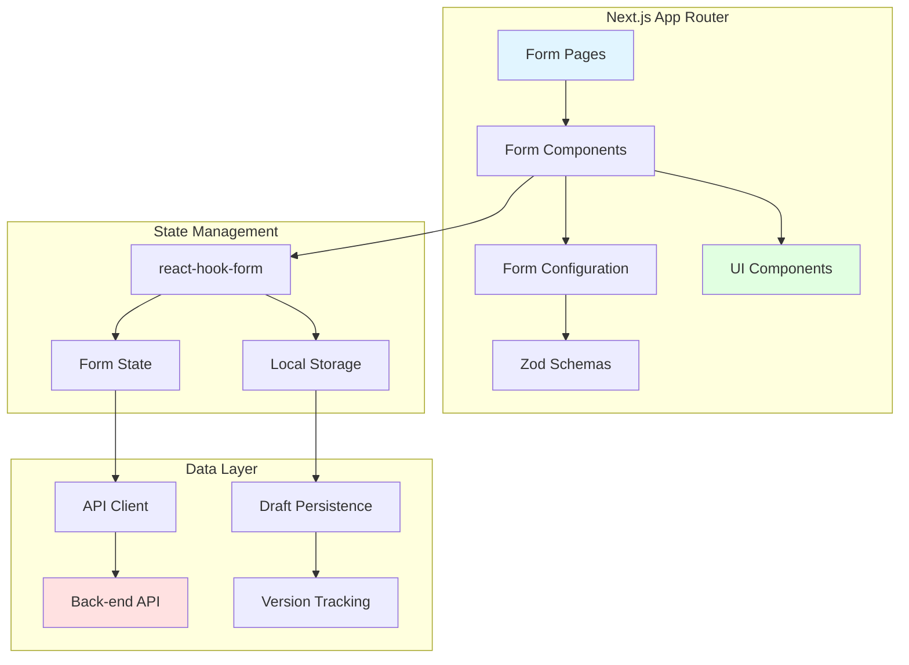

# Design Document

## Overview

The announcement forms system is a micro frontend application built with Next.js 15 and React 19 that captures structured announcement data through a series of forms. This design focuses on implementing the buy-back announcement form (Appendix 3C) as the first example, establishing patterns and architecture that will be reused for the remaining 9 announcement forms.

The system uses react-hook-form for form state management, Zod for schema validation and type safety, and components from the shared UI package. Form data is submitted as JSON documents to a back-end API service, with local storage providing draft persistence and version tracking for audit trails.

### Key Design Principles

1. **Template-First Approach**: The buy-back form serves as a reference implementation with reusable patterns
2. **Type Safety**: Zod schemas provide runtime validation and compile-time TypeScript types
3. **Separation of Concerns**: Form configuration (schemas, field definitions) is separated from rendering logic
4. **Composability**: Reusable form components and validation schemas can be shared across all 10 forms
5. **Progressive Enhancement**: Forms work with basic functionality first, enhanced features layer on top

## Architecture

### High-Level Architecture



### Directory Structure

```
apps/announcements/
├── src/
│   ├── app/
│   │   ├── forms/
│   │   │   ├── buy-back/
│   │   │   │   ├── page.tsx              # Buy-back form page
│   │   │   │   └── review/
│   │   │   │       └── page.tsx          # Review page
│   │   │   └── layout.tsx                # Forms layout
│   │   ├── layout.tsx
│   │   └── page.tsx
│   ├── components/
│   │   ├── forms/
│   │   │   ├── buy-back-form.tsx         # Buy-back form component
│   │   │   ├── form-field-wrapper.tsx    # Reusable field wrapper
│   │   │   ├── form-section.tsx          # Section grouping component
│   │   │   ├── form-review.tsx           # Review component
│   │   │   └── compliance-section.tsx    # Compliance statements
│   │   └── ui/
│   │       └── form-progress.tsx         # Progress indicator
│   ├── lib/
│   │   ├── schemas/
│   │   │   ├── buy-back.schema.ts        # Buy-back Zod schema
│   │   │   ├── common.schema.ts          # Shared validation schemas
│   │   │   └── index.ts
│   │   ├── api/
│   │   │   ├── client.ts                 # API client
│   │   │   └── forms.ts                  # Form submission endpoints
│   │   ├── storage/
│   │   │   ├── form-storage.ts           # Local storage utilities
│   │   │   └── version-tracker.ts        # Version management
│   │   ├── types/
│   │   │   ├── forms.ts                  # Form type definitions
│   │   │   └── api.ts                    # API types
│   │   └── utils/
│   │       ├── form-helpers.ts           # Form utility functions
│   │       └── validation.ts             # Custom validators
│   └── config/
│       └── forms.ts                      # Form configuration
```

## Components and Interfaces

### Core Components

#### 1. BuyBackForm Component

The main form component that orchestrates the buy-back announcement form.

```typescript
interface BuyBackFormProps {
  initialData?: Partial<BuyBackFormData>;
  onSubmit: (data: BuyBackFormData) => Promise<void>;
  onSaveDraft?: (data: Partial<BuyBackFormData>) => void;
}

// Component responsibilities:
// - Initialize react-hook-form with Zod schema
// - Render form sections with conditional logic
// - Handle form submission and validation
// - Auto-save to local storage
// - Display validation errors
```

#### 2. FormFieldWrapper Component

A reusable wrapper for form fields that handles labels, errors, and help text.

```typescript
interface FormFieldWrapperProps {
  label: string;
  name: string;
  required?: boolean;
  helpText?: string;
  error?: FieldError;
  children: React.ReactNode;
}

// Provides consistent styling and error display across all form fields
```

#### 3. FormSection Component

Groups related form fields with visual separation and optional conditional rendering.

```typescript
interface FormSectionProps {
  title: string;
  description?: string;
  children: React.ReactNode;
  visible?: boolean;
}

// Handles section visibility based on form state
```

#### 4. FormReview Component

Displays completed form data in read-only format for user review.

```typescript
interface FormReviewProps {
  data: BuyBackFormData;
  onEdit: () => void;
  onConfirm: () => void;
}

// Shows all entered data organized by section
// Highlights conditional sections that are active
```

#### 5. ComplianceSection Component

Renders compliance statements and signature fields.

```typescript
interface ComplianceSectionProps {
  isTrust: boolean;
  control: Control<BuyBackFormData>;
}

// Displays appropriate compliance statement based on entity type
// Captures signatory information
```

### Form Configuration

#### Form Field Definitions

```typescript
interface FormFieldConfig {
  name: string;
  label: string;
  type: 'text' | 'number' | 'date' | 'select' | 'textarea' | 'checkbox';
  placeholder?: string;
  helpText?: string;
  options?: Array<{ value: string; label: string }>;
  conditional?: {
    field: string;
    value: any;
  };
}

// Declarative field configuration that drives form rendering
```

## Data Models

### Buy-Back Form Schema

The Zod schema defines the complete structure and validation rules for the buy-back form.

```typescript
// Common reusable schemas
const abnSchema = z.string()
  .regex(/^\d{11}$/, 'ABN must be 11 digits')
  .or(z.string().regex(/^\d{9}$/, 'ARSN must be 9 digits'));

const positiveNumberSchema = z.number().positive('Must be a positive number');

const shareClassSchema = z.object({
  class: z.string().min(1, 'Share class is required'),
  votingRights: z.string().min(1, 'Voting rights are required'),
  paidStatus: z.enum(['fully-paid', 'partly-paid']),
  paidDetails: z.string().optional(),
  numberOnIssue: positiveNumberSchema,
});

// Buy-back type enum
const buyBackTypeSchema = z.enum([
  'on-market',
  'employee-share-scheme',
  'selective',
  'equal-access-scheme'
]);

// Conditional sections
const onMarketBuyBackSchema = z.object({
  brokerName: z.string().min(1, 'Broker name is required'),
  maximumShares: positiveNumberSchema.optional(),
  timePeriod: z.string().optional(),
  conditions: z.string().optional(),
});

const employeeShareSchemeBuyBackSchema = z.object({
  numberOfShares: positiveNumberSchema,
  price: positiveNumberSchema,
});

const selectiveBuyBackSchema = z.object({
  personOrClass: z.string().min(1, 'Person or class is required'),
  numberOfShares: positiveNumberSchema,
  price: positiveNumberSchema,
});

const equalAccessSchemeSchema = z.object({
  percentage: z.number().min(0).max(100),
  totalShares: positiveNumberSchema,
  price: positiveNumberSchema,
  recordDate: z.date(),
});

// Main form schema
const buyBackFormSchema = z.object({
  // Entity information
  entityName: z.string().min(1, 'Entity name is required'),
  abnArsn: abnSchema,
  
  // Buy-back information
  buyBackType: buyBackTypeSchema,
  shareClass: shareClassSchema,
  shareholderApprovalRequired: z.boolean(),
  reason: z.string().min(1, 'Reason is required'),
  materialInformation: z.string().optional(),
  
  // Conditional sections (discriminated union)
  onMarketBuyBack: onMarketBuyBackSchema.optional(),
  employeeShareSchemeBuyBack: employeeShareSchemeBuyBackSchema.optional(),
  selectiveBuyBack: selectiveBuyBackSchema.optional(),
  equalAccessScheme: equalAccessSchemeSchema.optional(),
  
  // Compliance
  compliance: z.object({
    isTrust: z.boolean(),
    signatoryName: z.string().min(1, 'Signatory name is required'),
    signatoryRole: z.enum(['director', 'company-secretary']),
    signatureDate: z.date(),
  }),
}).refine((data) => {
  // Ensure at least one conditional section is filled based on buy-back type
  const typeMap = {
    'on-market': 'onMarketBuyBack',
    'employee-share-scheme': 'employeeShareSchemeBuyBack',
    'selective': 'selectiveBuyBack',
    'equal-access-scheme': 'equalAccessScheme',
  };
  const requiredField = typeMap[data.buyBackType];
  return data[requiredField] !== undefined;
}, {
  message: 'Required fields for selected buy-back type must be completed',
  path: ['buyBackType'],
});

// TypeScript type derived from schema
type BuyBackFormData = z.infer<typeof buyBackFormSchema>;
```

### JSON Document Structure

The submitted JSON document follows this structure:

```typescript
interface FormSubmission<T = any> {
  // Metadata
  submissionId: string;              // UUID
  formType: string;                  // 'buy-back' | 'appendix-3a' | etc.
  formVersion: string;               // Schema version (e.g., '1.0.0')
  submittedAt: string;               // ISO 8601 timestamp
  
  // Form data
  data: T;                           // Validated form data
  
  // Version tracking (if updating existing submission)
  previousVersion?: string;          // Previous submission ID
  versionNumber: number;             // Incremental version
  delta?: FormDelta;                 // Changes from previous version
}

interface FormDelta {
  added: Record<string, any>;
  modified: Record<string, { old: any; new: any }>;
  removed: Record<string, any>;
}
```

### Local Storage Structure

```typescript
interface StoredFormDraft {
  formType: string;
  lastSaved: string;                 // ISO 8601 timestamp
  data: Partial<BuyBackFormData>;
  version: number;
}

// Storage key pattern: `form-draft-${formType}`
```

## Error Handling

### Validation Errors

Validation errors are handled at multiple levels:

1. **Field-level validation**: Zod schemas validate individual fields
2. **Form-level validation**: Cross-field validation using Zod refinements
3. **Conditional validation**: Different rules based on buy-back type

```typescript
// Error display strategy
interface ErrorDisplayStrategy {
  // Inline errors: Show below each field
  inline: boolean;
  
  // Summary errors: Show at top of form
  summary: boolean;
  
  // Toast notifications: For submission errors
  toast: boolean;
}
```

### API Errors

```typescript
interface ApiError {
  code: string;
  message: string;
  field?: string;                    // Field-specific errors
  details?: Record<string, any>;
}

// Error handling flow:
// 1. Network errors: Retry with exponential backoff
// 2. Validation errors: Map to form fields
// 3. Server errors: Display user-friendly message
// 4. Timeout errors: Offer to save draft locally
```

### Error Recovery

- **Network failures**: Queue submission for retry, save to local storage
- **Validation failures**: Highlight errors, scroll to first error
- **Session expiration**: Preserve form data, redirect to login
- **Browser crash**: Restore from local storage on return

## Testing Strategy

### Unit Testing

Test individual components and utilities in isolation.

```typescript
// Component tests
describe('BuyBackForm', () => {
  it('renders all required fields', () => {});
  it('shows conditional sections based on buy-back type', () => {});
  it('validates form data with Zod schema', () => {});
  it('calls onSubmit with valid data', () => {});
});

// Schema tests
describe('buyBackFormSchema', () => {
  it('validates valid buy-back data', () => {});
  it('rejects invalid ABN format', () => {});
  it('requires conditional fields based on type', () => {});
});

// Utility tests
describe('formStorage', () => {
  it('saves draft to local storage', () => {});
  it('restores draft from local storage', () => {});
  it('clears draft after submission', () => {});
});
```

### Integration Testing

Test form workflows end-to-end.

```typescript
describe('Buy-back form submission flow', () => {
  it('completes full form and submits successfully', () => {});
  it('saves draft and restores on page reload', () => {});
  it('handles API errors gracefully', () => {});
  it('validates conditional sections correctly', () => {});
});
```

### Validation Testing

Comprehensive tests for all validation rules.

```typescript
describe('Form validation', () => {
  it('validates ABN format', () => {});
  it('validates ARSN format', () => {});
  it('requires positive numbers for share counts', () => {});
  it('validates date formats', () => {});
  it('enforces conditional field requirements', () => {});
});
```

### Accessibility Testing

Ensure forms are accessible to all users.

```typescript
describe('Accessibility', () => {
  it('supports keyboard navigation', () => {});
  it('provides proper ARIA labels', () => {});
  it('announces validation errors to screen readers', () => {});
  it('maintains focus management', () => {});
});
```

## Implementation Patterns

### Conditional Rendering Pattern

```typescript
// Using react-hook-form watch for conditional sections
const buyBackType = watch('buyBackType');

{buyBackType === 'on-market' && (
  <FormSection title="On-Market Buy-Back Details">
    {/* On-market fields */}
  </FormSection>
)}
```

### Auto-Save Pattern

```typescript
// Debounced auto-save to local storage
const formValues = watch();

useEffect(() => {
  const timeoutId = setTimeout(() => {
    saveFormDraft('buy-back', formValues);
  }, 1000);
  
  return () => clearTimeout(timeoutId);
}, [formValues]);
```

### Form Submission Pattern

```typescript
const onSubmit = async (data: BuyBackFormData) => {
  try {
    // Create submission document
    const submission: FormSubmission<BuyBackFormData> = {
      submissionId: generateUUID(),
      formType: 'buy-back',
      formVersion: '1.0.0',
      submittedAt: new Date().toISOString(),
      data,
      versionNumber: 1,
    };
    
    // Submit to API
    await submitForm(submission);
    
    // Clear draft
    clearFormDraft('buy-back');
    
    // Show success message
    toast.success('Form submitted successfully');
    
    // Redirect
    router.push('/forms/success');
  } catch (error) {
    handleSubmissionError(error);
  }
};
```

### Version Tracking Pattern

```typescript
const calculateDelta = (
  previous: BuyBackFormData,
  current: BuyBackFormData
): FormDelta => {
  const delta: FormDelta = {
    added: {},
    modified: {},
    removed: {},
  };
  
  // Deep comparison logic
  // Track added, modified, and removed fields
  
  return delta;
};
```

## Reusability and Extensibility

### Shared Validation Schemas

Common validation patterns are extracted for reuse:

```typescript
// lib/schemas/common.schema.ts
export const commonSchemas = {
  abn: abnSchema,
  arsn: arsnSchema,
  positiveNumber: positiveNumberSchema,
  shareClass: shareClassSchema,
  complianceSignature: complianceSignatureSchema,
};
```

### Form Component Factory

A factory pattern for creating form components:

```typescript
interface FormConfig<T> {
  schema: z.ZodSchema<T>;
  fields: FormFieldConfig[];
  sections: FormSectionConfig[];
}

const createFormComponent = <T,>(config: FormConfig<T>) => {
  return (props: FormProps<T>) => {
    // Generic form rendering logic
  };
};
```

### Extensibility Points

1. **Custom Validators**: Add new Zod refinements for specific validation rules
2. **Custom Fields**: Create new field types by extending FormFieldConfig
3. **Custom Sections**: Add new section types for complex layouts
4. **Custom Storage**: Implement alternative storage strategies (IndexedDB, server-side)
5. **Custom Submission**: Override submission logic for different API endpoints

## Performance Considerations

### Optimization Strategies

1. **Code Splitting**: Lazy load form components by route
2. **Memoization**: Use React.memo for expensive form sections
3. **Debouncing**: Debounce auto-save and validation
4. **Virtual Scrolling**: For forms with many fields (future consideration)
5. **Schema Caching**: Cache compiled Zod schemas

### Bundle Size

- Zod: ~13KB gzipped
- react-hook-form: ~9KB gzipped
- Form components: ~15KB gzipped (estimated)
- Total additional: ~37KB gzipped

## Security Considerations

### Input Sanitization

- All user input is validated through Zod schemas
- HTML content is escaped by React by default
- No direct DOM manipulation with user input

### API Security

```typescript
// API client with authentication
const apiClient = {
  async post(endpoint: string, data: any) {
    const response = await fetch(endpoint, {
      method: 'POST',
      headers: {
        'Content-Type': 'application/json',
        'Authorization': `Bearer ${getAuthToken()}`,
        'X-CSRF-Token': getCsrfToken(),
      },
      body: JSON.stringify(data),
    });
    
    if (!response.ok) {
      throw new ApiError(await response.json());
    }
    
    return response.json();
  },
};
```

### Local Storage Security

- No sensitive data stored in local storage
- Draft data is cleared after submission
- Storage keys are namespaced to prevent conflicts

## Accessibility

### WCAG 2.1 AA Compliance

1. **Keyboard Navigation**: All form controls accessible via keyboard
2. **Screen Reader Support**: Proper ARIA labels and descriptions
3. **Error Announcements**: Validation errors announced to screen readers
4. **Focus Management**: Logical focus order, visible focus indicators
5. **Color Contrast**: Minimum 4.5:1 contrast ratio for text
6. **Form Labels**: All inputs have associated labels

### Implementation

```typescript
// Accessible form field example
<FormFieldWrapper
  label="Entity Name"
  name="entityName"
  required
  error={errors.entityName}
>
  <Input
    {...register('entityName')}
    aria-required="true"
    aria-invalid={!!errors.entityName}
    aria-describedby={errors.entityName ? 'entityName-error' : undefined}
  />
</FormFieldWrapper>
```

## Migration Path for Remaining Forms

### Template Checklist

When implementing each of the remaining 9 forms:

1. **Create Zod Schema**: Define validation rules based on source document
2. **Define Field Configuration**: Map form fields to configuration objects
3. **Identify Conditional Logic**: Determine which sections are conditional
4. **Reuse Common Schemas**: Use shared validation patterns
5. **Create Form Component**: Use BuyBackForm as template
6. **Add Route**: Create page in app/forms/[form-name]
7. **Configure API Endpoint**: Add submission endpoint
8. **Add Tests**: Copy test structure from buy-back form

### Estimated Effort Per Form

- Schema definition: 2-3 hours
- Component implementation: 3-4 hours
- Testing: 2-3 hours
- Total: 7-10 hours per form

With the buy-back form as a template, subsequent forms should follow a predictable pattern and timeline.
