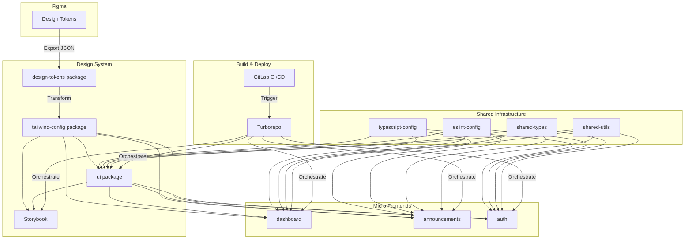

# Design Document

## Overview

This design document outlines the architecture for a micro frontend monorepo using Turborepo, pnpm workspaces, Next.js, React, Tailwind CSS, and shadcn components. The system enables independent development and deployment of multiple frontend applications while maintaining design consistency through shared packages and automated design token transformation from Figma.

### Key Design Principles

1. **Separation of Concerns**: Applications and shared packages are clearly separated
2. **Single Source of Truth**: Design tokens from Figma drive the visual design system
3. **Component Reusability**: All UI components are shared through a centralised package
4. **Build Efficiency**: Turborepo provides intelligent caching and parallel execution
5. **Type Safety**: TypeScript ensures type safety across package boundaries
6. **Developer Experience**: Hot reloading, Storybook, and clear tooling enhance productivity

## Architecture

### High-Level Structure

```
monorepo-root/
├── apps/
│   ├── dashboard/            # Dashboard micro frontend
│   ├── announcements/        # Announcements micro frontend
│   ├── auth/                 # Authentication micro frontend
│   └── storybook/            # Storybook application
│       ├── .storybook/
│       ├── stories/
│       └── package.json
├── packages/
│   ├── ui/                   # Shared shadcn components
│   │   ├── src/
│   │   │   └── components/   # Shadcn components copied to shared library
│   │   ├── package.json
│   │   └── tsconfig.json
│   ├── design-tokens/        # Design token transformation
│   │   ├── src/              # tokens for import to tailwind
│   │   │   ├── tokens/
│   │   │   │   ├── colors.ts
│   │   │   │   ├── typography.ts
│   │   │   │   └── spacing.ts
│   │   │   └── figma/        # Raw semantic tokens from figma
│   │   │       ├── sync-tokens.ts
│   │   │       └── .figmarc
│   ├── config/               # Shared configurations
│   │   ├── tailwind-config/  # Shared Tailwind configuration
│   │   ├── typescript-config/# Shared TypeScript configurations
│   │   └── eslint-config/    # Shared ESLint configurations
│   ├── shared-types/         # Shared TypeScript types and interfaces
│   └── shared-utils/         # Shared utility functions
├── .gitlab-ci.yml            # GitLab CI/CD configuration
├── .prettierrc               # Prettier configuration
├── .eslintrc.js              # Root ESLint configuration
├── tsconfig.json             # Root TypeScript configuration
├── turbo.json                # Turborepo configuration
├── pnpm-workspace.yaml       # pnpm workspace configuration
└── package.json              # Root package.json
```

### Architecture Diagram



## Components and Interfaces

### 1. Design Token Transformation Package

**Purpose**: Transform Figma design tokens into Tailwind CSS configuration

**Structure**:

```
packages/design-tokens/
├── src/
│   ├── transform.ts          # Token transformation logic
│   ├── validators.ts         # Token validation
│   ├── types.ts              # TypeScript types for tokens
│   └── index.ts              # Public API
├── scripts/
│   └── build-tokens.ts       # Build script
├── package.json
└── tsconfig.json
```

**Key Interfaces**:

```typescript
interface DesignToken {
  name: string;
  value: string | number;
  type: 'color' | 'spacing' | 'typography' | 'shadow' | 'borderRadius';
  category?: string;
}

interface TailwindThemeExtension {
  colors?: Record<string, string>;
  spacing?: Record<string, string>;
  fontSize?: Record<string, [string, { lineHeight: string }]>;
  boxShadow?: Record<string, string>;
  borderRadius?: Record<string, string>;
}

function transformTokens(tokens: DesignToken[]): TailwindThemeExtension;
function validateTokens(tokens: unknown): DesignToken[];
```

**Build Process**:

1. Read `tokens.json` from `packages/design-tokens/src/figma/` directory
2. Validate token structure
3. Transform tokens to Tailwind theme format
4. Generate TypeScript type definitions
5. Output transformed configuration

### 2. Tailwind Configuration Package

**Purpose**: Provide shared Tailwind CSS configuration with design tokens

**Structure**:

```
packages/config/tailwind-config/
├── src/
│   ├── base.ts               # Base Tailwind config
│   ├── tokens.ts             # Generated from design-tokens
│   └── index.ts              # Merged configuration
├── package.json
└── tsconfig.json
```

**Configuration**:

```typescript
// Extends base Tailwind with design tokens
export default {
  content: [], // To be extended by consumers
  theme: {
    extend: {
      ...designTokens,
      // Additional custom theme extensions
    },
  },
  plugins: [],
};
```

**Usage in Apps**:

```typescript
// apps/dashboard/tailwind.config.ts
import baseConfig from '@repo/tailwind-config';

export default {
  ...baseConfig,
  content: ['./src/**/*.{js,ts,jsx,tsx}', '../../packages/ui/src/**/*.{js,ts,jsx,tsx}'],
};
```

### 3. Shared UI Package (shadcn Components)

**Purpose**: Centralised component library using shadcn

**Structure**:

```
packages/ui/
├── src/
│   ├── components/
│   │   ├── button.tsx
│   │   ├── card.tsx
│   │   ├── input.tsx
│   │   └── ...
│   ├── lib/
│   │   └── utils.ts          # cn() utility
│   └── index.ts              # Public exports
├── components.json           # shadcn configuration
├── package.json
├── tsconfig.json
└── tailwind.config.ts        # Uses shared config
```

**Key Patterns**:

- All shadcn components installed in this package
- Components export from single entry point
- Uses shared Tailwind configuration
- React and React-DOM as peer dependencies

**Component Example**:

```typescript
// packages/ui/src/components/button.tsx
import * as React from "react";
import { cn } from "../lib/utils";

export interface ButtonProps extends React.ButtonHTMLAttributes<HTMLButtonElement> {
  variant?: "default" | "destructive" | "outline";
}

export const Button = React.forwardRef<HTMLButtonElement, ButtonProps>(
  ({ className, variant = "default", ...props }, ref) => {
    return (
      <button
        className={cn(/* variant classes */, className)}
        ref={ref}
        {...props}
      />
    );
  }
);
```

### 4. Storybook Application

**Purpose**: Component documentation and development environment

**Structure**:

```
apps/storybook/
├── .storybook/
│   ├── main.ts               # Storybook configuration
│   ├── preview.ts            # Global decorators and parameters
│   └── preview-head.html     # Custom head tags
├── stories/
│   ├── Button.stories.tsx
│   ├── Card.stories.tsx
│   └── ...
├── package.json
└── tsconfig.json
```

**Configuration**:

```typescript
// apps/storybook/.storybook/main.ts
export default {
  stories: ['../../packages/ui/src/**/*.stories.tsx'],
  addons: ['@storybook/addon-essentials', '@storybook/addon-interactions'],
  framework: '@storybook/react-vite',
};

// apps/storybook/.storybook/preview.ts
import '../styles/globals.css'; // Imports Tailwind
export const parameters = {
  actions: { argTypesRegex: '^on[A-Z].*' },
  controls: { expanded: true },
};
```

### 5. Next.js Micro Frontend Applications

**Purpose**: Independent deployable applications

**Structure** (example: dashboard app):

```
apps/dashboard/
├── src/
│   ├── app/                  # Next.js App Router
│   │   ├── layout.tsx
│   │   ├── page.tsx
│   │   └── ...
│   ├── components/           # App-specific components
│   └── styles/
│       └── globals.css       # Tailwind imports
├── public/
├── next.config.js
├── tailwind.config.ts        # Extends shared config
├── package.json
└── tsconfig.json
```

**Applications**:

- **dashboard**: Main dashboard interface for data visualization and management
- **announcements**: Announcements and notifications management interface
- **auth**: Authentication and user management interface

**Dependencies**:

- Imports from `@repo/ui` for shared components
- Uses `@repo/tailwind-config` for styling
- Extends `@repo/typescript-config` for TypeScript
- Extends `@repo/eslint-config` for linting
- Imports from `@repo/shared-types` for common type definitions
- Imports from `@repo/shared-utils` for utility functions

### 6. TypeScript Configuration Package

**Purpose**: Shared TypeScript configurations

**Structure**:

```
packages/config/typescript-config/
├── base.json                 # Base config
├── nextjs.json               # Next.js specific
├── react-library.json        # For React packages
└── package.json
```

**Configurations**:

```json
// base.json
{
  "compilerOptions": {
    "target": "ES2020",
    "lib": ["ES2020", "DOM", "DOM.Iterable"],
    "module": "ESNext",
    "moduleResolution": "bundler",
    "strict": true,
    "skipLibCheck": true,
    "composite": true,
    "declaration": true,
    "declarationMap": true
  }
}

// nextjs.json
{
  "extends": "./base.json",
  "compilerOptions": {
    "jsx": "preserve",
    "plugins": [{ "name": "next" }],
    "paths": {
      "@/*": ["./src/*"]
    }
  },
  "include": ["next-env.d.ts", "**/*.ts", "**/*.tsx"],
  "exclude": ["node_modules"]
}
```

### 7. ESLint Configuration Package

**Purpose**: Shared linting rules

**Structure**:

```
packages/config/eslint-config/
├── next.js                   # Next.js apps
├── react-internal.js         # React packages
├── library.js                # Non-React packages
└── package.json
```

**Configuration**:

```javascript
// next.js
module.exports = {
  extends: ['next/core-web-vitals', 'plugin:@typescript-eslint/recommended', 'prettier'],
  rules: {
    // Custom rules
  },
};
```

### 8. Shared Types Package

**Purpose**: Common TypeScript types and interfaces used across the monorepo

**Structure**:

```
packages/shared-types/
├── src/
│   ├── api/                  # API-related types
│   │   ├── requests.ts
│   │   └── responses.ts
│   ├── models/               # Domain models
│   │   ├── user.ts
│   │   ├── announcement.ts
│   │   └── auth.ts
│   ├── common/               # Common utility types
│   │   └── index.ts
│   └── index.ts              # Public exports
├── package.json
└── tsconfig.json
```

**Example Types**:

```typescript
// packages/shared-types/src/models/user.ts
export interface User {
  id: string;
  email: string;
  name: string;
  role: UserRole;
  createdAt: Date;
  updatedAt: Date;
}

export enum UserRole {
  ADMIN = 'admin',
  USER = 'user',
  GUEST = 'guest',
}

// packages/shared-types/src/api/responses.ts
export interface ApiResponse<T> {
  data: T;
  status: number;
  message?: string;
}

export interface PaginatedResponse<T> {
  items: T[];
  total: number;
  page: number;
  pageSize: number;
}
```

**Usage**:

```typescript
// In any app or package
import { User, ApiResponse } from '@repo/shared-types';

const user: User = {
  id: '123',
  email: 'user@example.com',
  // ...
};
```

### 9. Shared Utils Package

**Purpose**: Common utility functions and helpers used across the monorepo

**Structure**:

```
packages/shared-utils/
├── src/
│   ├── date/                 # Date utilities
│   │   ├── format.ts
│   │   └── parse.ts
│   ├── string/               # String utilities
│   │   ├── validation.ts
│   │   └── transform.ts
│   ├── api/                  # API utilities
│   │   ├── fetch.ts
│   │   └── error-handler.ts
│   ├── storage/              # Storage utilities
│   │   └── local-storage.ts
│   └── index.ts              # Public exports
├── package.json
└── tsconfig.json
```

**Example Utilities**:

```typescript
// packages/shared-utils/src/date/format.ts
export function formatDate(date: Date, format: string): string {
  // Implementation
}

export function getRelativeTime(date: Date): string {
  // Implementation
}

// packages/shared-utils/src/api/fetch.ts
export async function fetchWithAuth<T>(url: string, options?: RequestInit): Promise<T> {
  // Implementation with auth headers
}

// packages/shared-utils/src/string/validation.ts
export function isValidEmail(email: string): boolean {
  // Implementation
}

export function sanitizeInput(input: string): string {
  // Implementation
}
```

**Usage**:

```typescript
// In any app or package
import { formatDate, fetchWithAuth, isValidEmail } from '@repo/shared-utils';

const formattedDate = formatDate(new Date(), 'YYYY-MM-DD');
const data = await fetchWithAuth('/api/users');
const valid = isValidEmail('test@example.com');
```

## Data Models

### Design Token Schema

```typescript
interface FigmaTokenExport {
  version: string;
  tokens: {
    colors?: Record<string, ColorToken>;
    spacing?: Record<string, SpacingToken>;
    typography?: Record<string, TypographyToken>;
    shadows?: Record<string, ShadowToken>;
    radii?: Record<string, RadiusToken>;
  };
}

interface ColorToken {
  value: string; // hex, rgb, hsl
  type: 'color';
  description?: string;
}

interface SpacingToken {
  value: string; // px, rem, em
  type: 'spacing';
  description?: string;
}

interface TypographyToken {
  value: {
    fontFamily: string;
    fontSize: string;
    fontWeight: string | number;
    lineHeight: string;
    letterSpacing?: string;
  };
  type: 'typography';
  description?: string;
}
```

### Package.json Structure

```json
{
  "name": "@repo/ui",
  "version": "0.0.0",
  "private": true,
  "exports": {
    "./components/*": "./src/components/*.tsx",
    "./lib/*": "./src/lib/*.ts"
  },
  "scripts": {
    "build": "tsc",
    "dev": "tsc --watch",
    "lint": "eslint src/",
    "type-check": "tsc --noEmit"
  },
  "peerDependencies": {
    "react": "^18.0.0",
    "react-dom": "^18.0.0"
  },
  "devDependencies": {
    "@repo/typescript-config": "workspace:*",
    "@repo/eslint-config": "workspace:*",
    "@types/react": "^18.0.0",
    "typescript": "^5.0.0"
  },
  "dependencies": {
    "@repo/tailwind-config": "workspace:*",
    "class-variance-authority": "^0.7.0",
    "clsx": "^2.0.0",
    "tailwind-merge": "^2.0.0"
  }
}
```

## Error Handling

### Build-Time Errors

1. **Design Token Validation**
   - Invalid token structure: Clear error message with expected format
   - Missing required fields: Specify which fields are missing
   - Invalid values: Type-specific validation errors

2. **TypeScript Errors**
   - Cross-package type errors: Use project references for accurate errors
   - Missing type definitions: Ensure all packages export types

3. **Turborepo Errors**
   - Failed tasks: Show which package failed and why
   - Dependency errors: Clear indication of missing dependencies

### Runtime Errors

1. **Component Errors**
   - React error boundaries in applications
   - Prop validation with TypeScript
   - Console warnings for development

2. **Build Failures**
   - Next.js build errors with clear stack traces
   - Tailwind CSS purge issues: Verify content paths

## Testing Strategy

### Unit Testing

**Packages to Test**:

- `design-tokens`: Token transformation logic
- `ui`: Component behavior and props
- `utils`: Utility functions

**Tools**:

- Vitest for unit tests
- React Testing Library for component tests

**Example**:

```typescript
// packages/design-tokens/src/__tests__/transform.test.ts
import { describe, it, expect } from 'vitest';
import { transformTokens } from '../transform';

describe('transformTokens', () => {
  it('should transform color tokens correctly', () => {
    const tokens = [{ name: 'primary', value: '#000000', type: 'color' }];
    const result = transformTokens(tokens);
    expect(result.colors).toEqual({ primary: '#000000' });
  });
});
```

### Integration Testing

**Focus Areas**:

- Token transformation to Tailwind config
- Component rendering with design tokens
- Package dependency resolution

### Visual Testing

**Storybook Integration**:

- Visual regression testing with Chromatic or Percy
- Interaction testing with Storybook test runner
- Accessibility testing with axe

### E2E Testing

**Application Level**:

- Playwright or Cypress for critical user flows
- Test in individual micro frontends
- Run in CI pipeline

## Root Configuration Files

### .prettierrc

**Purpose**: Root Prettier configuration for consistent code formatting

```json
{
  "semi": true,
  "trailingComma": "es5",
  "singleQuote": true,
  "printWidth": 100,
  "tabWidth": 2,
  "useTabs": false,
  "arrowParens": "always",
  "endOfLine": "lf"
}
```

### .eslintrc.js

**Purpose**: Root ESLint configuration that extends shared configs

```javascript
module.exports = {
  root: true,
  extends: ['@repo/eslint-config/library'],
  parser: '@typescript-eslint/parser',
  parserOptions: {
    project: true,
  },
  ignorePatterns: ['node_modules/', 'dist/', '.next/', 'build/', 'coverage/'],
};
```

### tsconfig.json

**Purpose**: Root TypeScript configuration for workspace-wide settings

```json
{
  "compilerOptions": {
    "target": "ES2020",
    "lib": ["ES2020"],
    "module": "ESNext",
    "moduleResolution": "bundler",
    "strict": true,
    "skipLibCheck": true,
    "noEmit": true
  },
  "exclude": ["node_modules", "dist", ".next", "build"]
}
```

Note: Individual packages and apps will extend these base configurations with their specific needs.

## Build and Deployment

### Turborepo Configuration

```json
{
  "$schema": "https://turbo.build/schema.json",
  "globalDependencies": ["**/.env.*local"],
  "pipeline": {
    "build": {
      "dependsOn": ["^build"],
      "outputs": [".next/**", "!.next/cache/**", "dist/**"]
    },
    "dev": {
      "cache": false,
      "persistent": true
    },
    "lint": {
      "dependsOn": ["^build"]
    },
    "type-check": {
      "dependsOn": ["^build"]
    },
    "test": {
      "dependsOn": ["^build"]
    }
  }
}
```

### pnpm Workspace Configuration

```yaml
# pnpm-workspace.yaml
packages:
  - 'apps/*'
  - 'packages/*'
```

### GitLab CI/CD Pipeline

```yaml
# .gitlab-ci.yml
stages:
  - install
  - build
  - test
  - deploy

variables:
  PNPM_CACHE_FOLDER: .pnpm-store

cache:
  key:
    files:
      - pnpm-lock.yaml
  paths:
    - .pnpm-store
    - node_modules/.cache/turbo

install:
  stage: install
  script:
    - corepack enable
    - pnpm install --frozen-lockfile
  artifacts:
    paths:
      - node_modules
      - apps/*/node_modules
      - packages/*/node_modules
    expire_in: 1 hour

build:
  stage: build
  dependencies:
    - install
  script:
    - pnpm turbo build --filter=...[$CI_COMMIT_BEFORE_SHA]
  artifacts:
    paths:
      - apps/*/.next
      - packages/*/dist
    expire_in: 1 hour

lint:
  stage: test
  dependencies:
    - install
  script:
    - pnpm turbo lint --filter=...[$CI_COMMIT_BEFORE_SHA]

type-check:
  stage: test
  dependencies:
    - install
  script:
    - pnpm turbo type-check --filter=...[$CI_COMMIT_BEFORE_SHA]

test:
  stage: test
  dependencies:
    - install
  script:
    - pnpm turbo test --filter=...[$CI_COMMIT_BEFORE_SHA]

deploy:dashboard:
  stage: deploy
  dependencies:
    - build
  script:
    - echo "Deploy dashboard"
    # Deployment commands
  only:
    changes:
      - apps/dashboard/**/*
      - packages/**/*
  when: manual

deploy:announcements:
  stage: deploy
  dependencies:
    - build
  script:
    - echo "Deploy announcements"
    # Deployment commands
  only:
    changes:
      - apps/announcements/**/*
      - packages/**/*
  when: manual

deploy:auth:
  stage: deploy
  dependencies:
    - build
  script:
    - echo "Deploy auth"
    # Deployment commands
  only:
    changes:
      - apps/auth/**/*
      - packages/**/*
  when: manual
```

### Development Workflow

1. **Local Development**:

   ```bash
   # Install dependencies
   pnpm install

   # Run all apps in dev mode
   pnpm dev

   # Run specific app
   pnpm --filter dashboard dev

   # Run Storybook
   pnpm --filter storybook dev
   ```

2. **Design Token Update**:

   ```bash
   # Export tokens from Figma to packages/design-tokens/src/figma/tokens.json
   # Build design-tokens package
   pnpm --filter design-tokens build

   # Rebuild dependent packages
   pnpm turbo build --filter=...design-tokens
   ```

3. **Adding New Component**:

   ```bash
   # Add shadcn component to ui package
   cd packages/ui
   pnpm dlx shadcn-ui@latest add button

   # Create story in Storybook
   # Component automatically available to all apps
   ```

### Deployment Strategy

**Independent Deployment**:

- Each micro frontend can be deployed independently
- GitLab CI detects changes and builds only affected apps
- Manual deployment gates for production

**Shared Package Updates**:

- Shared packages use workspace protocol (`workspace:*`)
- Updates propagate through version bumps
- Turborepo rebuilds affected applications

**Rollback Strategy**:

- Git-based rollbacks
- Independent app versions allow partial rollbacks
- Shared package versions pinned in package.json

## Performance Considerations

1. **Build Performance**:
   - Turborepo caching reduces rebuild times
   - pnpm's efficient dependency management
   - Parallel task execution

2. **Bundle Size**:
   - Tailwind CSS purging removes unused styles
   - Next.js automatic code splitting
   - Shared dependencies reduce duplication

3. **Development Experience**:
   - Fast Refresh in Next.js
   - Hot Module Replacement in Storybook
   - Incremental TypeScript compilation

## Security Considerations

1. **Dependency Management**:
   - Regular dependency audits with `pnpm audit`
   - Automated security updates
   - Lock file integrity checks

2. **CI/CD Security**:
   - Secrets management in GitLab CI
   - Protected branches for production
   - Code review requirements

3. **Type Safety**:
   - Strict TypeScript configuration
   - No implicit any
   - Proper type exports from packages
