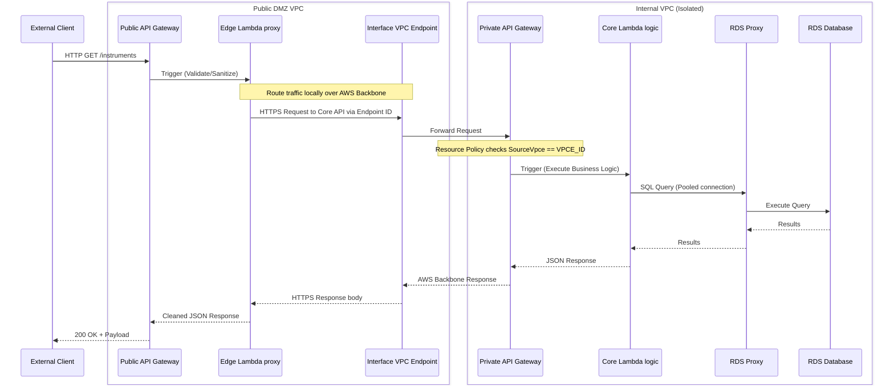

# Reference Data: Edge-to-Core DMZ Architecture

To strictly isolate the internal RDS database while securely exposing endpoints via a DMZ API Gateway, we implement an **Edge-to-Core Proxy Pattern** utilizing **AWS PrivateLink**.

This document outlines the design, boundaries, and components for routing reference data requests securely and performantly from the public internet down into the isolated internal VPC network.

## 1. Architecture Flow

## 2. Component Specifications

### 2.1 DMZ VPC (`lambdas/reference-data-edge`)
The edge layer acts as the sanitization and network boundary.

*   **DMZ API Gateway (Public REST API):** 
    *   Exposed to the internet.
    *   Configured with Edge/Regional caching to absorb highly redundant read requests, relieving the backend.
*   **Edge Lambda (`reference-data-edge`):**
    *   Acts purely as a lightweight HTTP proxy (`node.js` / TypeScript).
    *   Validates query parameters, trims malicious payloads, handles JWT/API Key authorization.
    *   Forwards the allowed requests to the core gateway using the VPC Endpoint hostname.
*   **VPC Interface Endpoint (PrivateLink for API Gateway):**
    *   Deploys ENIs (Elastic Network Interfaces) directly into the DMZ private subnets.
    *   Enables the Edge Lambda to securely invoke the Internal API Gateway over the AWS backbone network without traversing a public NAT Gateway or internet gateway.

### 2.2 Internal VPC (`lambdas/reference-data-core`)
The core layer houses the database and the actual application logic, completely isolated from inbound internet traffic.

*   **Internal API Gateway (Private REST API):**
    *   Accessible *only* from within a VPC.
    *   Secured by a strict Resource Policy that explicitly purely `Allow`s traffic if `aws:SourceVpce` matches the specific VPC Endpoint ID in the DMZ VPC. All other traffic is `Deny`ed.
*   **Core Lambda (`reference-data-core`):**
    *   Heavy lifter. Orchestrates SQL queries and complex data aggregation.
    *   Deployed into isolated private subnets with no internet route.
*   **Amazon RDS Proxy:**
    *   Positioned between the Core Lambda and the Database.
    *   Prevents Lambda horizontal scaling "Connection Storms". Maintains a warm connection pool to the underlying RDS instance, radically dropping connection handshake latencies (TLS/TCP) when Lambdas cold-start.

## 3. Infrastructure Monorepo Strategy
This setup forces a strict decoupling within our monorepo:

1.  **`lambdas/reference-data-edge/`**
    *   Contains its own `openapi.yaml` describing the public interface.
    *   Contains its own `terraform` defining the Public API Gateway, the lightweight edge Lambda, and the PrivateLink VPCE.
2.  **`lambdas/reference-data-core/`**
    *   Contains its own `openapi.yaml` describing the internal execution interface.
    *   Contains its own `terraform` defining the Private API Gateway, Resource Policies, the heavy Core Lambda, and the RDS Proxy attachments to the isolated private subnets.
