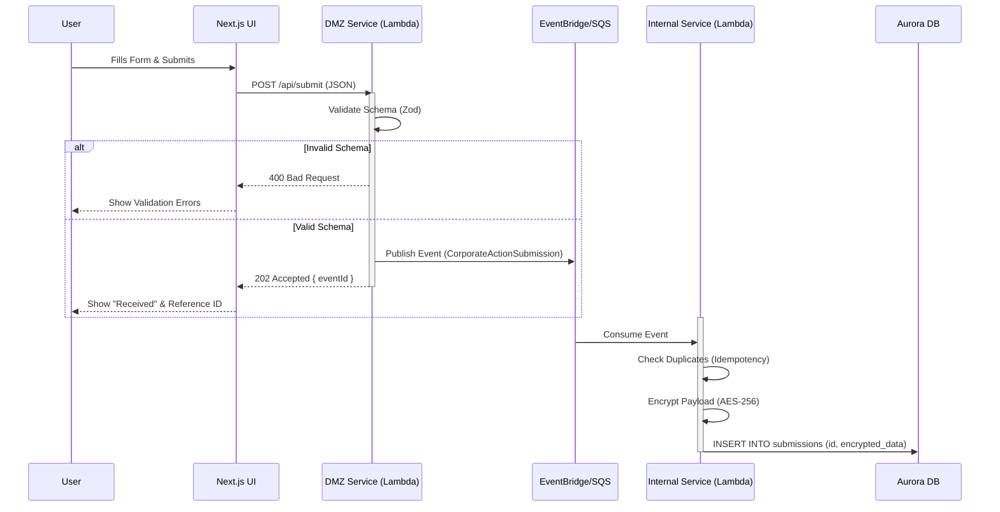
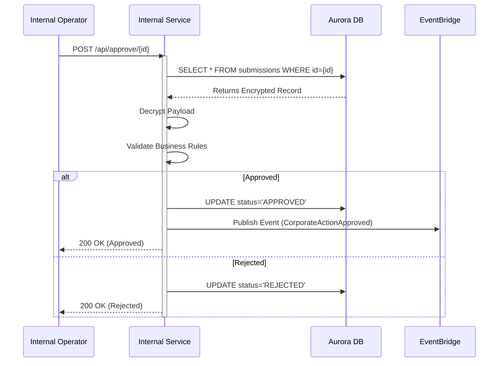

# Corporate Action Submission Application - Design Document

## 1. Overview
This document outlines the architecture for the Corporate Action Submission application. The application is designed to be highly secure, separating the public-facing DMZ from internal business logic and data storage using distinct AWS VPCs. The system leverages an asynchronous, event-driven architecture using AWS Lambda, EventBridge/SQS, and RDS Aurora (PostgreSQL).

## 2. High-Level Architecture

The architecture follows a strict separation of concerns:
- **Web UI:** A Next.js application (Server-Side Rendering) deployed on AWS (e.g., Amplify or ECS Fargate).
- **DMZ VPC:** Contains the Public API Gateway and stateless "DMZ Lambda" functions. These services perform initial validation and schema checks but do not access the database directly.
- **Async Event Bus:** An EventBridge or SQS queue decouples the ingestion from processing.
- **Internal VPC:** Contains the "Internal Lambda" functions and the RDS Aurora database. These services handle business logic, encryption, and persistence.

### Architecture Diagram

```mermaid
graph TD
    subgraph "Web Application"
        UI[Next.js Frontend]
    end

    subgraph "AWS Cloud"
        subgraph "DMZ VPC"
            APIG[API Gateway (Public)]
            DMZ_Lambda[DMZ Service Lambda]
        end

        subgraph "Async Layer"
            EB[EventBridge / SQS Queue]
        end

        subgraph "Internal VPC"
            Internal_Lambda[Internal Service Lambda]
            DB[(Aurora PostgreSQL)]
        end
    end

    UI -->|HTTPS POST| APIG
    APIG -->|Invoke| DMZ_Lambda
    DMZ_Lambda -->|Validate & Publish| EB
    EB -->|Trigger| Internal_Lambda
    Internal_Lambda -->|Encrypt & Store| DB
```

## 3. Data Flow & Sequence

### 3.1. Submission Flow (User Perspective)

1.  User fills out the corporate action form on the Web UI.
2.  The UI sends a POST request to the DMZ API.
3.  The DMZ Service validates the payload against the Zod schema.
4.  If valid, the DMZ Service publishes an event to the Async Event Bus.
5.  The DMZ Service immediately returns `202 Accepted` with a Reference ID to the UI.
6.  The UI displays a success message with the Reference ID.

### 3.2. Processing Flow (Backend Perspective)

1.  The Internal Service is triggered by the event from the Event Bus.
2.  The service performs duplicate checks (idempotency) using the Official Event ID.
3.  The service encrypts the sensitive payload using AES-256-CBC.
4.  The encrypted payload is stored in the Aurora PostgreSQL database.

### Sequence Diagram: Submission



## 4. Async Approvals Process

Once a submission is stored, it enters an approval workflow. This process is also asynchronous.

1.  An internal operator or system triggers an approval check (e.g., via another UI or API).
2.  The Internal Service retrieves the record from the DB and decrypts it.
3.  If approved, a `CorporateActionApproved` event is published.
4.  Downstream systems (e.g., Settlement, Notification) subscribe to this event.

### Sequence Diagram: Approvals



## 5. Security Strategy

-   **Transport Security:** All communication between the UI and API Gateway is over HTTPS (TLS 1.2+).
-   **Data at Rest:** Sensitive corporate action details are encrypted at the application level using AES-256-CBC before being persisted to the database. The `ENCRYPTION_KEY` is managed via AWS Secrets Manager and injected as an environment variable `ENCRYPTION_KEY`.
-   **Network Security:**
    -   **DMZ VPC:** Only exposes the API Gateway and stateless validation logic. No direct database access.
    -   **Internal VPC:** Not directly accessible from the public internet. Access is restricted to internal services and the VPN.
-   **Authentication:** API Gateway authorizes requests (e.g., via Cognito or IAM), ensuring only authenticated users can submit forms.

## 6. Deployment Artifacts

-   **Next.js Frontend:** Dockerized and deployed to ECS/EKS behind an Application Load Balancer (ALB).
-   **Lambda Functions:** TypeScript code compiled and deployed as AWS Lambda functions.
-   **Infrastructure as Code (IaC):** All resources (VPC, API Gateway, Lambda, RDS, EventBridge) are defined using AWS CDK or Terraform (to be implemented).
