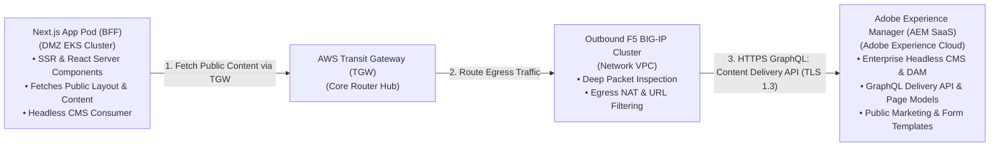

### Architectural Validation & Findings


1. **North-South Ingress & Egress Routing (Network VPC / F5 Big-IP / GWLB)**
   * **Ingress**: Traffic flows `Client -> Imperva (CDN/WAF/DDoS) -> F5 (Network VPC)`.
     * *Validation*: For NextJS web UI, traffic terminates on F5 and reverse-proxies to the DMZ ALB (port 443). For DMZ API Gateway, traffic reaches the DMZ API Gateway via VPC Endpoint (PrivateLink) or public edge depending on whether API Gateway is regional or private.
   * **Egress**: All outbound traffic (to external SaaS like Salesforce, ABR, GLEIF, or on-prem) routed through F5 / NAT / Direct Connect via AWS Transit Gateway (TGW).
2. **Account vs. VPC Boundary Separation**
   * **Account-Level (Serverless / Global AWS Services)**: Amazon S3 (DMZ Temp/Quarantine bucket, Internal Clean bucket), Amazon EventBridge (Default and Custom Event Buses), AWS KMS, AWS IAM, GuardDuty.
   * **VPC-Level**: AWS Transit Gateway attachments, VPC Endpoints (PrivateLink for S3, KMS, API Gateway execute-api), Application Load Balancers (ALB), Network Load Balancers (NLB), EKS Cluster VPC nodes/subnets, RDS PostgreSQL & RDS Proxy, F5 appliance ENIs.
3. **East-West & Cross-Account Event-Driven Flow**
   * GuardDuty S3 Malware Protection triggers an EventBridge event in the DMZ Account.
   * Cross-account EventBridge bus routes clean events across accounts to an Internal Worker Lambda, which copies the file across account boundaries from `DMZ-S3-Temp` to `Internal-S3-Clean`. Quarantined files are moved/tagged in `DMZ-S3-Quarantine`.
4. **BFF (Backend-for-Frontend) Flow & Authentication Layer**
   * NextJS app in DMZ acts as BFF, calling the Internal API Gateway over Transit Gateway (using private API Gateway with Private VPC Endpoints / NLB).
   * Dual API Gateway Custom Authorizers (Lambda):
     1. **Auth Service** (Internal EKS) proxies to on-prem ForgeRock; mints RS256/ES256 JWT using AWS KMS asymmetric signing key.
     2. **JWKS Lambda** exposes public key set to validate tokens.
     3. **Cedar Policy Evaluation Engine** evaluates fine-grained authorization policies per request.

---

### Clarifications & Assumptions to Confirm

Before rendering the complete draw.io XML, please confirm or adjust the following assumptions:

#### 1. AWS Accounts Breakdown
* **Assumption**: There are **4 AWS Accounts**:
  1. **Network Account**: Network VPC (F5 Firewalls, TGW hub, Direct Connect Gateway attachment, AWS NAT Gateways / Internet Gateways).
  2. **DMZ Account**: DMZ VPC (NextJS EKS, ALB, DMZ API Gateway, File Upload Lambda, S3 Temp & Quarantine buckets, EventBridge DMZ Bus).
  3. **Internal Core Account**: Internal VPC (Internal EKS cluster, RDS PostgreSQL + Proxy, Internal API Gateway, JWKS Lambda, Reference Data Lambdas, SQS, S3 Document bucket, EventBridge Internal Bus).
  4. **Kafka Account / VPC**: Confluent Kafka cluster attached to Transit Gateway.
  * *Is this 4-account structure aligned with your setup, or are Network and DMZ grouped into one?*

#### 2. Egress Path for Outbound SaaS / On-Prem Calls
* For outbound calls originating from Internal services (e.g. Organisation Service calling ABR / GLEIF / Salesforce, or Notification Service calling SFMC):
  * **Assumption**: Traffic traverses `Internal VPC -> Transit Gateway -> Network VPC -> F5 / Egress NAT -> Internet / SaaS`.
  * For on-premise calls (TIBCO EMS port 9222, Dell ECS S3 API, nCore XML, ForgeRock):
  * **Assumption**: Traffic traverses `Transit Gateway -> Direct Connect Gateway (DXGW) -> On-Premises Data Center`.

#### 3. Internal Reference Data Services: Pods vs. Lambdas
* In the prompt, some reference services are mentioned as Lambdas (Issuer, Instrument, Calendar, Country, Currency, Organisation) and some as EKS pods (Submission, Validation, Enrichment, PDF Gen, Lodgement, CodeSet Lookup).
  * **Assumption**: In the Internal VPC, the Internal API Gateway routes:
    * Microservices / Core domain workloads $\rightarrow$ Private NLB / VPC Lattice / Core EKS Pods.
    * Reference data & lookup endpoints $\rightarrow$ Direct AWS Lambda integrations (accessing RDS PostgreSQL via RDS Proxy in private subnets).

#### 4. File Upload & Antivirus Lifecycle
* **Assumption**:
  * Client $\rightarrow$ DMZ API Gateway $\rightarrow$ Upload Lambda $\rightarrow$ DMZ Temp S3.
  * GuardDuty S3 Malware Protection scans the object.
  * Event emitted $\rightarrow$ EventBridge:
    * **Clean branch**: Cross-account EventBridge event $\rightarrow$ Internal S3 Transfer Lambda $\rightarrow$ Internal S3 Bucket $\rightarrow$ Triggers downstream processing.
    * **Infected / Dirty branch**: DMZ Quarantine Lambda moves object to Quarantine Bucket / applies KMS deny tag and alerts SecOps.

---

### Proposed Diagram Layout Structure (North to South)

```
[Layer 0: External Clients / Callbacks / SaaS / On-Prem]
   │
   ▼
[Layer 1: Edge Security & Ingress]
   │  - Imperva Cloud CDN / DDoS / WAF
   │  - Route 53 (External DNS)
   ▼
[Layer 2: Network Account - Network VPC]
   │  - Inbound & Outbound F5 BIG-IP appliances (Active/Standby or Cluster)
   │  - AWS Transit Gateway (TGW) Core Hub + Direct Connect Gateway (DXGW)
   ▼
[Layer 3: DMZ Account - DMZ VPC & Account Services]
   │  - Account Level: S3 (Temp & Quarantine), EventBridge DMZ Bus, GuardDuty
   │  - VPC Level: DMZ API GW + Auth Lambda, NextJS EKS Pods + ALB, Upload Lambda
   ▼ (Transit Gateway Private Interconnect)
[Layer 4: Internal Account - Internal VPC & Account Services]
   │  - Account Level: S3 PDF/Doc Bucket, EventBridge Internal Bus, KMS Asymmetric Key
   │  - VPC Level: Internal API GW + Auth Lambda (ForgeRock Proxy, JWKS, Cedar Engine)
   │  - Microservices (EKS Cluster): Submission, Validation (OPA), Enrichment, PDF Gen, Lodgement, MAP & nCore Adaptors
   │  - RDS Proxy & RDS PostgreSQL (Multi-AZ)
   │  - Reference Data Lambdas (Issuer, Instrument, Calendar, Country, Currency, Org)
   │  - SQS Queue for Asynchronous PDF Generation
   ▼ (Transit Gateway & Direct Connect)
[Layer 5: Integrations & Data Destinations]
   │  - Confluent Kafka VPC (Cross-Account via TGW)
   │  - On-Premise DC via DX (TIBCO EMS :9222, Dell ECS S3 API, nCore, ForgeRock)
   │  - External SaaS / Third-Party (Salesforce, SFMC, ABR, GLEIF)
```

Please confirm if this matches your expectations or if you would like any adjustments to the account boundaries, connectivity paths, or service placement before the `.drawio` file is generated.
---

### AEM SaaS Public Content Architecture



---

### Key Details Added to the Diagram

1. **DMZ EKS Consumer**:
   * **Component**: `Next.js Application Pod (BFF)` in the DMZ EKS cluster.
   * **Functionality**: Serves web browsers via SSR while pulling editorial content fragments, navigation menus, headers/footers, and public form layout definitions from AEM as a headless CMS.
2. **Centralized Egress Routing via Network VPC**:
   * Adheres to the core architectural requirement that **all outbound traffic must pass through the Network VPC's F5 cluster**.
   * **Route**: `Next.js Pod (DMZ)` $\rightarrow$ `Transit Gateway (TGW)` $\rightarrow$ `Outbound F5 BIG-IP (Network VPC)` $\rightarrow$ `Egress NAT` $\rightarrow$ `AEM Cloud Service`.
3. **Dedicated Target Entity**:
   * **Component**: `Adobe Experience Manager (AEM SaaS - Cloud Service)` styled in **Adobe Crimson (`#BE123C`)** with a 3px bold stroke connector.
   * **Protocols & Endpoints**: GraphQL Content Delivery API & Assets REST API over HTTPS / TLS 1.3.
4. **Diagram Legend**:
   * Added: **`― AEM SaaS Public Content Link (Next.js Headless CMS Delivery via TGW & Outbound F5)`**.

---

### Complete Enterprise Integrations Inventory in the `.drawio` File

| Integration | Type | Source Service | Network Egress / Transport Path | Protocol / API |
|---|---|---|---|---|
| **AEM SaaS** | Headless CMS | `Next.js Pod` (DMZ EKS) | `DMZ VPC` $\rightarrow$ `TGW` $\rightarrow$ `Outbound F5` $\rightarrow$ `NAT` | **HTTPS GraphQL / REST** |
| **Salesforce SaaS** | CRM / Account Sync | `Organisation` & `Notification` | `Internal VPC` $\rightarrow$ `TGW` $\rightarrow$ `Outbound F5` $\rightarrow$ `NAT` | **HTTPS REST (OAuth2)** |
| **SFMC (Outbound)** | Email Delivery | `Notification Service` (EKS) | `Internal VPC` $\rightarrow$ `TGW` $\rightarrow$ `Outbound F5` $\rightarrow$ `NAT` | **HTTPS REST API** |
| **SFMC (Inbound)** | Status Callback | External SFMC Cloud | `Imperva` $\rightarrow$ `Inbound F5` $\rightarrow$ `DMZ NLB` $\rightarrow$ `API GW` | **Webhook (OAuth2 Client Creds)** |
| **ABR** | Government Register | `Organisation Service` (Lambda) | `Internal VPC` $\rightarrow$ `TGW` $\rightarrow$ `Outbound F5` $\rightarrow$ `NAT` | **HTTPS REST / ABN Search** |
| **GLEIF** | International Register | `Organisation Service` (Lambda) | `Internal VPC` $\rightarrow$ `TGW` $\rightarrow$ `Outbound F5` $\rightarrow$ `NAT` | **HTTPS REST (ISO 17442 LEI)** |
| **Dell ECS** | Document Archive | `Lodgement Service` (EKS) | `Internal VPC` $\rightarrow$ `TGW` $\rightarrow$ `Direct Connect (DXGW)` | **S3 Protocol (s3:PutObject)** |
| **ForgeRock IAM** | User Directory & Auth | `Authorisation Service` (EKS) | `Internal VPC` $\rightarrow$ `TGW` $\rightarrow$ `Direct Connect (DXGW)` | **HTTPS REST / OpenAM** |
| **TIBCO EMS (:9222)** | Transaction Messaging | `MAP Adaptor Service` (EKS) | `Internal VPC` $\rightarrow$ `TGW` $\rightarrow$ `Direct Connect (DXGW)` | **JMS / TCP Port 9222** |
| **nCore Banking** | Financial Settlement | `nCore Adaptor Service` (EKS) | `Internal VPC` $\rightarrow$ `TGW` $\rightarrow$ `Direct Connect (DXGW)` | **XML REST API** |
| **Confluent Kafka** | Streaming Platform | `Kafka Subscriber Pod` (EKS) | `Internal VPC` $\rightarrow$ `TGW` $\rightarrow$ `Kafka VPC (10.103.0.0/16)` | **TCP Ports 9092 / 9093** |