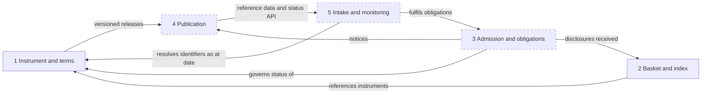
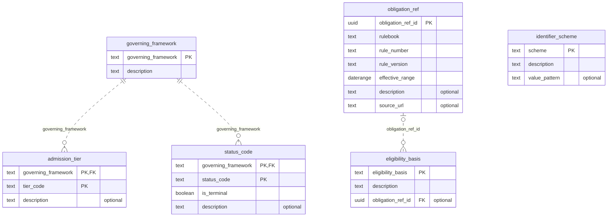
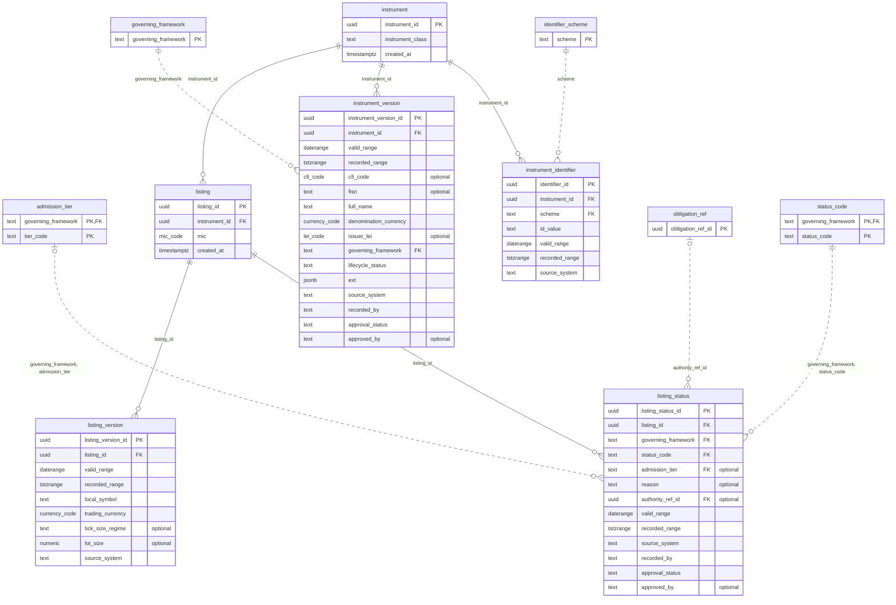
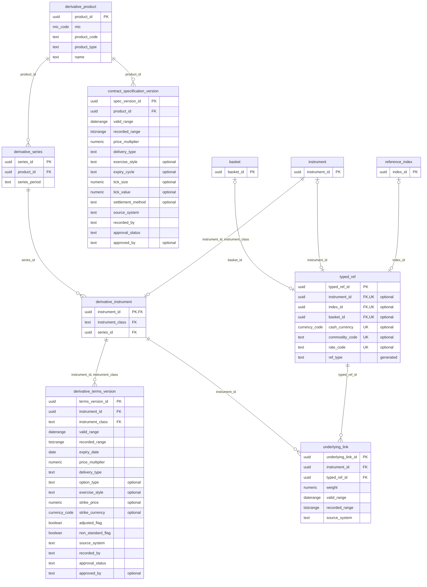
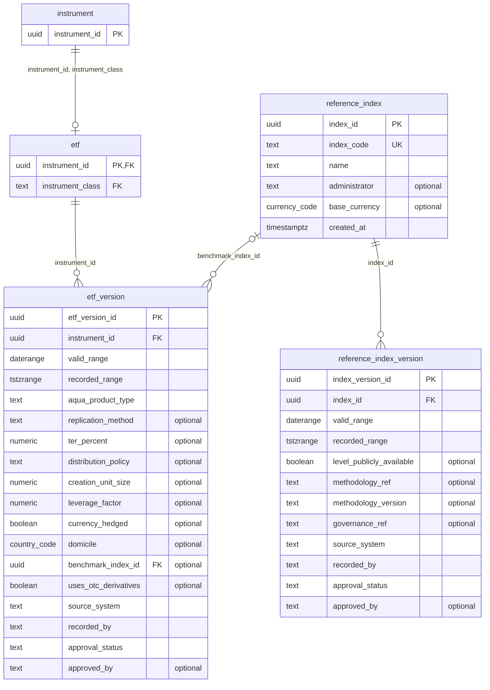
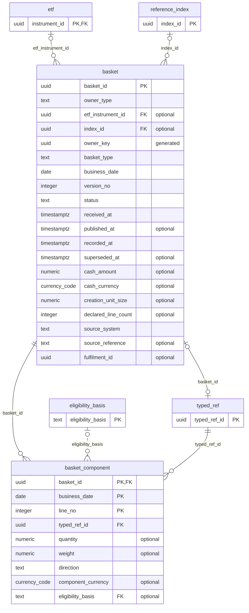

# Instrument reference data model: entity relationship diagrams

Covers context 1 (instrument and terms) and context 2 (basket and index composition), matching `instrument_reference_model.sql`. The diagrams were generated by applying that DDL to PostgreSQL 16 and reading keys and foreign keys from the catalog, so they match the delivered schema. Mermaid ER diagrams render natively on GitHub, GitLab and most Markdown viewers.

## Contents

1. [How to read the diagrams](#how-to-read-the-diagrams)
2. [Context map](#context-map)
3. [Overview of all entities](#overview-of-all-entities)
4. [Vocabularies and rules (ref)](#vocabularies-and-rules-ref)
5. [Instruments, identifiers and listings](#instruments-identifiers-and-listings)
6. [Derivatives and typed references](#derivatives-and-typed-references)
7. [ETFs and indices](#etfs-and-indices)
8. [Baskets](#baskets)
9. [Rules that apply across the model](#rules-that-apply-across-the-model)
10. [Functions and views](#functions-and-views)
11. [Not yet modelled](#not-yet-modelled)

## How to read the diagrams

- `PK`, `FK` and `UK` mark primary keys, foreign keys and single-column unique keys. `optional` means the column is nullable. `generated` means the database computes it.
- A solid line is a relationship between operational tables. A dotted line is a lookup to a vocabulary in the `ref` schema.
- Entities shown with only their key are context, drawn from another diagram.
- **Bitemporal tables** carry `valid_range` (a `daterange`, when the fact applies in the world, upper bound exclusive) and `recorded_range` (a `tstzrange`, when the operator held that version, open upper bound means current).
- Domain types keep their names, for example `currency_code` (ISO 4217), `mic_code` (ISO 10383), `lei_code` (ISO 17442) and `cfi_code` (ISO 10962). All are text underneath.

## Context map

Contexts 1 and 2 are built. Contexts 3 to 5 are designed but not yet in the DDL, and are drawn dashed.

## Overview of all entities

All 25 tables with keys only. The detailed diagrams follow, and the same content is available as standalone files: `data-model-overview.mermaid` and `data-model-detailed.mermaid`.

```mermaid
erDiagram
    admission_tier |o..o{ listing_status : "governing_framework, admission_tier"
    basket ||--o{ basket_component : "basket_id"
    basket |o--o| typed_ref : "basket_id"
    derivative_instrument ||--o{ derivative_terms_version : "instrument_id, instrument_class"
    derivative_instrument ||--o{ underlying_link : "instrument_id"
    derivative_product ||--o{ contract_specification_version : "product_id"
    derivative_product ||--o{ derivative_series : "product_id"
    derivative_series ||--o{ derivative_instrument : "series_id"
    eligibility_basis |o..o{ basket_component : "eligibility_basis"
    etf |o--o{ basket : "etf_instrument_id"
    etf ||--o{ etf_version : "instrument_id"
    governing_framework ||..o{ admission_tier : "governing_framework"
    governing_framework ||..o{ instrument_version : "governing_framework"
    governing_framework ||..o{ status_code : "governing_framework"
    identifier_scheme ||..o{ instrument_identifier : "scheme"
    instrument ||--o| derivative_instrument : "instrument_id, instrument_class"
    instrument ||--o| etf : "instrument_id, instrument_class"
    instrument ||--o{ instrument_identifier : "instrument_id"
    instrument ||--o{ instrument_version : "instrument_id"
    instrument ||--o{ listing : "instrument_id"
    instrument |o--o| typed_ref : "instrument_id"
    listing ||--o{ listing_status : "listing_id"
    listing ||--o{ listing_version : "listing_id"
    obligation_ref |o..o{ eligibility_basis : "obligation_ref_id"
    obligation_ref |o..o{ listing_status : "authority_ref_id"
    reference_index |o--o{ basket : "index_id"
    reference_index |o--o{ etf_version : "benchmark_index_id"
    reference_index ||--o{ reference_index_version : "index_id"
    reference_index |o--o| typed_ref : "index_id"
    status_code ||..o{ listing_status : "governing_framework, status_code"
    typed_ref ||--o{ basket_component : "typed_ref_id"
    typed_ref ||--o{ underlying_link : "typed_ref_id"
    basket {
        uuid basket_id PK
        uuid etf_instrument_id FK
        uuid index_id FK
    }
    basket_component {
        uuid basket_id PK, FK
        date business_date PK
        integer line_no PK
        uuid typed_ref_id FK
        text eligibility_basis FK
    }
    contract_specification_version {
        uuid spec_version_id PK
        uuid product_id FK
    }
    derivative_instrument {
        uuid instrument_id PK, FK
        text instrument_class FK
        uuid series_id FK
    }
    derivative_product {
        uuid product_id PK
    }
    derivative_series {
        uuid series_id PK
        uuid product_id FK
    }
    derivative_terms_version {
        uuid terms_version_id PK
        uuid instrument_id FK
        text instrument_class FK
    }
    etf {
        uuid instrument_id PK, FK
        text instrument_class FK
    }
    etf_version {
        uuid etf_version_id PK
        uuid instrument_id FK
        uuid benchmark_index_id FK
    }
    instrument {
        uuid instrument_id PK
    }
    instrument_identifier {
        uuid identifier_id PK
        uuid instrument_id FK
        text scheme FK
    }
    instrument_version {
        uuid instrument_version_id PK
        uuid instrument_id FK
        text governing_framework FK
    }
    listing {
        uuid listing_id PK
        uuid instrument_id FK
    }
    listing_status {
        uuid listing_status_id PK
        uuid listing_id FK
        text governing_framework FK
        text status_code FK
        text admission_tier FK
        uuid authority_ref_id FK
    }
    listing_version {
        uuid listing_version_id PK
        uuid listing_id FK
    }
    reference_index {
        uuid index_id PK
        text index_code UK
    }
    reference_index_version {
        uuid index_version_id PK
        uuid index_id FK
    }
    typed_ref {
        uuid typed_ref_id PK
        uuid instrument_id FK, UK
        uuid index_id FK, UK
        uuid basket_id FK, UK
        currency_code cash_currency UK
        text commodity_code UK
        text rate_code UK
    }
    underlying_link {
        uuid underlying_link_id PK
        uuid instrument_id FK
        uuid typed_ref_id FK
    }
    admission_tier {
        text governing_framework PK, FK
        text tier_code PK
    }
    eligibility_basis {
        text eligibility_basis PK
        uuid obligation_ref_id FK
    }
    governing_framework {
        text governing_framework PK
    }
    identifier_scheme {
        text scheme PK
    }
    obligation_ref {
        uuid obligation_ref_id PK
    }
    status_code {
        text governing_framework PK, FK
        text status_code PK
    }
```

## Vocabularies and rules (ref)

Small lookup tables held as data, so new frameworks, statuses, identifier schemes and eligibility categories need no schema change.

| Entity | Purpose | Notable rules |
|---|---|---|
| `ref.governing_framework` | Rulebook or regime an instrument is admitted under. | Seeded with illustrative values: LISTING_RULES, AQUA_RULES, ASX24_OPERATING_RULES, ASX_MARKET_ETO. |
| `ref.admission_tier` | Framework-specific admission tiers. | Seeded for AQUA_RULES: TRADING_STATUS, QUOTE_DISPLAY_BOARD, MFUND_SETTLEMENT. |
| `ref.status_code` | Framework-specific status vocabulary. | Composite key (framework, status). is_terminal marks end states. EXPIRED and SETTLED are seeded for the derivative frameworks only. |
| `ref.identifier_scheme` | Identifier schemes with an optional validation pattern. | The pattern is enforced by a trigger on insert into instrument_identifier. |
| `ref.eligibility_basis` | Categories used to test each basket component for eligibility. | Optional link to the rule that defines the category. |
| `ref.obligation_ref` | Pointer to one version of a rule: rulebook, rule number, version and effective date range. | Unique on (rulebook, rule_number, rule_version). Referenced by listing_status and eligibility_basis. |

## Instruments, identifiers and listings

A stable instrument identity with bitemporal versions, identifiers and venue listings. Status history sits on the listing and is restricted to the framework's own vocabulary.

| Entity | Purpose | Notable rules |
|---|---|---|
| `core.instrument` | Stable identity of an instrument and its class. | instrument_class is EQUITY, ETF, FUTURE or OPTION. Unique (instrument_id, instrument_class) lets subtype tables enforce their class through a composite foreign key. |
| `core.instrument_version` | Bitemporal descriptive attributes: CFI, FISN, name, denomination currency, issuer LEI, governing framework, lifecycle status. | Namespaced extension block in ext (jsonb object). Approved rows cannot overlap in valid and recorded time. Maker-checker through approval_status. |
| `core.instrument_identifier` | Bitemporal identifiers by scheme (ISIN, exchange codes, option codes, natural keys). | An identifier value maps to at most one instrument at any point in valid and recorded time. Pattern checked on insert. |
| `core.listing` | An instrument's presence on a venue, identified by MIC. | Unique (instrument_id, mic). Tickers live on the version, never as keys. |
| `core.listing_version` | Bitemporal local symbol, trading currency, optional tick regime and lot size. | No overlap per listing. |
| `core.listing_status` | Bitemporal status and admission tier under a governing framework. | Composite foreign keys restrict status and tier to the framework's vocabulary. Optional rule reference. Maker-checker. |

## Derivatives and typed references

Product, series and instrument levels for futures and options, with effective-dated terms. Underliers use the typed reference, so an option can be written on an ETF, an index or another instrument.

| Entity | Purpose | Notable rules |
|---|---|---|
| `core.derivative_product` | Exchange product or class: venue, product code and type (FUTURE or OPTION). | Unique (mic, product_code, product_type). |
| `core.contract_specification_version` | Bitemporal product-level defaults: price multiplier, delivery type, exercise style, expiry cycle, tick size and value, settlement method. | A series or instrument can override through its own terms. |
| `core.derivative_series` | An expiry series within a product. | Unique (product_id, series_period). |
| `core.derivative_instrument` | Registers a FUTURE or OPTION instrument against its series. | Composite foreign key to instrument enforces the class. |
| `core.derivative_terms_version` | Bitemporal contract terms: expiry, multiplier, delivery type, option type, exercise style, strike and currency, adjusted and non-standard flags. | A check requires the option fields for options and forbids them for futures. Terms changed by a corporate action are new versions. |
| `core.underlying_link` | Bitemporal weighted link from a derivative to what it is written on. | Points at typed_ref. A trigger rejects a derivative being its own underlying. |
| `core.typed_ref` | Typed pointer with exactly one target: instrument, index, basket, cash currency, commodity or rate. | ref_type is generated. One row per target. Shared by underlyings and basket lines, so referential integrity holds for every type. |

## ETFs and indices

ETF terms and index compliance attributes, both bitemporal. The ETF subtype table forces the instrument class to ETF.

| Entity | Purpose | Notable rules |
|---|---|---|
| `core.etf` | Registers an ETF instrument. | Composite foreign key forces the class to ETF. |
| `core.etf_version` | Bitemporal ETF terms: AQUA product type, replication method, TER, distribution policy, creation unit size, leverage, currency hedging, domicile, benchmark index, OTC derivative use. | A negative leverage_factor denotes an inverse product. |
| `core.reference_index` | Stable identity of an index. | Unique index_code. |
| `core.reference_index_version` | Bitemporal index compliance attributes: public availability of the level, methodology reference and version, governance reference. | Maker-checker. Approved rows cannot overlap. |

## Baskets

Immutable composition snapshots per owner, basket type and business date. A correction is a new version that supersedes the earlier one.

| Entity | Purpose | Notable rules |
|---|---|---|
| `basket.basket` | Immutable composition snapshot header. | Owner is exactly one of ETF or index, and BENCHMARK baskets belong to indices only. One current (non-superseded) version per owner, type and business date. Only publication state may change. |
| `basket.basket_component` | Basket lines, range-partitioned by business_date. | Each line points at a typed_ref and carries quantity and/or weight, direction and an eligibility basis. Lines are frozen once the basket leaves DRAFT. |

## Rules that apply across the model

- **Append-only versions.** Every bitemporal table rejects deletes and rejects updates other than closing `recorded_range` (and completing approval). A correction closes the old row and inserts a replacement.
- **Maker-checker.** Rows start `PENDING`. Only `APPROVED` rows take part in the no-overlap guarantees and the as-of functions.
- **No overlaps.** Exclusion constraints stop two approved versions of the same thing overlapping in both valid and recorded time. They need the `btree_gist` extension.
- **Subtypes keep their class.** `etf` and `derivative_instrument` reference `instrument` through `(instrument_id, instrument_class)`, so a row cannot be attached to an instrument of the wrong class.
- **Exchange codes are identifiers, not keys.** Tickers, ISINs and option codes live in `instrument_identifier` and `listing_version`, so a change of code never rewrites keys.
- **Baskets are evidence.** Headers are immutable apart from publication state, and lines are frozen after the basket leaves `DRAFT`.

## Functions and views

| Object | Purpose |
|---|---|
| `core.instrument_as_of(valid_on, known_at)` | Approved instrument versions valid on a date, as known at a point in time. |
| `core.resolve_identifier(scheme, value, valid_on, known_at)` | The instrument an identifier pointed to, with its version when one exists. |
| `core.v_instrument_current` | Each instrument with its current approved version. |
| `basket.v_basket_totals` | Line count and weight sum per basket, for completeness checks. |
| `basket.ensure_month_partition(month)` | Creates the monthly partition of `basket_component`. |

## Not yet modelled

- **Admission and obligations (context 3).** Issuer approval, admission applications, determinations, status actions, obligation instances and fulfilments. `basket.fulfilment_id` is reserved for the fulfilment foreign key.
- **Publication (context 4).** Operator notices and versioned reference data releases.
- **Intake and monitoring (context 5).** Participants and roles, report definitions, submissions, resolutions, validation results, findings and cases.
