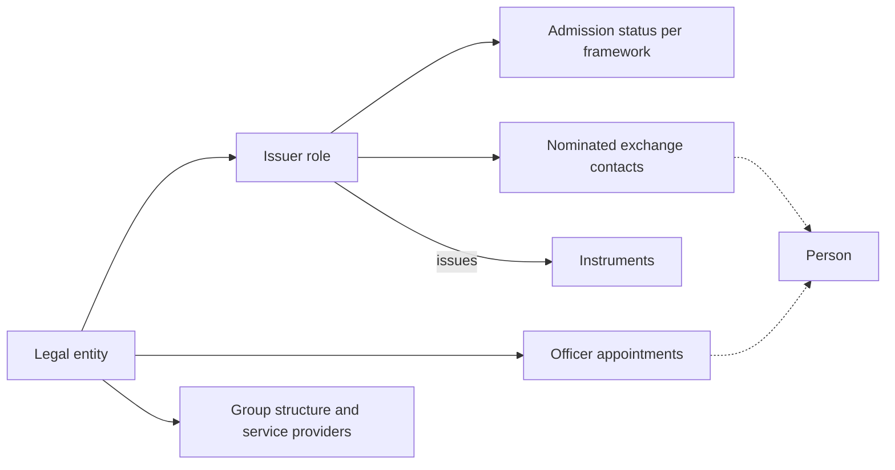
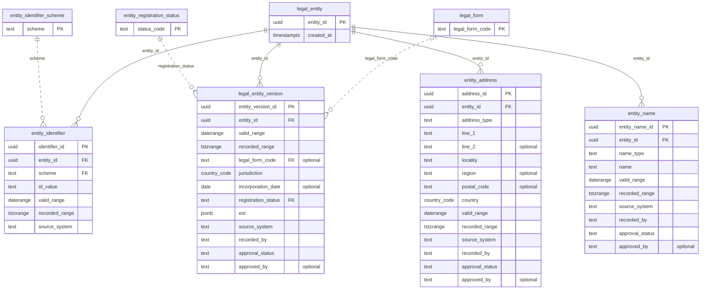
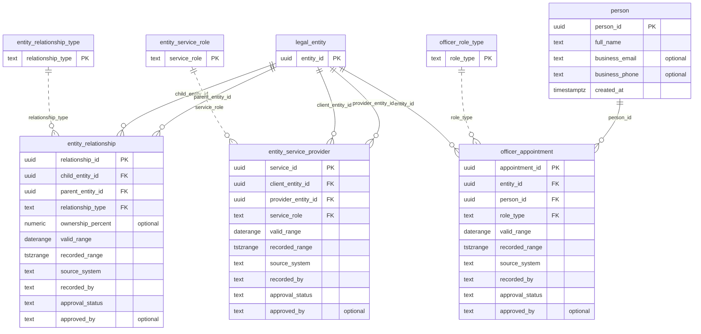

# Issuer reference data model: entity relationship diagrams

Models an issuer, typically a company listed on the exchange, matching `issuer_reference_model.sql`. It builds on the instrument model (`instrument_reference_model.sql`, documented in `data-model.md`) and follows the same conventions. The diagrams were generated by applying both DDL files to PostgreSQL 16 and reading keys and foreign keys from the catalog, so they match the delivered schema.

## Contents

1. [How to read the diagrams](#how-to-read-the-diagrams)
2. [How the pieces fit](#how-the-pieces-fit)
3. [Overview of all entities](#overview-of-all-entities)
4. [Vocabularies (ref)](#vocabularies-ref)
5. [Legal entity core](#legal-entity-core)
6. [Group structure, service providers and people](#group-structure-service-providers-and-people)
7. [Issuer role and admission](#issuer-role-and-admission)
8. [What is recorded at entity, security and session level](#what-is-recorded-at-entity-security-and-session-level)
9. [Rules that apply across the model](#rules-that-apply-across-the-model)
10. [Views](#views)
11. [Not yet modelled](#not-yet-modelled)

## How to read the diagrams

- `PK`, `FK` and `UK` mark primary keys, foreign keys and single-column unique keys. `optional` means the column is nullable. `generated` means the database computes it.
- A solid line is a relationship between operational tables. A dotted line is a lookup to a vocabulary in the `ref` schema.
- Entities shown with only their key are context, drawn from another diagram or from the instrument model.
- **Bitemporal tables** carry `valid_range` (a `daterange`, when the fact applies in the world, upper bound exclusive) and `recorded_range` (a `tstzrange`, when the operator held that version, open upper bound means current).
- Two schemas are new. `party` is the legal entity master. `issuer` is the issuer role and its relationship with the exchange.

## How the pieces fit

## Overview of all entities

All 25 new tables with keys only, plus three tables from the instrument model for context. The same content is available as standalone files: `issuer-data-model-overview.mermaid` and `issuer-data-model-detailed.mermaid`.

```mermaid
erDiagram
    classification_scheme ||..o{ issuer_classification : "scheme"
    entity_identifier_scheme ||..o{ entity_identifier : "scheme"
    entity_registration_status ||..o{ legal_entity_version : "registration_status"
    entity_relationship_type ||..o{ entity_relationship : "relationship_type"
    entity_service_role ||..o{ entity_service_provider : "service_role"
    governing_framework ||..o{ issuer_status_code : "governing_framework"
    instrument ||--o{ instrument_issuer : "instrument_id"
    instrument_party_role ||..o{ instrument_issuer : "party_role"
    issuer ||--o{ instrument_issuer : "issuer_id"
    issuer ||--o{ issuer_classification : "issuer_id"
    issuer ||--o{ issuer_status : "issuer_id"
    issuer ||--o{ issuer_version : "issuer_id"
    issuer ||--o{ nominated_exchange_contact : "issuer_id"
    issuer_status_code ||..o{ issuer_status : "governing_framework, status_code"
    legal_entity ||--o{ entity_address : "entity_id"
    legal_entity ||--o{ entity_identifier : "entity_id"
    legal_entity ||--o{ entity_name : "entity_id"
    legal_entity ||--o{ entity_relationship : "child_entity_id"
    legal_entity ||--o{ entity_relationship : "parent_entity_id"
    legal_entity ||--o{ entity_service_provider : "client_entity_id"
    legal_entity ||--o{ entity_service_provider : "provider_entity_id"
    legal_entity ||--o| issuer : "entity_id"
    legal_entity ||--o{ legal_entity_version : "entity_id"
    legal_entity ||--o{ officer_appointment : "entity_id"
    legal_form |o..o{ legal_entity_version : "legal_form_code"
    listing_category |o..o{ issuer_status : "listing_category"
    obligation_ref |o..o{ issuer_status : "authority_ref_id"
    officer_role_type ||..o{ officer_appointment : "role_type"
    person ||--o{ nominated_exchange_contact : "person_id"
    person ||--o{ officer_appointment : "person_id"
    entity_address {
        uuid address_id PK
        uuid entity_id FK
    }
    entity_identifier {
        uuid identifier_id PK
        uuid entity_id FK
        text scheme FK
    }
    entity_name {
        uuid entity_name_id PK
        uuid entity_id FK
    }
    entity_relationship {
        uuid relationship_id PK
        uuid child_entity_id FK
        uuid parent_entity_id FK
        text relationship_type FK
    }
    entity_service_provider {
        uuid service_id PK
        uuid client_entity_id FK
        uuid provider_entity_id FK
        text service_role FK
    }
    legal_entity {
        uuid entity_id PK
    }
    legal_entity_version {
        uuid entity_version_id PK
        uuid entity_id FK
        text legal_form_code FK
        text registration_status FK
    }
    officer_appointment {
        uuid appointment_id PK
        uuid entity_id FK
        uuid person_id FK
        text role_type FK
    }
    person {
        uuid person_id PK
    }
    instrument_issuer {
        uuid instrument_issuer_id PK
        uuid instrument_id FK
        uuid issuer_id FK
        text party_role FK
    }
    issuer {
        uuid issuer_id PK
        uuid entity_id FK, UK
    }
    issuer_classification {
        uuid classification_id PK
        uuid issuer_id FK
        text scheme FK
    }
    issuer_status {
        uuid issuer_status_id PK
        uuid issuer_id FK
        text governing_framework FK
        text status_code FK
        text listing_category FK
        uuid authority_ref_id FK
    }
    issuer_version {
        uuid issuer_version_id PK
        uuid issuer_id FK
    }
    nominated_exchange_contact {
        uuid contact_id PK
        uuid issuer_id FK
        uuid person_id FK
    }
    entity_identifier_scheme {
        text scheme PK
    }
    legal_form {
        text legal_form_code PK
    }
    entity_registration_status {
        text status_code PK
    }
    entity_relationship_type {
        text relationship_type PK
    }
    entity_service_role {
        text service_role PK
    }
    officer_role_type {
        text role_type PK
    }
    classification_scheme {
        text scheme PK
    }
    listing_category {
        text listing_category PK
    }
    instrument_party_role {
        text party_role PK
    }
    issuer_status_code {
        text governing_framework PK, FK
        text status_code PK
    }
    instrument {
        uuid instrument_id PK
    }
    governing_framework {
        text governing_framework PK
    }
    obligation_ref {
        uuid obligation_ref_id PK
    }
```

## Vocabularies (ref)

Held as data, so new roles, statuses and categories need no schema change. Seed values are illustrative and must be aligned with the operator's own vocabulary and the current rulebooks.

| Table | Purpose | Seeded values |
|---|---|---|
| `ref.entity_identifier_scheme` | Entity identifier schemes with a validation pattern. | LEI, ABN, ACN, ARBN, INTERNAL |
| `ref.legal_form` | Legal forms, with an optional ISO 20275 code. | PUBLIC_COMPANY, PROPRIETARY_COMPANY, FOREIGN_COMPANY, TRUST, MANAGED_INVESTMENT_SCHEME, PARTNERSHIP, OTHER |
| `ref.entity_registration_status` | Registration status of the legal entity. | ACTIVE, IN_ADMINISTRATION, IN_LIQUIDATION, DEREGISTERED |
| `ref.entity_relationship_type` | Parent relationship kinds. | DIRECT_PARENT, ULTIMATE_PARENT |
| `ref.entity_service_role` | Service provider roles. | AUDITOR, SHARE_REGISTRY, RESPONSIBLE_ENTITY, TRUSTEE |
| `ref.officer_role_type` | Officer roles. | DIRECTOR, CHAIR, CHIEF_EXECUTIVE, CHIEF_FINANCIAL_OFFICER, COMPANY_SECRETARY |
| `ref.classification_scheme` | Industry classification schemes. | GICS, ANZSIC |
| `ref.listing_category` | Categories of entities admitted to the official list. | ASX_LISTING, ASX_DEBT_LISTING, ASX_FOREIGN_EXEMPT_LISTING |
| `ref.instrument_party_role` | Roles an entity can play for an instrument. | ISSUER, RESPONSIBLE_ENTITY, INVESTMENT_MANAGER, TRUSTEE |
| `ref.issuer_status_code` | Entity-level status vocabulary per governing framework. | PROPOSED, APPROVED, ADMITTED, REMOVED, for LISTING_RULES and AQUA_RULES |

## Legal entity core

A stable identity for any legal entity, with bitemporal attributes, names, identifiers and addresses. The issuer is one role played by such an entity, so auditors, registries and later participants can reuse the same master.

| Entity | Purpose | Notable rules |
|---|---|---|
| `party.legal_entity` | Stable identity of any legal entity. | Reusable for auditors, registries and later participants. |
| `party.legal_entity_version` | Bitemporal legal form, jurisdiction, incorporation date and registration status. | Extension block in ext (jsonb object). Approved rows cannot overlap in valid and recorded time. Maker-checker through approval_status. |
| `party.entity_name` | Bitemporal names by type: legal, trading, former and short. | One legal name and one short name at a time. Trading and former names can repeat. |
| `party.entity_identifier` | Bitemporal identifiers by scheme: LEI, ABN, ACN, ARBN, internal. | An identifier value belongs to one entity at a time. Pattern checked on insert. |
| `party.entity_address` | Bitemporal addresses by type: registered office, principal place of business, postal. | One address per type at a time. |

## Group structure, service providers and people

Parent links, service providers and officer appointments. Natural persons are held in one mutable table, and every history table refers to them by identifier only.

| Entity | Purpose | Notable rules |
|---|---|---|
| `party.entity_relationship` | Bitemporal parent links seen from the child: direct or ultimate parent, with optional ownership percent. | One parent per relationship type at a time, so several direct parents are not representable. A check rejects an entity being its own parent. |
| `party.entity_service_provider` | Bitemporal link from a client entity to a provider in a role such as auditor, registry, responsible entity or trustee. | A check rejects self reference. For a trust, the responsible entity is the link that matters for directors, CEO and CFO. |
| `party.person` | Natural person with the minimum personal data: name, business email and phone. | Mutable on purpose so it can be corrected or erased. History tables carry person_id only. |
| `party.officer_appointment` | Bitemporal appointment of a person to a role on a legal entity. Valid time runs from appointment to cessation. | The same person, role and entity cannot overlap. |

## Issuer role and admission

The issuer role of a legal entity, its admission status under each governing framework, the people nominated to communicate with the exchange, and the link to the instruments it issued.

```mermaid
erDiagram
    classification_scheme ||..o{ issuer_classification : "scheme"
    instrument ||--o{ instrument_issuer : "instrument_id"
    instrument_party_role ||..o{ instrument_issuer : "party_role"
    issuer ||--o{ instrument_issuer : "issuer_id"
    issuer ||--o{ issuer_classification : "issuer_id"
    issuer ||--o{ issuer_status : "issuer_id"
    issuer ||--o{ issuer_version : "issuer_id"
    issuer ||--o{ nominated_exchange_contact : "issuer_id"
    issuer_status_code ||..o{ issuer_status : "governing_framework, status_code"
    legal_entity ||--o| issuer : "entity_id"
    listing_category |o..o{ issuer_status : "listing_category"
    obligation_ref |o..o{ issuer_status : "authority_ref_id"
    person ||--o{ nominated_exchange_contact : "person_id"
    issuer {
        uuid issuer_id PK
        uuid entity_id FK, UK
        timestamptz created_at
    }
    issuer_version {
        uuid issuer_version_id PK
        uuid issuer_id FK
        daterange valid_range
        tstzrange recorded_range
        currency_code reporting_currency "optional"
        int2 financial_year_end_month "optional"
        int2 financial_year_end_day "optional"
        mic_code home_exchange_mic "optional"
        text principal_activities "optional"
        text website_url "optional"
        jsonb ext
        text source_system
        text recorded_by
        text approval_status
        text approved_by "optional"
    }
    issuer_classification {
        uuid classification_id PK
        uuid issuer_id FK
        text scheme FK
        text code
        daterange valid_range
        tstzrange recorded_range
        text source_system
    }
    issuer_status {
        uuid issuer_status_id PK
        uuid issuer_id FK
        text governing_framework FK
        text status_code FK
        text listing_category FK "optional"
        text reason "optional"
        uuid authority_ref_id FK "optional"
        daterange valid_range
        tstzrange recorded_range
        text source_system
        text recorded_by
        text approval_status
        text approved_by "optional"
    }
    nominated_exchange_contact {
        uuid contact_id PK
        uuid issuer_id FK
        uuid person_id FK
        boolean is_primary
        date compliance_course_completed_on "optional"
        daterange valid_range
        tstzrange recorded_range
        text source_system
        text recorded_by
        text approval_status
        text approved_by "optional"
    }
    instrument_issuer {
        uuid instrument_issuer_id PK
        uuid instrument_id FK
        uuid issuer_id FK
        text party_role FK
        daterange valid_range
        tstzrange recorded_range
        text source_system
    }
    legal_entity {
        uuid entity_id PK
    }
    person {
        uuid person_id PK
    }
    instrument {
        uuid instrument_id PK
    }
    issuer_status_code {
        text governing_framework PK, FK
        text status_code PK
    }
    listing_category {
        text listing_category PK
    }
    classification_scheme {
        text scheme PK
    }
    obligation_ref {
        uuid obligation_ref_id PK
    }
    instrument_party_role {
        text party_role PK
    }
```

| Entity | Purpose | Notable rules |
|---|---|---|
| `issuer.issuer` | The issuer role of a legal entity. | One issuer per legal entity. |
| `issuer.issuer_version` | Bitemporal issuer attributes: reporting currency, financial year end, home exchange, principal activities, website. | Financial year end is a month and day together or neither. Home exchange matters for foreign exempt listings. |
| `issuer.issuer_classification` | Bitemporal industry classification by scheme. | One code per scheme at a time. Codes of licensed schemes are not seeded. |
| `issuer.issuer_status` | Bitemporal admission and removal status per governing framework, with listing category and rule reference. | One status per issuer and framework at a time. Listing category applies under LISTING_RULES only. The status must exist in that framework's vocabulary. |
| `issuer.nominated_exchange_contact` | Bitemporal nomination of a person responsible for communication with the exchange. | Several contacts allowed, at most one primary at a time. Records when the compliance course was completed. |
| `issuer.instrument_issuer` | Bitemporal link between an instrument and its issuer, in a party role. | Several issuers per instrument are allowed, for example for a stapled security. |

## What is recorded at entity, security and session level

The Listing Rules separate admission of an entity to the official list from quotation of its securities. The model follows that split, so a status lives at the level where the rules place it.

| Level | Fact | Where it lives |
|---|---|---|
| Entity | Admitted to, or removed from, the official list, and the listing category | `issuer.issuer_status` |
| Security | Quotation, suspension and reinstatement of a class of securities | `core.listing_status` (instrument model) |
| Session | A trading halt, which is not a suspension | Not modelled. It is a trading platform state |

Removal of an entity from the official list ends quotation of all its securities, so an entity-level removal should be reflected by terminal statuses on its instruments. The model does not enforce that link. It belongs in the admission and obligations context.

## Rules that apply across the model

- **Append-only history.** Every bitemporal table rejects deletes and rejects updates other than closing `recorded_range` (and completing approval). A correction closes the old row and inserts a replacement.
- **Maker-checker.** Rows start `PENDING`. Only `APPROVED` rows take part in the no-overlap guarantees and in the views.
- **Personal data is isolated.** Only `party.person` holds names and business contact details. Everything else refers to a person by `person_id`, so erasure or correction does not touch append-only history.
- **Category follows framework.** `listing_category` can only be set when the framework is `LISTING_RULES`, and a status must exist in that framework's vocabulary.
- **Stapled securities.** An instrument can have several issuer links, so the entities behind a stapled security are all representable.
- **Identifiers are values, not keys.** LEI, ABN, ACN and ARBN sit in `party.entity_identifier` with pattern checks, and one value cannot belong to two entities at once.

## Views

| View | Purpose |
|---|---|
| `issuer.v_issuer_current` | Each issuer with its current legal name, registration status and admission status per framework. |
| `issuer.v_admitted_issuers_without_nominated_contact` | Admitted issuers with no current nominated exchange contact, with their listing category so the requirement can be filtered by category. |
| `issuer.v_instrument_issuer_lei_mismatch` | Instruments whose ISO 20022 issuer LEI has no matching issuer link, either because the link is missing or because it points to an issuer with a different LEI. |

## Not yet modelled

- **Admission applications and determinations.** Assessment of admission criteria, decisions and conditions belong to the admission and obligations context. `issuer_status.authority_ref_id` points at the rule that governed a status change.
- **Continuous and periodic disclosure obligations** and their fulfilment.
- **Capital structure and corporate actions**, including securities on issue and changes to them.
- **Substantial holders and shareholder spread.** These are operational data rather than reference data.
- **Contact details beyond the person record**, and supervision assignments such as the operator's own account manager for an issuer.
