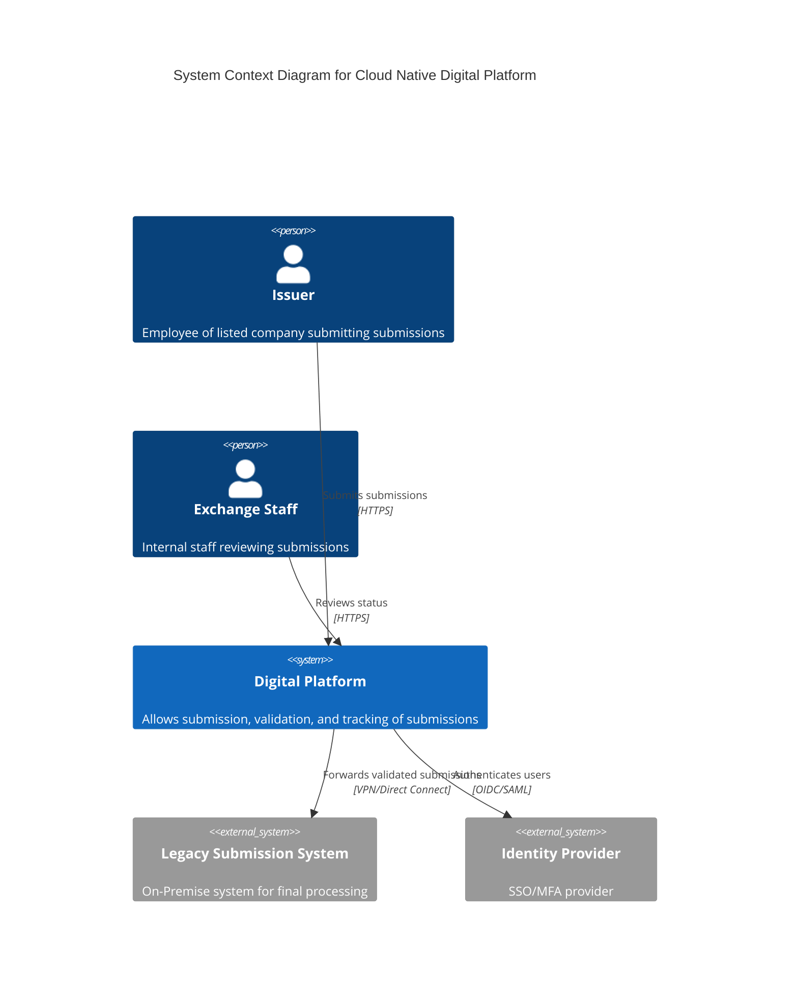
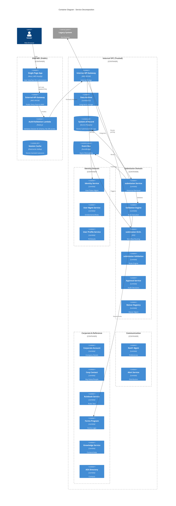
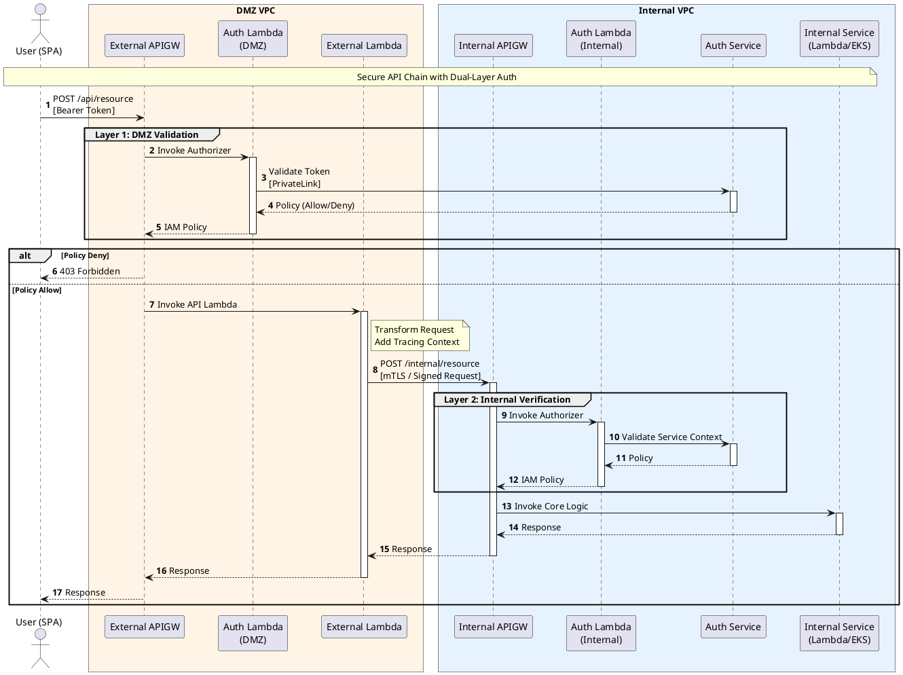

# Cloud Native Digital Platform Architecture

## 1. Executive Summary

This architecture specification outlines the design for a new Cloud Native Digital Platform enabling listed companies to submit regulatory submissions and announcements to the exchange. The platform is designed to provide a secure, scalable, and resilient ingestion channel that ensures Zero Data Loss (RPO=0) and strict compliance with regulatory standards through a segmented network topology.

## 2. Background

The exchange currently relies on legacy processes for handling submissions, which limits agility and scalability. As regulatory requirements evolve, there is a critical need for a modern digital channel that ensures data integrity, high availability, and seamless integration with existing processing systems.

Key drivers for this architecture include:
*   **Regulatory Compliance**: Ensuring immutable audit trails and guaranteed delivery.
*   **Security Segmentation**: Strict isolation between public-facing components and core processing logic.
*   **Modern User Experience**: Delivering a responsive, component-driven interface for issuers.

---

## 3. Strategic Alignment

The proposed architecture aligns with the exchange's broader strategic goals:

*   **Regulatory Compliance**: Adherence to strict financial industry standards for data protection and auditability.
*   **Cloud Modernisation**: Leveraging AWS managed services to reduce operational overhead and increase agility.
*   **Security First**: Implementing a Zero Trust model with network isolation (2-VPC strategy) and "Security by Design" principles.
*   **Operational Excellence**: Automating deployment and recovery to ensure high availability.

---

## 4. Architecture Principles

1.  **Zero Data Loss (RPO = 0)**: No submission shall be acknowledged as received until it is durably persisted in the internal system of record.
2.  **Security by Design**: The architecture enforces a "No Database in DMZ" rule, ensuring that the data layer is never directly exposed to the public internet.
3.  **Event-Driven**: Systems are decoupled via asynchronous events to improve resilience and scalability.
4.  **Immutable Infrastructure**: All compute resources are ephemeral and replaced rather than patched.
5.  **Fail-Safe Defaults**: The system defaults to rejecting invalid requests and failing closed to protect integrity.

---

## 5. Domain Driven Design (DDD) Model

The system is decomposed into the following Bounded Contexts:

### 5.1 Submission Context
*   **Responsibility**: Handling the ingestion, validation, and persistence of submission documents.
*   **Aggregates**: `Submission`, `Document`, `ValidationRule`.

### 5.2 Regulatory Context
*   **Responsibility**: Enforcing compliance rules and generating audit trails.
*   **Aggregates**: `AuditLog`, `ComplianceCheck`.

### 5.3 Notification Context
*   **Responsibility**: Managing communication back to the issuer (acknowledgements, status updates).
*   **Aggregates**: `Notification`, `Channel`.

### 5.4 Identity Context
*   **Responsibility**: Managing issuer authentication and authorisation.
*   **Aggregates**: `User`, `Session`, `Role`.

---

## 6. Business Capabilities

| Capability Group | Business Capability | Description |
| :--- | :--- | :--- |
| **Submission Management** | Submit submission | Secure upload of regulatory documents. |
| | Validate Submission | Real-time checks against regulatory business rules. |
| | Track Status | Visibility into the processing lifecycle of a submission. |
| **Compliance** | Audit Logging | Immutable recording of all user actions and system events. |
| | Archive Management | Long-term retention of submissions for regulatory purposes. |
| **Identity & Access** | Issuer Authentication | Secure login with Multi-Factor Authentication (MFA). |
| | Access Control | Role-based access to specific submission types. |

---

## 7. Current State

The existing environment is characterized by:
*   **Monolithic On-Premise Applications**: Tightly coupled systems that are difficult to update.
*   **Manual Processes**: Reliance on manual intervention for some validations.
*   **Limited Scalability**: Fixed infrastructure capacity that cannot handle burst load during reporting seasons.
*   **Network Flatness**: Insufficient segmentation between external-facing portals and internal processing.

---

## 8. Target State

The target architecture is a **Event-Driven Microservices** platform hosted on AWS, utilizing a 2-VPC strategy to maximize security.

### 8.1 Network Topology & Components

#### DMZ VPC (Public Zone)
*   **AWS Amplify**: Hosting the React SPA (Design System: Figma → Tailwind → React/Shadcn).
*   **External API Gateway**: Public entry point, handling rate limiting and WAF rules.
*   **DMZ Lambda**: Performs lightweight schema validation and session checks.
*   **Elasticache (ValKey)**: Stores transient session data and cache. **No database access**.

#### Internal VPC (Trusted Zone)
*   **Internal API Gateway**: Bridge between DMZ and Internal services.
*   **Internal Lambda**: Executes core business logic and persistence.
*   **Aurora Postgres**: The System of Record. Stores submissions and request logs.
*   **Amazon EventBridge**: Enterprise Service Bus for decoupling domains.
*   **EKS (Elastic Kubernetes Service)**: Hosts complex orchestration workflows and legacy bridges.
*   **Amazon SQS**: Provides durability buffering and retry queues.

#### On-Premise Integration
*   **Connectivity**: Direct Connect / VPN from Internal VPC only.
*   **Legacy Bridge**: Services running in EKS connect to on-premise submission processors.

### 8.2 Architecture Diagrams (C4 Model)

#### Level 1: System Context Diagram
The high-level interactions between external actors and the Digital Platform.

#### Level 2: Container Diagram (Detailed Service View)
Drill-down into the **Digital Platform** illustrating the 2-VPC Strategy and the decomposition of the Internal VPC into standalone microservices.

### 8.3 Service Catalog

The following services and operations have been identified as part of the core platform capabilities:

| Service Name | Operations |
| :--- | :--- |
| **Identity Service** | • Create new user • Generate token • Trigger creation of user identity context via SSO • Associate OpenID with user identity (PII) • Validate user identity (KYC status) |
| **User Management Service** | • Manage user entitlements (vehicle/company access) • Manage user roles/permissions • Manage user status • Capture user usage data |
| **User Profile Service** | • Manage ES/PII (Sensitive Info) • Manage email & contact details • Reset password • Manage MFA |
| **Notification Management Service** | • Manage communication channel preferences • Manage alerts/notification preferences • Manage user business relationships / subscriptions |
| **Alert/Notification Service** | • Manage alerts • Manage templates • Manage distribution |
| **Corporate Account Service** | • Manage company details • Manage Company Directors/Management Details • Retrieve company listing status |
| **Corporate Account Contact Service** | • Manage company key dates • Manage company calendar • Manage directors/management dates • Manage AMC lodgement dates |
| **Rulebook Service** | • Manage rulebook by chapter and rule number • Audit updates to rulebook • Search/Retrieve rulebook • Print rulebook |
| **Forms Program Service** | • Manage forms by code, rule number, category, date • Add validation rules |
| **Knowledge Service** | • Manage system knowledge base • Search/Retrieve knowledge base • Manage webinars/videos • Manage banners |
| **ASX Directory Service** | • Retrieve ASX Directory Contact details • Retrieve assigned listing adviser details • Retrieve assigned MAG contact details |
| **submission Orchestration Management** | • Routing of submission notification • Routing of submission workflow • Retrieve/Update submission status • Reject submission |
| **submission Validation Service** | • Validate announcement & market sensitivity • Scored price sensitivity • Verify submissions are correct • Suggest submission type based on content • Validate dependencies |
| **Approval Service** | • Determine if adviser approval is required • Capture approval decision and audit trail |
| **Submission Service** | • Validate sequencing of submission • Preview before submission • Save/Withdraw draft • Submit submission |
| **Submission Validation Engine** | • Execute config-driven validation rules • Load rules from Forms Program Service |
| Waiver Registry Service | • Waiver Search (by rulebook, rule number, company or date) • Retrieve Waiver (by rulebook, rule number, company or date) |
| **submission Service** | • Retrieve Historical submissions |
| **Data Archive Service** | • Archive historical submissions |

### 8.4 API Chaining & Authorisation Flow

The following PlantUML sequence diagram illustrates the secure interaction flow from the Client through to the Internal Services. This pattern enforces a "Defence in Depth" strategy by requiring authorisation at both the External and Internal network boundaries.

**Key Flow:**
1.  **Request**: User invokes External API (DMZ).
2.  **Auth Layer 1**: External APIGW triggers `Auth Lambda (DMZ)`, which verifies the token via `Auth Service`.
3.  **Handoff**: `External Lambda` transforms the request and invokes the `Internal API`.
4.  **Auth Layer 2**: Internal APIGW triggers `Auth Lambda (Int)`, which verifies the service-to-service context via `Auth Service`.
5.  **Execution**: Request is routed to the specific `Internal Service` (Lambda or Container).

---

## 9. Design Considerations

### 9.1 Patterns
*   **Transactional Outbox**: To guarantee event delivery, the Internal Lambda writes the submission and the event to Postgres in a single transaction. A background process publishes the event to EventBridge.
*   **Circuit Breaker**: Implemented in adapters to prevent cascading failures when downstream systems (e.g., On-Prem) are slow.
*   **Saga Pattern**: Manages distributed transactions across the Submission and Notification contexts.
*   **Configurable Validation**: Validation logic is decoupled from the Orchestrator. Rules are defined in the `Forms Program Service` and executed by the generic `Submission Validation Engine` to support diverse submission types without code changes.

### 9.2 Cloud Deployment
*   **Infrastructure as Code (IaC)**: All resources defined in Terraform/CDK.
*   **Blue/Green Deployment**: Utilized for EKS and Lambda updates to ensure zero downtime.
*   **Container Strategy**: Long-running/Complex workloads on EKS; Short-lived/Burst workloads on Lambda.

### 9.3 Extensibility
*   **API-First**: All capabilities exposed via documented REST APIs.
*   **Future Protocols**: Architecture supports easy addition of GraphQL (for composite frontends) or gRPC (for high-performance low-latency internal comms) behind the API Gateways.

### 9.4 Availability (Critical)
*   **Multi-AZ**: All Persistence (Aurora), Compute (EKS/Lambda), and Messaging (SQS/EventBridge) spanned across 3 Availability Zones.
*   **Zero RPO Buffering**:
    *   Synchronous persistence to Aurora before client acknowledgement.
    *   If On-Prem is down, data is safe in Aurora + SQS, and retried automatically.
*   **Graceful Degradation**: If non-critical services (e.g., Notification) fail, the core submission flow continues, and notifications are queued for later delivery.