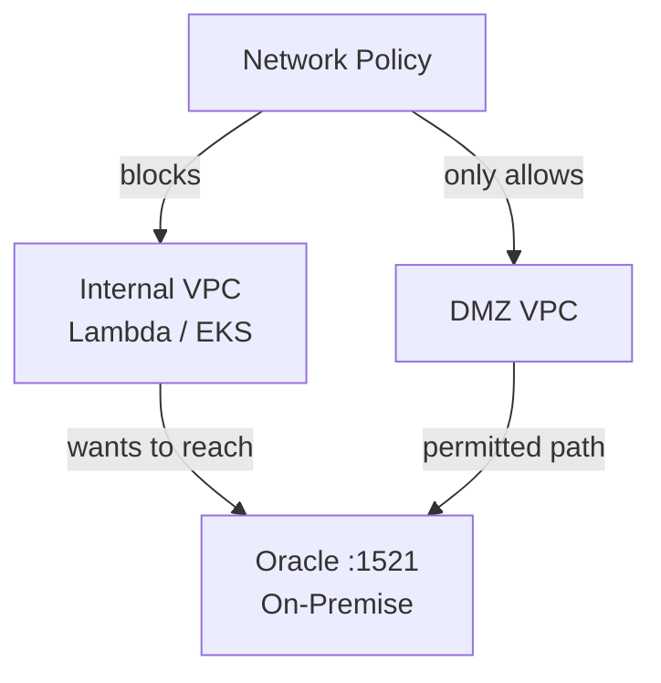
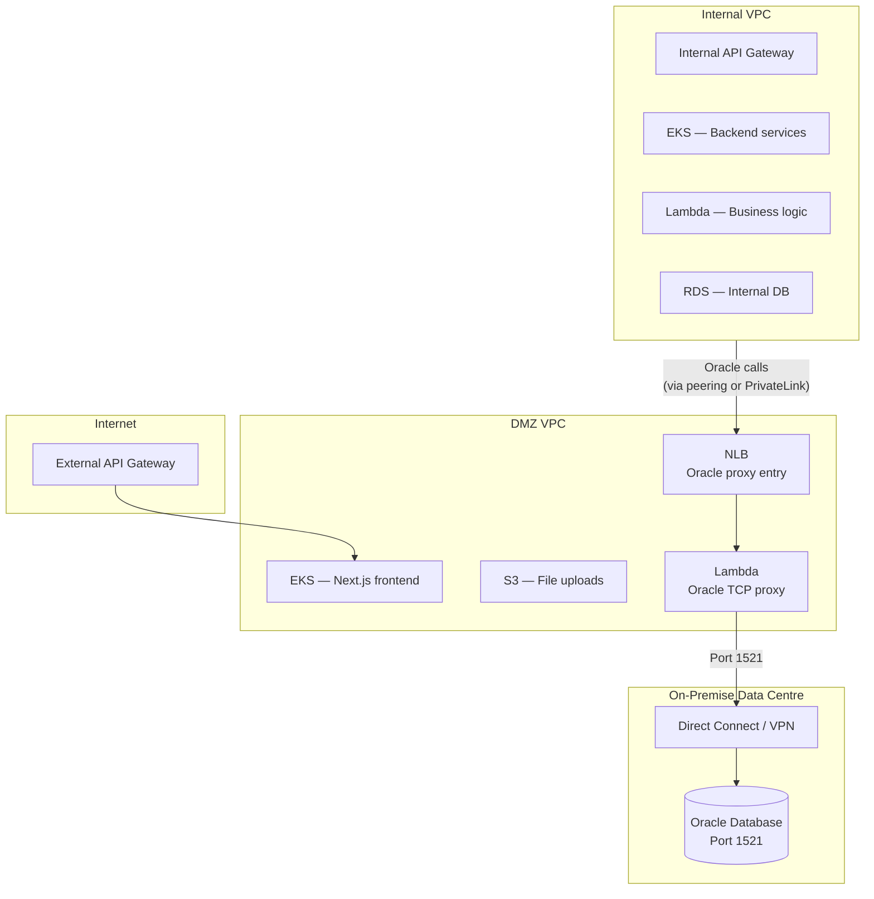
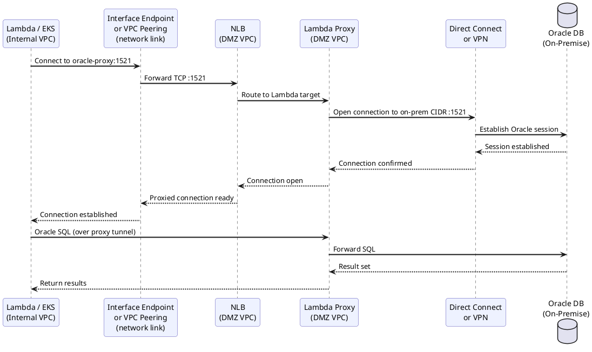
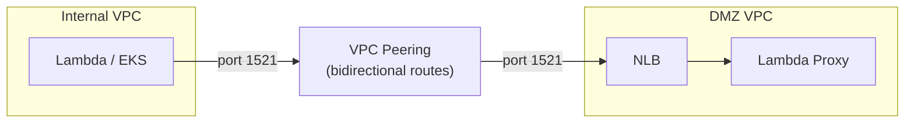
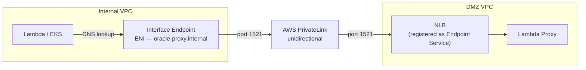
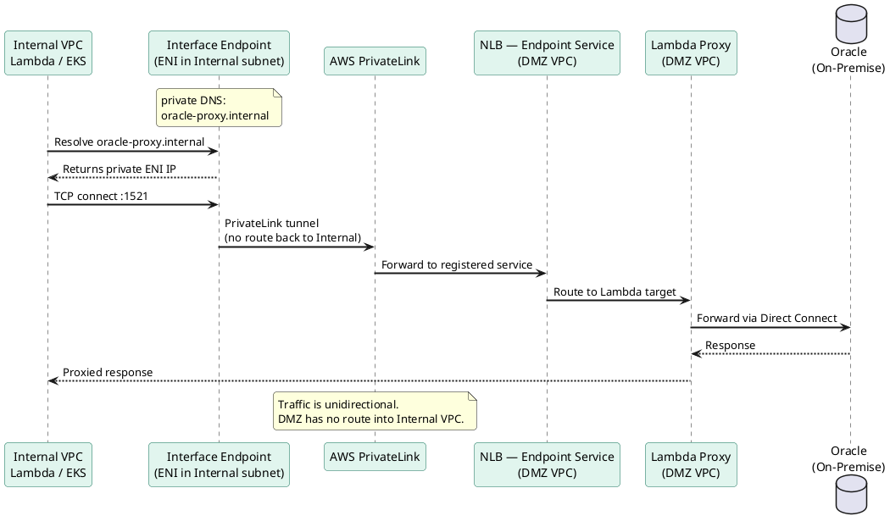
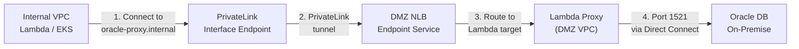

# AWS VPC Architecture — Oracle On-Premise Connectivity

## Overview

This document describes the recommended architecture for connecting an Internal VPC to an on-premise Oracle database, given that network policy only permits traffic to the on-premise environment from the DMZ VPC. Two connectivity options are evaluated: VPC Peering and AWS PrivateLink.

---

## Architecture Context — Bulkhead Pattern

The environment uses two VPCs in a bulkhead configuration:

- **DMZ VPC** — internet-facing, hosts the external API Gateway, an EKS cluster running Next.js frontend containers, and an S3 bucket for file uploads.
- **Internal VPC** — private, hosts an internal API Gateway, EKS for backend services, Lambda functions (TypeScript), and an RDS database.

The on-premise data centre hosts an Oracle database (port 1521). Due to network policy, only traffic originating from the DMZ VPC is permitted to reach this database.

---

## The Core Problem

The Internal VPC cannot reach the on-premise Oracle database directly. All Oracle traffic must be **proxied through the DMZ VPC**, which then connects to on-premise via AWS Direct Connect or a Site-to-Site VPN.

---

## Solution — DMZ Proxy Architecture

Traffic flows as follows:

1. A service in the Internal VPC (Lambda or EKS pod) initiates a connection to Oracle.
2. The connection is routed into the DMZ VPC via a network link (Peering or PrivateLink — see options below).
3. A Lambda function in the DMZ VPC acts as a TCP proxy, receiving the connection on port 1521.
4. The DMZ Lambda forwards the connection to the on-premise Oracle instance via Direct Connect or VPN.

### Full Architecture Diagram

### Proxy Call Sequence

---

## Connectivity Options

### Option 1 — VPC Peering

VPC Peering creates a direct, two-way routing relationship between the Internal and DMZ VPCs. Routes are added to each VPC's route table, and security groups control what traffic is permitted.

**Security group rules required:**

| Resource | Inbound | Outbound |
|---|---|---|
| Lambda / EKS (Internal) | — | Port 1521 → DMZ NLB IP |
| NLB (DMZ) | Port 1521 from Internal CIDR | — |
| Lambda proxy (DMZ) | Port 1521 from NLB | Port 1521 → on-prem CIDR |

**Considerations:**

- Bidirectional routing is established by default — traffic could flow from DMZ into Internal VPC if security groups drift.
- CIDR ranges between VPCs must not overlap.
- Simpler to configure; fewer AWS components.
- Suitable for lower-traffic workloads or where PrivateLink costs are a concern.

---

### Option 2 — AWS PrivateLink (Recommended)

AWS PrivateLink exposes the DMZ NLB as a **VPC Endpoint Service**. The Internal VPC connects to it via an **Interface Endpoint** — an ENI provisioned in the Internal subnet with a private IP address. Traffic flows strictly one-way: Internal → DMZ. There is no return route into the Internal VPC.

### PrivateLink Connection Sequence

**Security group rules required:**

| Resource | Inbound | Outbound |
|---|---|---|
| Interface Endpoint (Internal) | Port 1521 from Lambda / EKS SG | — |
| NLB (DMZ) | Port 1521 from PrivateLink | — |
| Lambda proxy (DMZ) | Port 1521 from NLB | Port 1521 → on-prem CIDR |

---

## Comparison

| Criteria | VPC Peering | AWS PrivateLink |
|---|---|---|
| **Traffic direction** | Bidirectional (routes both ways) | Strictly unidirectional |
| **Bulkhead integrity** | Weaker — DMZ can route into Internal if SGs drift | Strong — no return route exists by design |
| **CIDR overlap** | Not supported — CIDRs must be unique | Supported — no IP conflict risk |
| **DNS integration** | Manual (use NLB DNS name) | Private DNS — endpoint resolves to a friendly name |
| **Setup complexity** | Low — route tables + security groups | Moderate — Endpoint Service + Interface Endpoint |
| **Cost** | No hourly charge; data transfer billed | ~$0.01/hr per endpoint + per-GB data transfer |
| **Scalability** | Scales with VPC routing | Scales automatically via NLB |
| **Account boundary support** | Same-account only (without sharing) | Cross-account supported natively |
| **Recommended for** | Simple setups, cost-sensitive workloads | Production, compliance-sensitive, or multi-account environments |

---

## Recommendation

**Use AWS PrivateLink** for production deployments. The bulkhead pattern's purpose is strict traffic isolation, and PrivateLink enforces that isolation at the network layer rather than relying on security group configuration staying correct over time. The additional cost is negligible for most transactional Oracle workloads.

VPC Peering remains a viable choice for development environments or where the additional PrivateLink overhead is not justified.

---

## Lambda Proxy Notes

The Lambda proxy function runs in a private subnet of the DMZ VPC. It is implemented in TypeScript using Node's `net` module for raw TCP forwarding, or the `oracledb` npm package if connection pooling is required.

**Important constraint:** Lambda has a maximum execution timeout of 15 minutes. If your workload involves long-lived Oracle sessions (e.g. batch jobs with open cursors), replace the Lambda proxy with an EC2-based proxy (such as `socat` or a Node.js service) running in an Auto Scaling Group within the DMZ VPC. The NLB target group registration and PrivateLink/Peering configuration remain unchanged.

---

## Network Path Summary

