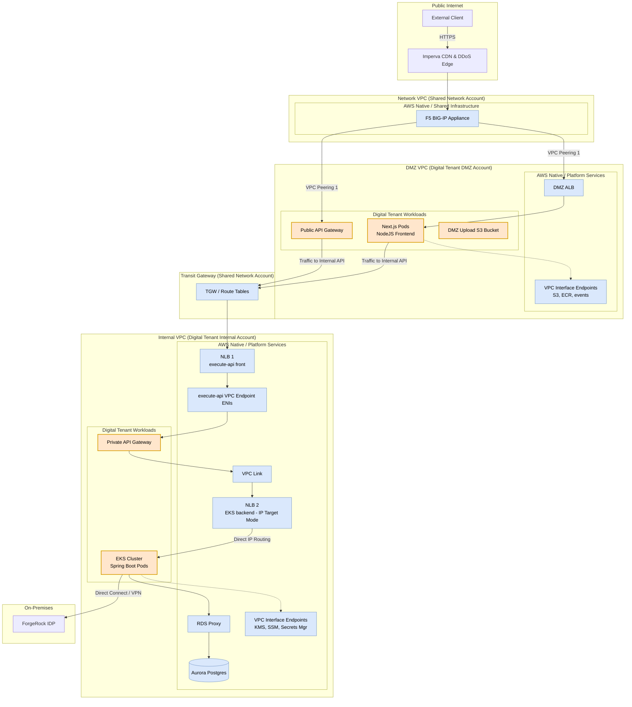

# AWS Platform Architecture Review & Implementation Guide
## Digital Tenant · SDLC (Dev / QA / UAT / Prod) · Transit Gateway Topology

## Summary Assessment
The architecture adopts defence-in-depth correctly with a DMZ / Internal account boundary, PrivateLink for AWS service traffic, and GuardDuty malware scanning for untrusted uploads. Transit Gateway replaces the DMZ-to-Internal VPC Peering connection, providing a scalable hub-and-spoke routing model across all SDLC environments with per-environment isolation enforced at the TGW route table level.

| Domain | Status | Key Finding |
|---|---|---|
| **Multi-account boundary model** | APPROVED | DMZ / Internal account separation is correct. Non-overlapping CIDRs are mandatory for TGW. |
| **DMZ-to-Internal connectivity** | UPDATED | Transit Gateway replaces VPC Peering 2. TGW route tables enforce env-to-env isolation. |
| **Network VPC-to-DMZ peering** | APPROVED | VPC Peering Connection 1 (F5 -> DMZ) is retained. Simple point-to-point; TGW not required here. |
| **Private API Gateway routing** | REVISE | NLB 1 + execute-api VPC Endpoint are required for cross-VPC API ingress. A VPC Link + NLB 2 are required for proxying from API Gateway to the EKS backend. See Section 4A. |
| **GuardDuty malware scan workflow** | APPROVED | S3 tag-based quarantine with EventBridge promotion is compliant and recommended. |
| **KMS / JWKS key rotation** | APPROVED | Dual-key JWKS with 24 h grace and 48 h deletion schedule is correct. Authorizer in-memory caching is required. |
| **Runtime versions** | CONFIRMED | Java 25 OpenJDK LTS (GA September 2025) and Node.js 24. AWS Corretto 25 and EKS AMI compatibility must be confirmed before production rollout. |
| **EKS Flyway migration pattern** | APPROVED | Kubernetes Job pre-deployment with DDL/DML privilege separation is the correct pattern. |
| **IaC / SSM parameter sharing** | APPROVED | SSM-driven cross-repo parameter sharing decouples foundation infra from application release cycles. |

---

# 1. How the Architecture Works — End to End
This section walks through every layer of the platform in the order traffic traverses it, from the public internet to the Aurora database.

## 1.0 Overall Network Flow Diagram
The following network diagram illustrates the end-to-end traffic flow from external clients, traversing the DMZ security boundaries via both the Public API Gateway and the NodeJS application (Next.js), through the Transit Gateway (TGW) to the Private API Gateway, EKS backend pods, and database layer:



## 1.1 Edge — Imperva CDN & DDoS Scrubbing
All inbound HTTPS traffic from the internet first hits Imperva. Imperva applies WAF rules, scrubs DDoS traffic, and caches static content. Clean traffic is forwarded to the F5 BIG-IP in the Network VPC.

> **Team obligation**
> - Configure Imperva to forward the original client IP via `X-Forwarded-For`. Without this, access logs show only Imperva IP ranges.
> - Restrict F5 inbound ACL to Imperva egress IP ranges only. No other source should reach F5 directly.

## 1.2 Network VPC — F5 BIG-IP TLS Termination
The F5 terminates TLS, applies network policy, and forwards traffic over VPC Peering Connection 1 into the DMZ VPC. This peering link is the only entry point into the AWS workload boundary from the on-premises network.

> **Team obligation**
> - VPC Peering Connection 1 requires explicit route table entries in both the Network VPC and DMZ VPC.
> - Security Groups on the DMZ ALB must restrict inbound to the F5 private IP range — not the entire Network VPC CIDR.

## 1.3 DMZ VPC — ALB, Next.js, and File Uploads
Traffic arrives at the DMZ Application Load Balancer. The AWS Load Balancer Controller in the DMZ EKS cluster manages ALB listener rules from Kubernetes Ingress resources. Next.js pods serve the frontend application. File uploads from the browser are written directly to the DMZ S3 bucket, keeping untrusted binary content outside the Internal VPC until GuardDuty has scanned it.

> **Team obligation**
> - Install the AWS Load Balancer Controller via Helm in the DMZ EKS cluster. Bind its service account via IRSA.
> - Apply the DMZ S3 bucket policy denying `GetObject` unless the `GuardDutyMalwareScanStatus` tag equals `NO_THREAT_FOUND`.
> - Enable GuardDuty Malware Protection for S3 on the DMZ account — this must be enabled per-account.

## 1.4 DMZ-to-Internal Connectivity — Transit Gateway
Transit Gateway (TGW) replaces VPC Peering Connection 2. Both the DMZ VPC and Internal VPC attach to the TGW. Routing between them is controlled by TGW route tables, which enforce environment isolation — a Prod Internal VPC cannot be reached from a Dev DMZ VPC.

> **TGW route table isolation pattern**
> - Create one TGW route table per environment (e.g., `tgw-rt-dev`, `tgw-rt-qa`, `tgw-rt-uat`, `tgw-rt-prod`).
> - Associate each environment's DMZ and Internal VPC attachments with their respective route table only.
> - Add propagation entries: DMZ VPC attachment propagates its CIDR to the env route table, and Internal VPC attachment propagates its CIDR to the same env route table.
> - Do NOT add cross-environment propagations. A Dev DMZ VPC should never have a route to the Prod Internal VPC CIDR.

## 1.5 Internal VPC — Private API Gateway & Spring Boot EKS
Traffic from DMZ EKS pods travels over TGW to the Internal VPC, where it is received by **NLB 1** (execute-api front) that fronts the `execute-api` VPC Endpoint. The VPC Endpoint proxies traffic to the Private API Gateway, which enforces resource policies and routes to Spring Boot microservices in the Internal EKS cluster via a VPC Link pointing to **NLB 2** (EKS backend).

> **Team obligation**
> - The Private API Gateway resource policy must restrict access to the specific `execute-api` VPC Endpoint ID.
> - The `execute-api` VPC Endpoint Security Group must allow inbound HTTPS (443) from the DMZ VPC CIDR only.
> - Spring Boot pods must authenticate to RDS Proxy via IRSA — no static DB credentials in config or Kubernetes Secrets.
> - Deploy and manage **NLB 2** (EKS backend) using the AWS Load Balancer Controller with IP target mode (Option B) to forward traffic directly to Spring Boot pods.

## 1.6 Data Layer — RDS Proxy & Aurora PostgreSQL
Spring Boot pods connect to Aurora PostgreSQL via RDS Proxy. The proxy pools connections and enforces IAM authentication. Aurora subnets are fully isolated — no route table entries to TGW, VPC Peering, or NAT Gateways.

> **Team obligation**
> - Aurora subnet route tables must contain no entries to TGW or internet. Reachable only from the Internal VPC Private App subnets.
> - Enable RDS Proxy IAM authentication. Disable password-based authentication on the proxy.
> - Flyway DDL migrations run as a Kubernetes Job before service deployment, using high-privilege credentials from Secrets Manager.

## 1.7 On-Premises — ForgeRock IDP
The Authorisation Service in the Internal EKS cluster queries ForgeRock IDP on-premises for token validation. Connectivity uses a Virtual Private Gateway (VGW) or Direct Connect Gateway (DXGW) attached to the Internal VPC. Route 53 Outbound Resolvers forward ForgeRock DNS queries to on-premises DNS servers over this link.

---

# 2. Transit Gateway — Detailed Design

## 2.1 TGW Architecture Overview
One Transit Gateway is deployed per AWS region (`ap-southeast-2` primary). All environment VPCs attach to this shared TGW. Routing isolation is enforced by per-environment TGW route tables rather than by separate TGW instances.

| Component | Location | Count | Purpose |
| :--- | :--- | :--- | :--- |
| **Transit Gateway** | ap-southeast-2 | 1 | Regional hub. Shared across all environments. |
| **TGW VPC Attachment — DMZ** | Per environment | 4 (one per env) | Attaches each env DMZ VPC to TGW. |
| **TGW VPC Attachment — Internal** | Per environment | 4 (one per env) | Attaches each env Internal VPC to TGW. |
| **TGW Route Table** | TGW (logical) | 4 (one per env) | Isolates routing to same-environment attachments only. |

## 2.2 TGW Route Table Design
Each environment gets its own TGW route table. Attachments are associated with and propagate routes into their environment-specific table only. This is the enforcement mechanism for environment isolation.

*   **Example: Dev environment TGW route table (`tgw-rt-dev`)**
    *   **Associated attachments:** Dev DMZ VPC attachment, Dev Internal VPC attachment.
    *   **Route propagations:** Dev DMZ VPC CIDR (e.g. `10.10.0.0/20`) propagated from DMZ attachment. Dev Internal VPC CIDR (e.g. `10.10.16.0/20`) propagated from Internal attachment.
    *   **Result:** Dev DMZ can reach Dev Internal and vice versa. Neither can reach QA, UAT, or Prod VPCs.
    *   The QA, UAT, and Prod route tables follow the same pattern with their own CIDRs and attachments.

## 2.3 VPC Route Table Updates for TGW
Each VPC that attaches to TGW must update its route tables to send cross-VPC traffic to the TGW attachment. Existing local VPC routes are unaffected.

| VPC / Subnet | Destination CIDR | Target | Notes |
| :--- | :--- | :--- | :--- |
| **Dev DMZ — Private Subnets** | `10.10.16.0/20` (Dev Internal) | `tgw-xxxxxxxxx` | Routes Internal-bound traffic to TGW |
| **Dev Internal — App Subnets** | `10.10.0.0/20` (Dev DMZ) | `tgw-xxxxxxxxx` | Routes return traffic back to DMZ via TGW |
| **Dev Internal — DB Subnets** | `(none)` | `(none)` | Isolated. No route to TGW or internet. |
| **QA / UAT / Prod** | Same pattern per env | `tgw-xxxxxxxxx` | Repeat for each environment's CIDRs. |

## 2.4 CIDR Planning
Non-overlapping CIDRs are mandatory for TGW to function. The TGW will not accept an attachment from a VPC whose CIDR overlaps with any other attached VPC. Suggested allocation for 8 VPCs across 4 environments:

| Environment | VPC | Suggested CIDR | Notes |
| :--- | :--- | :--- | :--- |
| **Dev** | DMZ | `10.10.0.0/20` | 4096 IPs |
| **Dev** | Internal | `10.10.16.0/20` | 4096 IPs |
| **QA** | DMZ | `10.10.32.0/20` | 4096 IPs |
| **QA** | Internal | `10.10.48.0/20` | 4096 IPs |
| **UAT** | DMZ | `10.10.64.0/20` | 4096 IPs |
| **UAT** | Internal | `10.10.80.0/20` | 4096 IPs |
| **Prod** | DMZ | `10.10.96.0/20` | 4096 IPs |
| **Prod** | Internal | `10.10.112.0/20` | 4096 IPs |

---

# 3. VPC Endpoints — Required Configuration
VPC Endpoints keep AWS service API traffic within the AWS backbone. Without them, traffic from EKS pods to S3, ECR, KMS, and EventBridge exits to the internet through NAT Gateways — unacceptable for a financial services workload.

| Endpoint | DMZ VPC | Internal VPC | Purpose |
| :--- | :--- | :--- | :--- |
| **S3 Gateway Endpoint** | Required | Required | ECR image layers, S3 object storage. Free. Add to route tables. |
| **ecr.api** (Interface) | Required | Required | ECR control plane — auth token, image manifest. |
| **ecr.dkr** (Interface) | Required | Required | Docker image layer pull. |
| **kms** (Interface) | Not required | Required | JWKS signing key operations, KMS encrypt/decrypt. |
| **execute-api** (Interface) | Not required | Required | Private API Gateway access point. Fronted by **NLB 1** for TGW path. |
| **events** (Interface) | Required | Required | EventBridge event publishing from microservices. |
| **ssm / ssmmessages** (Interface) | Required | Required | SSM parameter reads, Systems Manager Session Manager. |
| **secretsmanager** (Interface) | Optional | Required | Flyway migration credentials, RDS Proxy secrets. |

---

# 4. Accuracy Issues Requiring Correction

## 4A CRITICAL: Private API Gateway Routing
### Finding — REVISE REQUIRED
The original document states that deploying a VPC Endpoint (execute-api) 'eliminates the administrative overhead and cost of configuring an NLB or VPC Link'. This is incorrect.

A VPC Interface Endpoint in the Internal VPC creates ENIs with private IPs in that VPC. When traffic arrives from the DMZ via TGW, it targets those ENI IPs. AWS does not automatically resolve Private API Gateway endpoint DNS names across a TGW boundary — the DNS response from the Internal VPC's execute-api endpoint is not visible to the DMZ VPC without additional configuration.

The correct and supported pattern is:
**DMZ EKS pods -> TGW -> Internal NLB 1 (execute-api front) -> execute-api VPC Endpoint ENI IPs -> Private API Gateway**

### Required Implementation (execute-api Front — NLB 1)
1.  **Deploy the execute-api Interface VPC Endpoint** in the Internal VPC. Note the ENI private IPs assigned to each AZ subnet.
2.  **Deploy an internal-facing NLB (NLB 1 — execute-api front)** in the Internal VPC Private App subnets. Add a TCP/443 listener forwarding to a target group of the execute-api endpoint ENI IPs (target type: IP).
3.  **DNS:** Create an alias A record in the Route 53 Private Hosted Zone pointing the internal service name at the NLB 1 DNS name. Associate the PHZ with both Internal VPC and DMZ VPC.
4.  **DMZ EKS pods** resolve the internal service name via Route 53 -> get the NLB 1 IP -> traffic routes over TGW -> NLB 1 -> execute-api endpoint -> Private API Gateway.
5.  **Set the Private API Gateway resource policy** to allow invocations from the execute-api VPC Endpoint ID only.

> **Cost implication**
> Internal NLB 1: ~USD $0.008/LCU-hour + $0.0065/GB processed. This cost is unavoidable if cross-boundary Private API Gateway access is required without an internet-facing path.

### EKS Backend Routing — NLB with IP Targets (Option B — Recommended)
For routing from the Private API Gateway to the Spring Boot pods in the Internal EKS cluster, a separate NLB (**NLB 2 — EKS backend**) and a VPC Link are required.

The AWS Load Balancer Controller (already deployed in the Internal EKS cluster for this architecture) provisions and manages **NLB 2** directly from a Kubernetes Service of type `LoadBalancer` with the following annotations:
```yaml
metadata:
  annotations:
    service.beta.kubernetes.io/aws-load-balancer-type: "external"
    service.beta.kubernetes.io/aws-load-balancer-nlb-target-type: "ip"
    service.beta.kubernetes.io/aws-load-balancer-scheme: "internal"
```
The NLB targets pod IPs directly, bypassing the node hop entirely. The controller keeps target group registrations in sync as pods scale up and down.

**Benefits:**
*   **Lower latency** — no inter-node hop (bypasses kube-proxy iptables).
*   **Cleaner Security Groups** — inbound only from NLB 2 to the pod CIDR on the service port.
*   **Internal-facing** — NLB 2 is internal-facing (no internet exposure).
*   **Direct Health Checks** — Health checks go directly to the pod's Spring Boot Actuator readiness endpoint (`/actuator/health/readiness`).

This is the recommended pattern for EKS workloads with the Load Balancer Controller already in place.

### Where ALB Fits in this Architecture
ALB is the right choice at the DMZ boundary — the DMZ ALB sits in front of the Next.js pods and is managed by the Load Balancer Controller via Kubernetes Ingress resources. ALB gives you path-based routing, header inspection, and WAF integration, which are valuable at the edge. Inside the Internal VPC, those capabilities are handled by the Private API Gateway itself, so there is no role for an ALB there.

### The Two-NLB Distinction
The architecture implements two separate NLBs serving distinct purposes:

| NLB | Purpose | Target |
| :--- | :--- | :--- |
| **NLB 1** — execute-api front | Receives traffic from DMZ via TGW, forwards to execute-api VPC Endpoint ENIs | execute-api endpoint ENI IPs |
| **NLB 2** — EKS backend | Receives traffic from Private API Gateway via VPC Link, forwards to Spring Boot pods | EKS pod IPs (IP target mode) |

---

## 4B Java 25 OpenJDK LTS & Node 24 — Confirmed Runtimes
### Decisions confirmed:
*   **Java 25 OpenJDK LTS (GA September 2025):** Confirmed target runtime for Spring Boot backend services. Before rolling out to production node groups, confirm AWS Corretto 25 availability in `ap-southeast-2`, EKS optimised AMI support, and Spring Boot 3.x dependency compatibility validated in Dev. Set `spring.threads.virtual.enabled=true` in all Spring Boot application configurations to leverage Virtual Threads (Project Loom).
*   **Node.js 24:** Confirmed runtime for DMZ Edge Lambdas and internal TypeScript functions, matching local build and deployment configurations.

---

## 4C MINOR: AWS Region Placeholder in OpenAPI Examples
The OpenAPI YAML examples reference `us-east-1` in Lambda ARNs and NLB hostnames. All ARNs and endpoint URIs must use `ap-southeast-2` (Sydney primary). Correct this before committing OpenAPI specs to the repository.

---

# 5. Step-by-Step Implementation Guide
Execute steps in sequence. Each step writes outputs to SSM Parameter Store for consumption by subsequent steps.

### Step 1: AWS Account Structure & CIDR Allocation
Confirm or create the account structure: one Network account, one DMZ account per environment, one Internal account per environment (9 accounts total across 4 SDLC environments).
Assign unique non-overlapping CIDRs per the table in Section 2.4. Record all VPC IDs and CIDRs.
*   **⚠ Do not proceed until the CIDR plan is peer-reviewed.** TGW will reject attachments from VPCs with overlapping CIDRs and the condition cannot be corrected without destroying and re-creating VPCs.

### Step 2: Transit Gateway Deployment
Deploy the Transit Gateway in the primary region (`ap-southeast-2`) from the Network account or a dedicated networking account. Enable DNS support and default route table association must be **DISABLED** — you will manage route tables explicitly.
Create four TGW route tables: `tgw-rt-dev`, `tgw-rt-qa`, `tgw-rt-uat`, `tgw-rt-prod`.
Create TGW VPC attachments for each DMZ and Internal VPC (8 attachments total). Use at least two AZ subnets per attachment for resilience.
Associate each attachment with its environment-specific route table only.
Enable route propagation per environment: Dev DMZ and Dev Internal attachments propagate into `tgw-rt-dev` only. Repeat for QA, UAT, Prod.
Update subnet route tables in each VPC: add a route for the peer environment CIDR pointing at the TGW attachment ID.
*   **✓ Validate:** Send a test packet from a Dev DMZ EC2 instance to a Dev Internal private IP. Confirm it arrives. Confirm a packet from Dev DMZ to QA Internal is dropped.

### Step 3: VPC Peering Connection 1 (Network VPC to DMZ VPCs)
Create VPC Peering connections between the Network VPC (F5) and each environment's DMZ VPC (4 peering connections).
Update route tables in both directions: Network VPC routes DMZ CIDRs via the peering connection. DMZ VPC routes Network VPC CIDR via the peering connection.
Restrict DMZ ALB Security Groups: inbound 443 from F5 private IPs only.
*   **✓ Validate:** Confirm traffic from F5 reaches the DMZ ALB and gets a response.

### Step 4: VPC Endpoints
Deploy all endpoints in Section 3 using Terraform. For S3, use a Gateway Endpoint and add it to the relevant route tables. For all Interface Endpoints, enable private DNS.
Create Security Groups for Interface Endpoints. Allow inbound 443 from the respective VPC CIDR. For the execute-api endpoint, also allow inbound 443 from the DMZ VPC CIDR (traffic arrives via TGW).
*   **⚠ Private DNS must be enabled on Interface Endpoints or AWS SDK calls will resolve public endpoints and traffic will exit via NAT Gateway.**

### Step 5: Private API Gateway — NLB 1 & execute-api Endpoint
Deploy the `execute-api` Interface VPC Endpoint in the Internal VPC. Note the ENI private IPs for each AZ.
Deploy an internal-facing NLB (**NLB 1 — execute-api front**) in the Internal VPC App subnets. Listener: TCP/443. Target group: IP type, targeting the execute-api ENI IPs.
Deploy the Private API Gateway. Set a resource policy allowing invocations only from the `execute-api` VPC Endpoint ID.
Create a Route 53 A record alias in the Private Hosted Zone (`internal.digital.local`) pointing the API service name at the NLB 1 DNS name.
Associate the PHZ with both Internal VPC and DMZ VPC.
*   **✓ Validate:** From a DMZ EKS pod, resolve the internal API DNS name — it should return the NLB 1 IP. Then invoke the API endpoint and confirm a 200 response from the Private API Gateway.

### Step 6: DNS — Route 53 PHZ & Outbound Resolvers
Route 53 PHZ (`internal.digital.local`): created in Step 5. Confirm association with both VPCs is in place.
Route 53 Outbound Resolver: deploy in the Internal VPC. Create a forwarding rule for the on-premises ForgeRock domain (e.g., `identity.corp.onprem`) pointing to the on-premises DNS server IP reachable over Direct Connect or VPN.
*   **✓ Validate:** From an Internal EKS pod, run `nslookup` against the ForgeRock hostname and confirm it resolves to an on-premises IP.

### Step 7: EKS Clusters — DMZ & Internal
Deploy EKS clusters via Terraform. Use managed node groups. Place nodes in Private Subnets.
*   **DMZ cluster:** Install AWS Load Balancer Controller via Helm with IRSA.
*   **Internal cluster:** Configure IRSA for all service accounts. Key roles: Authorisation Service (KMS + JWKS S3), Spring Boot pods (RDS Proxy IAM auth), Flyway Job (Secrets Manager + DDL DB user).
*   Set `spring.threads.virtual.enabled=true` in all Spring Boot application configuration.
*   Use Distroless or Alpine base images. Scan all images with Amazon Inspector on push to ECR.
*   **EKS Backend NLB (NLB 2):** Deploy a Kubernetes Service of type `LoadBalancer` annotated for the AWS Load Balancer Controller with IP target mode (Option B):
    ```yaml
    metadata:
      annotations:
        service.beta.kubernetes.io/aws-load-balancer-type: "external"
        service.beta.kubernetes.io/aws-load-balancer-nlb-target-type: "ip"
        service.beta.kubernetes.io/aws-load-balancer-scheme: "internal"
    ```
*   **Private API Gateway VPC Link:** Create the VPC Link in the Private API Gateway pointing to the provisioned NLB 2 DNS name to route traffic directly to the pod IP target group.
*   **⚠ Java 25 OpenJDK LTS (GA September 2025) and Node.js 24 are the confirmed targets. Confirm AWS Corretto 25 and EKS AMI support in Dev before rolling to QA and production node groups.**

### Step 8: GuardDuty Malware Protection & File Promotion
Enable GuardDuty Malware Protection for S3 on the DMZ account. Associate it with the DMZ upload S3 bucket.
Apply the bucket policy denying `s3:GetObject` unless object tag `GuardDutyMalwareScanStatus = NO_THREAT_FOUND`.
Create two EventBridge rules on GuardDuty findings: one for clean files (trigger file promotion Lambda) and one for infected files (trigger SNS security alert).
The file-promotion Lambda copies the clean object to the Internal S3 bucket and deletes the DMZ source object.
*   **✓ Validate:** Upload an EICAR test file and a clean file. Confirm the clean file is promoted to Internal S3 and EICAR triggers an SNS alert.

### Step 9: KMS JWKS Key Rotation
Create the first KMS asymmetric signing key (`ECC_NIST_P384`). Store the key ID in SSM.
Deploy the JWKS endpoint Lambda serving the public key set at a well-known URL. The endpoint reads the current and previous public keys from KMS.
Deploy the rotation Lambda on a 24-hour EventBridge schedule: create new key, add to JWKS, keep previous key for 24 h grace, schedule deletion of keys older than 48 h.
Configure the API Gateway Lambda Authorizer to cache JWKS keys in memory with a 5-15 minute TTL.
*   **✓ Validate:** Issue a token, rotate the key, confirm token is still accepted during grace window and rejected after 48 h.

### Step 10: Aurora PostgreSQL, RDS Proxy & Flyway
Deploy Aurora PostgreSQL in Isolated subnets (no route to TGW or internet).
Deploy RDS Proxy in Private App subnets. Enable IAM authentication. Disable password-based access on the proxy.
Create two DB users: migration user (DDL: `CREATE`, `ALTER`, `DROP`) and application user (DML only: `SELECT`, `INSERT`, `UPDATE`, `DELETE`).
Store migration user credentials in Secrets Manager with automatic rotation enabled.
Package Flyway migration scripts as a Kubernetes Job image. The Job retrieves credentials from Secrets Manager via IRSA and runs before each service deployment.
*   **✓ Validate:** Confirm application pods can connect to the proxy endpoint and cannot connect directly to Aurora cluster endpoint. Run a migration Job and confirm schema changes are applied.

### Step 11: CI/CD & IaC Governance
Common Infrastructure Repo: manages VPCs, TGW, Peering Connection 1, EKS cluster foundations. Pipeline writes all output resource IDs to SSM Parameter Store on successful apply.
Service Repos: read VPC IDs, Subnet IDs, TGW IDs, Security Group IDs from SSM — never hardcode resource IDs.
Helm chart deployments triggered by GitLab CI/CD or ArgoCD after Terraform apply.
Enforce GitLab branch protection on `main`. SonarQube scan must pass for Java, TypeScript, and Python services.
*   **✓ Validate end-to-end:** Trigger a full deployment pipeline from a clean environment. Confirm all SSM reads succeed and no hardcoded resource IDs appear in Terraform plans.

---

# 6. Resolved Architectural Decisions
The following decisions have been confirmed and are reflected throughout this document. They are recorded here for audit and onboarding purposes.

| # | Decision | Resolution | Owner |
|---|---|---|---|
| **D1** | Ownership of the Transit Gateway and all TGW route tables. | Networks team. All route table changes (new attachments, propagation updates, cross-env routes) require a Networks team change request. | Networks |
| **D2** | DMZ-to-Internal VPC connectivity model. | Transit Gateway replaces VPC Peering Connection 2. One TGW per region with per-environment route tables for isolation. | Platform Engineering |
| **D3** | Ownership of Imperva CDN/DDoS and F5 BIG-IP configuration. | Cyber and Networks teams. New DMZ ALB targets and any Imperva/F5 policy changes require a joint change request to both teams. | Cyber / Networks |
| **D4** | ForgeRock IDP on-premises connectivity. | Out of scope for this initiative. The Authorisation Service integration with ForgeRock is deferred to a separate workstream. | TBD |
| **D5** | Shared Services VPC (centralised logging, Vault, Nexus). | Out of scope for this initiative. TGW route table design accommodates a future Shared Services attachment without rework. | TBD |
| **D6** | Target runtime versions. | Java 25 OpenJDK LTS (GA September 2025) and Node.js 24. Confirm AWS Corretto 25 availability and EKS AMI compatibility in Dev before production rollout. | Platform Engineering |

---

# 7. Open Questions for the Team
All previously identified open questions have been resolved and recorded in Section 6. No outstanding questions remain for this initiative at this time.

### Action required — Java 25 rollout validation
Java 25 OpenJDK LTS (GA September 2025) is the confirmed target. Before rolling out beyond Dev, the team must confirm:
1.  AWS Corretto 25 is available in `ap-southeast-2` and the required EKS optimised AMI is published.
2.  Spring Boot 3.x dependency compatibility has been validated in a Dev environment.
3.  Container base images are updated from Java 21 to Java 25 and re-scanned via Amazon Inspector.
*   Once confirmed in Dev, promote to QA then UAT before Prod node group rollout.

---

# 8. Compliance Alignment Notes
Relevant to APRA CPS 234 and ISO 27001 obligations for this environment.
*   **Network segmentation (CPS 234 §36):** The DMZ / Internal account boundary with TGW route-table-enforced isolation satisfies the requirement for logical separation by information sensitivity. Document the TGW route table design and CIDR plan in the network architecture register.
*   **Encryption in transit (CPS 234 §38):** TLS termination at Imperva/F5, re-encryption within the AWS backbone via PrivateLink, and TGW encryption in transit (enabled by default for inter-VPC traffic). Ensure EKS pod-to-pod internal traffic uses mTLS.
*   **Key management (ISO 27001 A.10.1):** KMS ECC_NIST_P384 rotation with 48-hour deletion window is compliant. Key custodian and rotation approval workflow must be documented.
*   **Vulnerability management (CPS 234 §37):** GuardDuty Malware Protection on DMZ S3 satisfies the requirement for malware detection on externally received files. EventBridge quarantine workflow must be tested annually.
*   **Privileged access (ISO 27001 A.9.2):** Flyway DDL/DML privilege separation ensures application pods never hold schema-altering credentials. Secrets Manager rotation for the migration user must be enabled.

---

# 9. Document Sign-Off
| Role | Name | Date |
|---|---|---|
| **Principal AWS Architect** | | |
| **Engineering Lead** | | |
| **Security Architect** | | |
