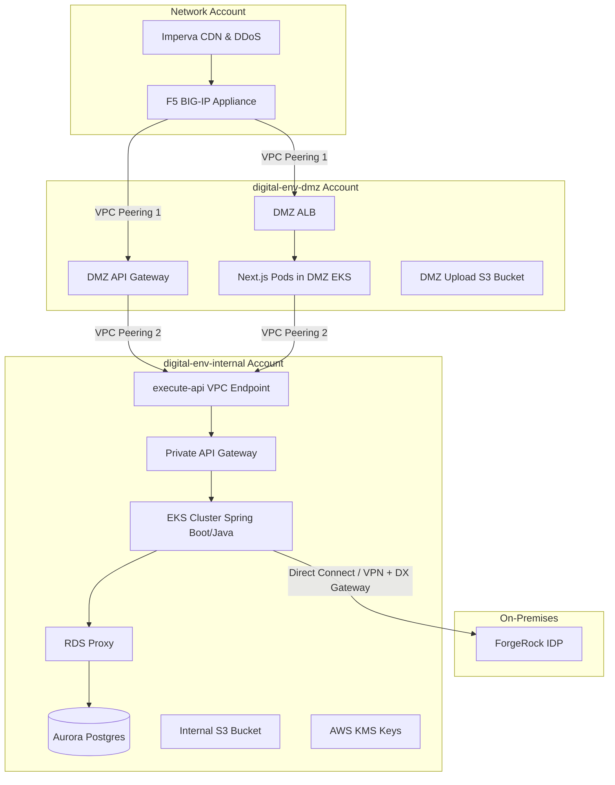

# AWS Architecture Review & Detailed Implementation Guide
**Role:** Principal AWS Architect  
**Tenant:** Digital  
**Environments:** SDLC (Dev, QA, UAT, Prod)  

---

## 1. Executive Summary
This document provides a rigorous architectural review of the proposed AWS platform for the **Digital** tenant. The architecture adopts a secure, multi-account, DMZ-to-Internal separation model. External traffic is scrubbed by an external CDN/DDoS firewall (Imperva) and terminated at a central network VPC (F5) before entering the environment-specific DMZ VPCs. 

This review identifies critical, implicit networking infrastructure required to make this architecture functional, provides a feedback assessment of the proposed patterns, details concrete implementation steps, and presents a high-level visual architecture diagram.

---

## 2. Detailed Networking Elements (Not Explicit in Summary)
To establish secure, reliable communication across accounts and VPCs without using AWS Transit Gateway, the following networking components must be implemented:



### A. Cross-VPC & Cross-Account Connectivity
*   **VPC Peering Connections:** 
    *   **VPC Peering 1 (Network VPC <-> DMZ VPC):** Routes external traffic terminated at the F5 BIG-IP appliance to the DMZ ALB and DMZ API Gateway.
    *   **VPC Peering 2 (DMZ VPC <-> Internal VPC):** Connects the DMZ environment directly to the Internal environment. Next.js pods and the DMZ API Gateway use this peering connection to reach the Private API Gateway endpoints in the Internal VPC.
*   **On-Premises Connectivity (ForgeRock Integration):** The Internal VPC will establish direct on-premises connectivity via a **Virtual Private Gateway (VGW)** or a **Direct Connect Gateway (DXGW)** attached to the Internal VPC. This allows the Authorisation Service in the Internal VPC EKS cluster to securely query the ForgeRock IDP for authentication.

### B. Subnet Segmentation and IP Planning
To prevent routing conflicts and enable VPC Peering, unique non-overlapping CIDR blocks must be assigned to each VPC across all environments (e.g., Dev DMZ, Dev Internal, QA DMZ, QA Internal).
*   **DMZ VPC Subnets:**
    *   *Private Subnets (EKS & ALB):* Hosting EKS Next.js worker nodes and the Internal ALB. These subnets have route table entries directing Internal VPC traffic to the VPC Peering Connection. Egress traffic to the internet must route through NAT Gateways.
*   **Internal VPC Subnets:**
    *   *Private App Subnets:* For EKS worker nodes, Java/Typescript Lambdas, and VPC Endpoints.
    *   *Isolated Database Subnets:* For Aurora Postgres and RDS Proxy. These subnets must not have route table entries to the Peering Connection or NAT Gateways, ensuring database nodes are completely unreachable from outside the Internal VPC.

### C. VPC Endpoints (AWS PrivateLink)
To ensure traffic to AWS services remains entirely within the AWS backbone network, the following **Interface VPC Endpoints** must be provisioned:
1.  **S3 Gateway Endpoint:** Configured in both DMZ and Internal VPC route tables.
2.  **ECR Endpoints (`ecr.api` and `ecr.dkr`):** Required in both DMZ and Internal VPCs to allow EKS nodes to pull container images securely.
3.  **KMS Endpoint:** In the Internal VPC, allowing the Authorisation Service to perform key rotation and cryptographic operations.
4.  **API Gateway Endpoint (`execute-api`):** Deployed in the Internal VPC. The DMZ API Gateway and Next.js applications in the DMZ VPC resolve and route traffic over the VPC Peering Connection to reach this VPC Endpoint, which then forwards the requests to the Private API Gateway service.
5.  **EventBridge Endpoint (`events`):** Deployed in both VPCs to allow microservices to publish events.

### D. DNS Resolution and Route 53 Resolvers
*   **Route 53 Private Hosted Zones (PHZs):** An internal DNS zone (e.g., `internal.digital.local`) must be created and associated with both the DMZ and Internal VPCs to resolve the Private API Gateway endpoint.
*   **Route 53 Outbound Resolvers:** Provisioned in the Internal VPC to forward queries for on-premises ForgeRock domains (e.g., `identity.corp.onprem`) to the on-premise DNS servers via the Direct Connect/VPN.

---

## 3. Architectural Review & Suggested Improvements

### A. Private API Gateway Routing (Interface VPC Endpoints)
*   **Routing Architecture:** To enable cross-VPC access to the Private API Gateway, we deploy an **Interface VPC Endpoint (execute-api)** within the Internal VPC.
*   **Integration Flow:**
    1.  The DMZ API Gateway receives external API requests.
    2.  The DMZ applications (API Gateway, Next.js) route their traffic over **VPC Peering** to the `execute-api` VPC Endpoint located in the Internal VPC.
    3.  The VPC Endpoint securely proxies the traffic to the managed Private API Gateway service.
    4.  This setup eliminates the administrative overhead and cost of configuring a Network Load Balancer (NLB) or VPC Link within the Internal VPC.
    5.  **Security Constraint:** Implement resource policies on the Private API Gateway to restrict access exclusively to the specific VPC Endpoint ID deployed in the Internal VPC, and ensure Security Groups on the endpoint allow inbound HTTPS traffic only from the DMZ VPC CIDR blocks.

### B. GuardDuty S3 Malware Scanning Workflow (Compliant)
*   **Traffic Flow & Quarantine:**
    1.  Next.js uploads file to the DMZ S3 bucket.
    2.  A Bucket Policy on the DMZ S3 bucket denies `GetObject` permissions to all principals *unless* the object has a tag `GuardDutyMalwareScanStatus` with a value of `NO_THREAT_FOUND`.
    3.  GuardDuty scans the object asynchronously and automatically updates the object tags with the scan result.
    4.  If clean, an EventBridge event triggers the Internal Lambda to copy the file to the Internal S3 bucket and delete the source object in the DMZ. If infected, the Lambda is not triggered; instead, a security alert is sent to an SNS topic, and the object is quarantined or deleted.

### C. Authorization Service & KMS Key Rotation
*   **Token Expiry & Key Lifecycle:** Since keys are rolled every 24 hours, tokens issued just before the rotation must remain verifiable. The JWKS (JSON Web Key Set) endpoint must serve both the **current active public key** and the **previous public key** (at least for the duration of the maximum token lifetime, e.g., 24 hours).
*   **Implementation:** The key rotation Lambda should:
    1.  Create a new KMS asymmetric key (used for signing new tokens).
    2.  Update the JWKS document stored in S3/DynamoDB to include the new public key.
    3.  Keep the previous key in the JWKS for a grace period (e.g., 24 hours).
    4.  Deprecate and schedule deletion of keys older than 48 hours.
*   **Authorizer Caching:** The Authorization Lambda on the API Gateways must cache the JWKS keys locally (using in-memory cache with a TTL of ~5-15 minutes) to avoid making network calls to the JWKS service on every single API request.

### D. EKS Ingress Management
*   Deploy the **AWS Load Balancer Controller** in the EKS cluster.
*   The Next.js mono repo deployment should include standard Kubernetes `Ingress` resources. The controller will dynamically update the target groups and listener rules on the shared DMZ ALB based on these resources.

---

## 4. Specific Implementation Details

### A. Java 25 & Spring Boot Services on EKS
*   **Runtime Optimization:** Java 25 (LTS) introduces advanced garbage collection optimizations and fully stabilized Virtual Threads (Project Loom). Ensure Spring Boot 3.x configuration has `spring.threads.virtual.enabled=true` set. This allows container pods to handle high concurrency with minimal memory footprints.
*   **Containerization Best Practices:** Use **Distroless** or **Alpine-based** minimal base images to reduce the security attack surface.
*   **Liveness and Readiness Probes:** Leverage Spring Boot Actuator endpoints (`/actuator/health/liveness` and `/actuator/health/readiness`) mapped directly to Kubernetes probes.

### B. OpenAPI Integration with AWS API Gateway
*   To seamlessly load OpenAPI specs into AWS API Gateway, utilize the **AWS OpenAPI Extensions** (`x-amazon-apigateway-*`).
*   **Lambda Integrations:**
    ```yaml
    /my-endpoint:
      get:
        x-amazon-apigateway-integration:
          type: "aws_proxy"
          httpMethod: "POST"
          uri: "arn:aws:apigateway:us-east-1:lambda:path/2015-03-31/functions/arn:aws:lambda:us-east-1:123456789012:function:MyServiceLambda/invocations"
          payloadFormatVersion: "1.0"
    ```
*   **EKS Pod Integrations:**
    ```yaml
    /my-service:
      get:
        x-amazon-apigateway-integration:
          type: "http_proxy"
          httpMethod: "GET"
          uri: "http://internal-my-eks-nlb.elb.us-east-1.amazonaws.com/my-service"
          connectionType: "VPC_LINK"
          connectionId: "vpc-link-id-here"
    ```

### C. Database Migrations (DDL) using Flyway
*   **RDS Proxy Configuration:** Ensure IAM Authentication is enabled on the RDS Proxy. Spring Boot pods should use IAM Roles for Service Accounts (IRSA) or EKS Pod Identities to authenticate against the RDS Proxy, eliminating static database credentials in code.
*   **Schema Migrations with Flyway:** Microservices must not run with DDL permissions at runtime. 
    *   *Implementation:* Package Flyway migration scripts into a separate container image and execute them as a **Kubernetes Job** prior to deploying the new service version. 
    *   *Privilege Separation:* The Flyway migration Kubernetes Job will run with a database user that has administrative/DDL credentials (retrieved securely from AWS Secrets Manager), whereas the service application pods run with a restricted DML-only role (SELECT, INSERT, UPDATE, DELETE).

---

## 5. Infrastructure and CI/CD Repository Strategy
The proposed mono-repo division is clean, but requires clear IaC governance:

1.  **Common Infrastructure Repo:**
    *   Contains the VPCs (including Cross-Account VPC Peering configurations), Route 53 Resolver, IAM Identity Providers, and EKS Cluster foundations.
    *   Outputs essential resource IDs (VPC IDs, Security Group IDs, Subnet IDs, Peering IDs) to **AWS Systems Manager (SSM) Parameter Store**.
2.  **Service Repos (CIAM, Application Services, Web Apps):**
    *   Reference the parameters in the SSM Parameter Store dynamically in their Terraform configurations.
    *   Deploy Kubernetes resources using Helm charts triggered by CI/CD pipelines (e.g., ArgoCD or GitLab CI/CD). This decouples foundational cloud infrastructure from the application release cycle.
