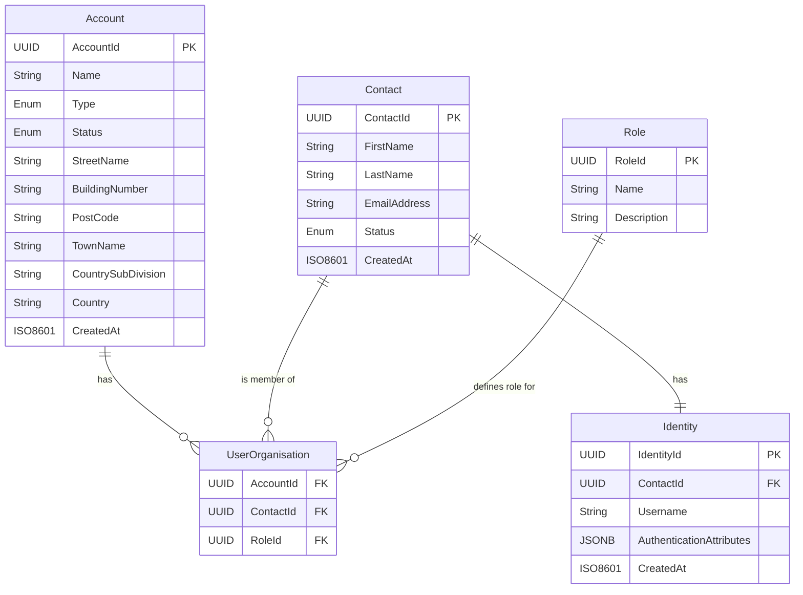

# Customer Identity and Access Management Data Model

## 1. Overview

This document defines the data model for the Customer Identity and Access Management (CIAM) platform. The model is designed to support the needs of a securities exchange, where Customers are Organisations (Participants, Issuers, etc.) and Users are individuals who act on behalf of those organisations.

The model aligns with the following principles:
- **Salesforce Financial Services Cloud Compatibility**: Entity and attribute names are chosen to align with the Salesforce Financial Services Cloud data model to ensure seamless integration.
- **ISO 20022 Alignment**: Customer and user attributes are based on the ISO 20022 party model to ensure consistency with financial messaging standards.
- **Domain-Driven Design**: The model is separated into distinct `Account` and `Identity` domains.

## 2. Core Entities & Relationships

### 2.1 Account (Organisation) Entity

Represents a legal entity, such as an issuer, a participant, or other related entity, that is registered with the exchange. This entity corresponds to the `Account` object in Salesforce.

| Field | Type | Description | Required |
| :--- | :--- | :--- | :--- |
| `AccountId` | UUID | Unique identifier for the account. | Yes |
| `Name` | String | Legal name of the organisation. | Yes |
| `Type` | Enum | Type of organisation (`PARTICIPANT`, `ISSUER`, `OTHER`). | Yes |
| `Status` | Enum | Account's status (`ACTIVE`, `INACTIVE`). | Yes |
| `StreetName` | String | Street name of the postal address. | No |
| `BuildingNumber` | String | Building number of the postal address. | No |
| `PostCode` | String | Post code of the postal address. | No |
| `TownName` | String | Town name of the postal address. | No |
| `CountrySubDivision` | String | Country sub division (e.g., state) of the postal address. | No |
| `Country` | String | Country of the postal address. | Yes |
| `CreatedAt` | ISO8601 | Timestamp of account creation. | Yes |

### 2.2 Contact (User) Entity

Represents an individual who can log in and act on behalf of one or more organisations. This entity corresponds to the `Contact` object in Salesforce.

| Field | Type | Description | Required |
| :--- | :--- | :--- | :--- |
| `ContactId` | UUID | Unique identifier for the contact. | Yes |
| `FirstName` | String | User's first name. | Yes |
| `LastName` | String | User's last name. | Yes |
| `EmailAddress` | String | User's email address. | Yes |
| `Status` | Enum | User's account status (`ACTIVE`, `INACTIVE`, `SUSPENDED`). | Yes |
| `CreatedAt` | ISO8601 | Timestamp of user creation. | Yes |

### 2.3 Identity Entity

Represents the user's login credentials and authentication attributes. This entity is managed by the Identity domain.

| Field | Type | Description | Required |
| :--- | :--- | :--- | :--- |
| `IdentityId` | UUID | Unique identifier for the identity. | Yes |
| `ContactId` | UUID | Foreign key to the `Contact` table. | Yes |
| `Username` | String | The user's username for authentication. | Yes |
| `AuthenticationAttributes` | JSONB | Stores authentication-related attributes (e.g., password hash, MFA factors). | Yes |
| `CreatedAt` | ISO8601 | Timestamp of identity creation. | Yes |

### 2.4 Role Entity

Represents the role a user has within an organisation.

| Field | Type | Description | Required |
| :--- | :--- | :--- | :--- |
| `RoleId` | UUID | Unique identifier for the role. | Yes |
| `Name` | String | The name of the role (e.g., "Issuer Admin", "Participant Submitter"). | Yes |
| `Description`| String | A brief description of the role's purpose. | No |

### 2.5 UserOrganisation Entity

This is a join table that manages the many-to-many relationship between `Contact` (User) and `Account` (Organisation), and assigns a specific role to the user within that organisation.

| Field | Type | Description | Required |
| :--- | :--- | :--- | :--- |
| `ContactId` | UUID | Foreign key to the `Contact` table. | Yes |
| `AccountId` | UUID | Foreign key to the `Account` table. | Yes |
| `RoleId` | UUID | Foreign key to the `Role` table. | Yes |

## 3. Entity Relationship Diagram

