# Regulatory Submission Platform Data Model

---

**For a detailed view of the Customer Identity and Access Management (CIAM) data model, please see the [Customer Identity and Access Management Data Model](customer-identity-access-management-data-model.md).**

---

## 1. Overview

This document defines the standardised data model for all submissions to the exchange's digital platform. The model adopts a **Generic Submission Envelope** pattern to handle various submission types (e.g., submissions, Waivers, Financial Reports), ensuring consistency and extensibility.

The platform supports multiple data formats, including:
- **ISO 20022**: For standard financial messaging, such as Corporate Actions (`seev.031`).
- **XBRL/iXBRL**: For structured digital financial reporting.
- **Proprietary JSON/XML**: For other specific submission types.

## 2. Generic Submission Envelope

All API requests to the platform must be wrapped in this standard envelope. This ensures consistent handling of metadata, auditing, and routing across the platform.

### 2.1 Envelope Schema

| Field | Type | Description | Required |
| :--- | :--- | :--- | :--- |
| `header` | Object | Standard submission metadata. | Yes |
| `header.submissionId` | UUID | Unique identifier for the submission attempt. | Yes |
| `header.timestamp` | ISO8601 | Time of submission (UTC). | Yes |
| `header.submitterId` | String | Identity of the Issuer or Agent. | Yes |
| `header.submissionType` | Enum | Discriminator for the payload. Values: `PROPRIETARY`, `CORPORATE_ACTION`, `WAIVER_REQ`, `FINANCIAL_REPORTING_XBRL`, `LISTING_APPLICATION`, `PRICE_SENSITIVE_ANNOUNCEMENT`. | Yes |
| `payload` | Object | The domain-specific data. Structure depends on `submissionType`. | Yes |

### 2.2 `submissionType` Enum Values

*   `PROPRIETARY`: For custom or non-standard submission types.
*   `CORPORATE_ACTION`: ISO 20022 `seev.031` notification.
*   `WAIVER_REQ`: Request for a waiver from exchange rules.
*   `FINANCIAL_REPORTING_XBRL`: Financial reports in XBRL format.
*   `LISTING_APPLICATION`: Application for a new security listing.
*   `PRICE_SENSITIVE_ANNOUNCEMENT`: Market-sensitive news or announcements.

---

## 3. Core Entities & Relationships

This section defines the core entities that underpin the submission process, including users, organisations, submissions, and the access control model.

### 3.1 Domain Model (UML Class Diagram)

This diagram illustrates the relationships between the core entities and the new Role-Based Access Control (RBAC) model.

```mermaid
classDiagram
    direction RL

    class User {
        +UUID userId
        +String email
        +Enum status
    }

    class Organisation {
        +UUID organisationId
        +String name
        +Enum type
    }

    class Submission {
        +UUID submissionId
        +Enum submissionType
        +JSONB payload
    }

    class UserOrganisation {
        <<Join Table>>
        +UUID userId
        +UUID organisationId
        +UUID roleId
    }

    class Role {
        +UUID roleId
        +String name
        +String description
    }

    class Entitlement {
        +UUID entitlementId
        +String name
        +String description
    }

    class Permission {
        +UUID permissionId
        +String action (e.g., CREATE, READ, UPDATE, DELETE)
        +String resource (e.g., SUBMISSION, USER)
    }

    User "1" -- "*" UserOrganisation : has
    Organisation "1" -- "*" UserOrganisation : has
    UserOrganisation "1" -- "1" Role : has

    Role "*" -- "*" Entitlement : has
    Entitlement "*" -- "*" Permission : grants

    User "1" -- "*" Submission : creates
    Submission "*" -- "*" Organisation : (SubmissionOrganisation)
```



### 3.2 User Entity

Represents an individual who can log in and act on behalf of one or more organisations.

| Field | Type | Description | Required |
| :--- | :--- | :--- | :--- |
| `userId` | UUID | Unique identifier for the user. | Yes |
| `firstName` | String | User's first name. | Yes |
| `lastName` | String | User's last name. | Yes |
| `email` | String | User's email address (used for login). | Yes |
| `status` | Enum | User's account status (`ACTIVE`, `INACTIVE`, `SUSPENDED`). | Yes |
| `createdAt` | ISO8601 | Timestamp of user creation. | Yes |

### 3.3 Organisation Entity

Represents a legal entity, such as an issuer or an agent, that is registered with the exchange.

| Field | Type | Description | Required |
| :--- | :--- | :--- | :--- |
| `organisationId` | UUID | Unique identifier for the organisation. | Yes |
| `name` | String | Legal name of the organisation. | Yes |
| `type` | Enum | Type of organisation (`ISSUER`, `AGENT`, `REGULATOR`). | Yes |
| `status` | Enum | Organisation's status (`ACTIVE`, `INACTIVE`). | Yes |
| `createdAt` | ISO8601 | Timestamp of organisation creation. | Yes |

### 3.4 Submission Entity

Represents the submission envelope itself, containing metadata and the specific data payload.

| Field | Type | Description | Required |
| :--- | :--- | :--- | :--- |
| `submissionId` | UUID | Unique identifier for the submission. | Yes |
| `submissionType` | Enum | Type of submission (`CORPORATE_ACTION`, `WAIVER_REQ`, `FINANCIAL_REPORTING_XBRL`, `LISTING_APPLICATION`, `PRICE_SENSITIVE_ANNOUNCEMENT`, etc.). | Yes |
| `createdById` | UUID | Foreign key to the `User` who created the submission. | Yes |
| `createdAt` | ISO8601 | Timestamp of submission creation. | Yes |
| `payload` | JSONB | The domain-specific data, e.g., an ISO 20022 message or XBRL document. | Yes |

### 3.5 Role-Based Access Control (RBAC) Entities

To link these core entities, we use associative tables to manage many-to-many relationships, providing flexibility and scalability. The `UserOrganisation` relationship is enriched with a `role` to support Role-Based Access Control (RBAC).

| Relationship | Entities Involved | Cardinality | Description |
| :--- | :--- | :--- | :--- |
| User-Organisation | `User`, `Organisation` | `*..*` (Many-to-Many) | A user's membership and role within an organisation. See `UserOrganisation` table below. |
| Submission-Organisation | `Submission`, `Organisation` | `*..*` (Many-to-Many) | A single submission can be relevant to multiple organisations (e.g., a joint announcement). This is managed via a `SubmissionOrganisation` join table. |
| User-Submission | `User`, `Submission` | `1..*` (One-to-Many) | A single user creates multiple submissions over time. The `submission` table will contain a `createdById` foreign key referencing the `User`. |

### 3.5 Associative Entities (Join Tables)

#### 3.5.1 UserOrganisation Entity

This table manages the many-to-many relationship between `User` and `Organisation`, and assigns a specific role to the user within that organisation.

| Field | Type | Description | Required |
| :--- | :--- | :--- | :--- |
| `userId` | UUID | Foreign key to the `User` table. | Yes |
| `organisationId` | UUID | Foreign key to the `Organisation` table. | Yes |
| `role` | Enum | The user's role within the organisation. Values: `ADMIN`, `SUBMITTER`, `VIEWER`. | Yes |

---

## 4. Corporate Action Data Model (ISO 20022)

| Field | Type | Description | Required |
| :--- | :--- | :--- | :--- |
| `roleId` | UUID | Unique identifier for the role. | Yes |
| `name` | String | The name of the role (e.g., "Issuer Admin", "Agent Submitter"). | Yes |
| `description`| String | A brief description of the role's purpose. | No |

#### 3.5.2 Entitlement Entity
An `Entitlement` is a collection of specific permissions.

This diagram illustrates the relationships between the core entities, including the role-based `UserOrganisation` relationship.

#### 3.5.3 Permission Entity
A `Permission` is the most granular level of control, defining a single action on a specific resource.

| Field | Type | Description | Required |
| :--- | :--- | :--- | :--- |
| `permissionId`| UUID | Unique identifier for the permission. | Yes |
| `action` | Enum | The action allowed (`CREATE`, `READ`, `UPDATE`, `DELETE`, `APPROVE`). | Yes |
| `resource` | String | The entity the action applies to (e.g., "SUBMISSION", "ORGANISATION_USER"). | Yes |

### 3.6 Entity Relationships

    class UserOrganisation {
        <<Association>>
        +Enum role
    }

    class Submission {
        +UUID submissionId
        +Enum submissionType
        +UUID createdById
        +DateTime createdAt
        +JSONB payload
    }

---

## 4. Submission Payload Schemas

    User "1" -- "*" Submission : creates
    (User, Organisation) .. UserOrganisation
    User " * " -- " * " Organisation : (UserOrganisation)

    Submission " * " -- " * " Organisation : (SubmissionOrganisation)

### 4.1 Corporate Actions (ISO 20022)

For `submissionType: "CORPORATE_ACTION"`, the payload follows the structure of an ISO 20022 **Corporate Action Notification** (`seev.031`). A formal JSON Schema definition is available in [`corporate-action-schema.json`](corporate-action-schema.json).

#### A. General Information (`CorpActnGnlInf`)
*   **Event Type** (`EvtTp`): `DVCA`, `SPLF`, `MRGR`, `RHTS`, etc.
*   **Mandatory/Voluntary** (`MndtryVlntryEvtTp`): `MAND`, `VOLU`, `CHOS`.

#### B. Underlying Security (`UndrlygScty`)
*   **ISIN**: International Securities Identification Number.
*   **Ticker**: Exchange symbol.

#### C. JSON Example: Cash Dividend (`DVCA`)

```json
{
  "header": {
    "submissionId": "a1b2c3d4-e5f6-7890-a1b2-c3d4e5f67890",
    "timestamp": "2024-10-15T09:30:00Z",
    "submitterId": "ISSUER_123",
    "submissionType": "CORPORATE_ACTION"
  },
  "payload": {
    "corporateActionGeneralInformation": {
      "officialCorporateActionEventID": "CA_2024_DIV_001",
      "eventType": "DVCA",
      "mandatoryVoluntaryEventType": "MAND"
    },
    "underlyingSecurity": {
      "isin": "AU000000BHP4",
      "ticker": "BHP"
    }
  }
}
```

### 4.2 Financial Reporting (XBRL)

For `submissionType: "FINANCIAL_REPORTING_XBRL"`, the payload contains the financial report in a structured format. A formal JSON Schema definition is available in [`financial-reporting-xbrl-schema.json`](docs/financial-reporting-xbrl-schema.json).
