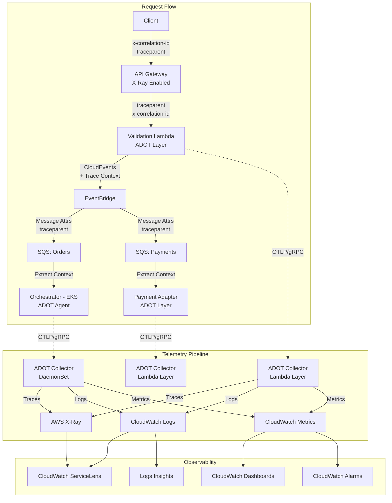

# End-to-End Observability Design
**Version 2.0 - Enhanced Edition**

This document outlines a comprehensive observability strategy for AWS microservices architecture, focusing on distributed tracing, metrics collection, centralized logging, and operational excellence using AWS CloudWatch, AWS X-Ray, and OpenTelemetry (OTel).

---

## Table of Contents

1. [Executive Summary](#1-executive-summary)
2. [Observability Pillars](#2-observability-pillars)
3. [Traceability Standards](#3-traceability-standards)
4. [Architecture & Data Flow](#4-architecture--data-flow)
5. [Component Implementation Details](#5-component-implementation-details)
6. [Metrics Strategy](#6-metrics-strategy)
7. [Logging Standards](#7-logging-standards)
8. [Sampling Strategy](#8-sampling-strategy)
9. [Data Security & Privacy](#9-data-security--privacy)
10. [ADOT Collector Configuration](#10-adot-collector-configuration)
11. [Error Handling & Alerting](#11-error-handling--alerting)
12. [Service Level Objectives (SLOs)](#12-service-level-objectives-slos)
13. [Aggregation & Visualization](#13-aggregation--visualization)
14. [Troubleshooting Runbook](#14-troubleshooting-runbook)
15. [Testing & Validation](#15-testing--validation)
16. [Cost Optimization](#16-cost-optimization)
17. [Compliance & Governance](#17-compliance--governance)
18. [Migration Path](#18-migration-path)

---

## 1. Executive Summary

### 1.1 Objectives

This observability framework enables:
- **Full request tracing** across API Gateway, Lambda, EKS, EventBridge, and SQS
- **Real-time monitoring** with metrics, logs, and traces correlated via correlation IDs
- **Proactive alerting** based on SLO violations and error patterns
- **Security compliance** with automated PII redaction and audit trails
- **Cost efficiency** through intelligent sampling and log retention policies

### 1.2 Key Technologies

| Component | Technology | Purpose |
|-----------|-----------|---------|
| Distributed Tracing | AWS X-Ray + OpenTelemetry | End-to-end request tracking |
| Metrics | CloudWatch Metrics + OTel | Performance and business metrics |
| Logging | CloudWatch Logs | Structured, centralized logs |
| Instrumentation | ADOT (AWS Distro for OTel) | Unified telemetry collection |
| Correlation | W3C Trace Context + Custom ID | Request correlation across services |

---

## 2. Observability Pillars

### 2.1 The Three Pillars

#### Traces
- **Purpose**: Understand request flow and latency bottlenecks
- **Implementation**: OpenTelemetry traces exported to AWS X-Ray
- **Retention**: 30 days in X-Ray, archived to S3 for compliance

#### Metrics
- **Purpose**: Monitor system health, performance, and business KPIs
- **Implementation**: OTel metrics exported to CloudWatch Metrics
- **Retention**: Standard CloudWatch retention (1 year for most metrics)

#### Logs
- **Purpose**: Detailed event information and debugging context
- **Implementation**: Structured JSON logs to CloudWatch Logs
- **Retention**: 90 days operational, 7 years for audit logs

### 2.2 Correlation Strategy

All three pillars are connected via:
- **Trace ID**: Links all spans in a distributed trace
- **Correlation ID**: Business-level identifier for customer-facing requests
- **Span ID**: Identifies individual operation within a trace

---

## 3. Traceability Standards

### 3.1 Correlation ID

**Header Name:** `x-correlation-id`

**Purpose:** Business-level tracking identifier that persists across all system boundaries, enabling customer support and business analytics.

**Format:** UUID v4 (e.g., `550e8400-e29b-41d4-a716-446655440000`)

**Behavior:**
- **Ingress (API Gateway):** 
  - If `x-correlation-id` is present in the request header, accept and use it
  - If missing, generate a new UUID v4 and add it to the request context
- **Propagation:** 
  - Must be passed downstream in **all** HTTP headers
  - Must be included in **all** message attributes for SQS/EventBridge
  - Must be included in all trace spans as an attribute
- **Logging:** 
  - Must be included in the structured log context as `correlation_id`
  - Should be indexed in CloudWatch for efficient queries

### 3.2 W3C Trace Context

**Standards:** Strict adherence to [W3C Trace Context](https://www.w3.org/TR/trace-context/) specification.

**Headers:**
- **`traceparent`**: `00-{trace-id}-{parent-id}-{trace-flags}`
  - Format: `version-traceid-parentid-traceflags`
  - Example: `00-4bf92f3577b34da6a3ce929d0e0e4736-00f067aa0ba902b7-01`
  - Version: `00` (current version)
  - Trace ID: 32 hex characters (128-bit)
  - Parent ID: 16 hex characters (64-bit)
  - Trace Flags: 2 hex characters (8-bit, `01` = sampled)
  
- **`tracestate`**: Vendor-specific trace data (optional)
  - Format: `key1=value1,key2=value2`
  - Example: `aws=t:r:s:5759e988bd862e3fe1be46a994272793`
  - Preserved and propagated if present

**Purpose:** Distributed tracing compatible with OpenTelemetry and AWS X-Ray.

**Behavior:**
- **Ingress:** API Gateway or ALB should initiate or propagate W3C headers
- **Services:** All services must:
  1. Extract the trace context from incoming headers
  2. Create a child span with the extracted context as parent
  3. Inject the new trace context into all downstream HTTP calls
  4. Add trace context to message attributes for async messaging

**AWS X-Ray Compatibility:**
- ADOT is configured to generate X-Ray compatible trace IDs
- Set `OTEL_PROPAGATORS=xray,tracecontext,baggage` for dual compatibility
- X-Ray traces are queryable in both X-Ray console and ServiceLens

### 3.3 Trace Context Propagation for Asynchronous Messaging

#### SQS Message Attributes
Trace context MUST be propagated via SQS message attributes (not just message body).

**Producer Example:**
```typescript
import { SQSClient, SendMessageCommand } from "@aws-sdk/client-sqs";
import { trace, context, propagation } from '@opentelemetry/api';

const currentContext = context.active();
const carrier = {};
propagation.inject(currentContext, carrier);

const command = new SendMessageCommand({
  QueueUrl: process.env.ORDER_QUEUE_URL,
  MessageBody: JSON.stringify(orderData),
  MessageAttributes: {
    'traceparent': {
      DataType: 'String',
      StringValue: carrier['traceparent']
    },
    'tracestate': {
      DataType: 'String',
      StringValue: carrier['tracestate'] || ''
    },
    'x-correlation-id': {
      DataType: 'String',
      StringValue: correlationId
    }
  }
});
```

**Consumer Example:**
```typescript
import { SQSEvent } from 'aws-lambda';
import { propagation, ROOT_CONTEXT } from '@opentelemetry/api';

export const handler = async (event: SQSEvent) => {
  for (const record of event.Records) {
    const traceparent = record.messageAttributes?.traceparent?.stringValue;
    const tracestate = record.messageAttributes?.tracestate?.stringValue;
    
    const carrier = { traceparent, tracestate };
    const extractedContext = propagation.extract(ROOT_CONTEXT, carrier);
    
    // Use extractedContext as parent for new spans
  }
};
```

#### EventBridge
For EventBridge, inject trace context into the CloudEvents detail object:

```typescript
import { EventBridgeClient, PutEventsCommand } from "@aws-sdk/client-eventbridge";

const event = {
  // CloudEvents required fields
  id: crypto.randomUUID(),
  source: 'validation-lambda',
  specversion: '1.0',
  type: 'com.example.order.validated',
  time: new Date().toISOString(),
  
  // Distributed tracing extension
  traceparent: carrier['traceparent'],
  tracestate: carrier['tracestate'],
  correlationid: correlationId,
  
  // Event data
  data: { orderId, customerId, items }
};
```

---

## 4. Architecture & Data Flow

### 4.1 System Architecture



### 4.2 Data Flow Scenarios

#### Scenario 1: Successful Order Processing
1. Client sends POST request with optional `x-correlation-id`
2. API Gateway generates/accepts correlation ID, initiates trace
3. Lambda validates request, creates child span
4. Lambda publishes to EventBridge with trace context in message attributes
5. SQS receives message with trace context
6. EKS Orchestrator consumes message, continues trace
7. All spans exported to X-Ray, logs to CloudWatch Logs

#### Scenario 2: Payment Failure with Retry
1. Payment adapter processes SQS message
2. External payment API returns 503 error
3. Error logged with trace ID, correlation ID, and error details
4. Message returned to SQS for retry (DLQ after 3 attempts)
5. CloudWatch Alarm triggered on error rate threshold
6. On-call receives PagerDuty alert with correlation ID for investigation

---

## 5. Component Implementation Details

### 5.1 API Gateway

#### Configuration
- **Enable X-Ray Tracing:** Stage-level setting in API Gateway console
- **Sampling Rate:** 100% for API Gateway (lightweight overhead)
- **Access Logging:** Enable with JSON format

#### Access Log Format
```json
{
  "requestId": "$context.requestId",
  "extendedRequestId": "$context.extendedRequestId",
  "ip": "$context.identity.sourceIp",
  "caller": "$context.identity.caller",
  "user": "$context.identity.user",
  "requestTime": "$context.requestTime",
  "httpMethod": "$context.httpMethod",
  "resourcePath": "$context.resourcePath",
  "status": "$context.status",
  "protocol": "$context.protocol",
  "responseLength": "$context.responseLength",
  "integrationLatency": "$context.integrationLatency",
  "responseLatency": "$context.responseLatency",
  "correlationId": "$input.params('x-correlation-id')"
}
```

### 5.2 Compute: Lambda (TypeScript/Node.js)

#### ADOT Lambda Layer Setup

**Layer ARN:** `arn:aws:lambda:<region>:901920570463:layer:aws-otel-nodejs-<architecture>-ver-<version>:latest`

**Environment Variables:**
```bash
AWS_LAMBDA_EXEC_WRAPPER=/opt/otel-handler
OTEL_SERVICE_NAME=validation-lambda
OTEL_PROPAGATORS=xray,tracecontext,baggage
OTEL_TRACES_SAMPLER=xray
OPENTELEMETRY_COLLECTOR_CONFIG_FILE=/var/task/collector.yaml
```

#### Code Instrumentation

```typescript
import { trace, context, SpanStatusCode } from '@opentelemetry/api';
import { Logger } from './logger';

const logger = new Logger('validation-lambda');

export const handler = async (event: any, lambdaContext: any) => {
  const tracer = trace.getTracer('validation-lambda');
  const currentSpan = trace.getSpan(context.active());
  
  const correlationId = event.headers?.['x-correlation-id'] || lambdaContext.requestId;
  
  currentSpan?.setAttribute('correlation_id', correlationId);
  currentSpan?.setAttribute('user_id', event.requestContext?.authorizer?.claims?.sub);
  currentSpan?.setAttribute('http.method', event.requestContext?.httpMethod);
  
  return await tracer.startActiveSpan('validate-order', async (span) => {
    try {
      logger.info('Processing order validation', {
        correlation_id: correlationId,
        order_id: event.body?.orderId
      });
      
      const result = await validateOrder(event.body);
      
      span.setStatus({ code: SpanStatusCode.OK });
      
      return {
        statusCode: 200,
        headers: { 'x-correlation-id': correlationId },
        body: JSON.stringify(result)
      };
      
    } catch (error) {
      span.setStatus({ code: SpanStatusCode.ERROR, message: error.message });
      span.recordException(error);
      
      logger.error('Order validation failed', {
        correlation_id: correlationId,
        error_code: error.code,
        error_message: error.message
      });
      
      throw error;
    } finally {
      span.end();
    }
  });
};
```

### 5.3 Compute: EKS (Spring Boot / Java)

#### ADOT Java Agent Setup

**Dockerfile:**
```dockerfile
FROM openjdk:17-slim

ADD https://github.com/aws-observability/aws-otel-java-instrumentation/releases/latest/download/aws-opentelemetry-agent.jar /opt/aws-opentelemetry-agent.jar

COPY target/orchestrator-service.jar /app/app.jar

ENV JAVA_TOOL_OPTIONS="-javaagent:/opt/aws-opentelemetry-agent.jar"
ENV OTEL_SERVICE_NAME=orchestrator-service
ENV OTEL_PROPAGATORS=xray,tracecontext,baggage
ENV OTEL_EXPORTER_OTLP_ENDPOINT=http://localhost:4317

ENTRYPOINT ["java", "-jar", "/app/app.jar"]
```

#### Java Code Instrumentation

```java
package com.example.orchestrator;

import io.opentelemetry.api.trace.Span;
import io.opentelemetry.api.trace.Tracer;
import org.slf4j.Logger;
import org.slf4j.LoggerFactory;
import org.slf4j.MDC;
import org.springframework.stereotype.Service;

@Service
public class OrderOrchestrator {
    
    private static final Logger logger = LoggerFactory.getLogger(OrderOrchestrator.class);
    private final Tracer tracer;
    
    public OrderOrchestrator(Tracer tracer) {
        this.tracer = tracer;
    }
    
    public void processOrder(OrderMessage message) {
        String correlationId = message.getCorrelationId();
        
        MDC.put("correlation_id", correlationId);
        MDC.put("trace_id", Span.current().getSpanContext().getTraceId());
        MDC.put("span_id", Span.current().getSpanContext().getSpanId());
        
        Span.current().setAttribute("correlation_id", correlationId);
        Span.current().setAttribute("order_id", message.getOrderId());
        
        try {
            logger.info("Processing order: {}", message.getOrderId());
            
            validateInventory(message);
            processPayment(message);
            fulfillOrder(message);
            
            logger.info("Order processed successfully: {}", message.getOrderId());
            
        } catch (Exception e) {
            Span.current().recordException(e);
            logger.error("Order processing failed: {}", message.getOrderId(), e);
            throw e;
        } finally {
            MDC.clear();
        }
    }
}
```

---

## 6. Metrics Strategy

### 6.1 Metrics Categories

#### RED Metrics (Request-focused)
- **Rate**: Requests per second
- **Errors**: Error rate and count
- **Duration**: Request latency (P50, P95, P99)

#### USE Metrics (Resource-focused)
- **Utilization**: CPU, Memory, Network
- **Saturation**: Queue depth, connection pool saturation
- **Errors**: Infrastructure errors (OOM, disk full)

#### Business Metrics
- Orders processed per minute
- Payment success rate
- Average order value
- Customer conversion rate

### 6.2 Metric Naming Convention

Follow OpenTelemetry semantic conventions:

**Format:** `{namespace}.{subsystem}.{metric_name}_{unit}`

**Examples:**
- `exchange.api.request_duration_ms`
- `exchange.order.processing_count`
- `exchange.payment.success_rate`

### 6.3 Implementation

#### Lambda Metrics (TypeScript)

```typescript
import { metrics } from '@opentelemetry/api';

const meter = metrics.getMeter('validation-lambda');

const requestCounter = meter.createCounter('exchange.validation.requests', {
  description: 'Total validation requests',
  unit: '1'
});

const requestDuration = meter.createHistogram('exchange.validation.duration', {
  description: 'Request processing duration',
  unit: 'ms'
});

export const handler = async (event: any) => {
  const startTime = Date.now();
  
  try {
    requestCounter.add(1, {
      method: event.httpMethod,
      route: event.path,
      environment: 'production'
    });
    
    const result = await validateOrder(event.body);
    
    requestCounter.add(1, {
      method: event.httpMethod,
      status: 'success',
      environment: 'production'
    });
    
    return result;
    
  } finally {
    const duration = Date.now() - startTime;
    requestDuration.record(duration, {
      method: event.httpMethod,
      environment: 'production'
    });
  }
};
```

---

## 7. Logging Standards

### 7.1 Standardized JSON Schema

All applications must emit logs in a consistent JSON format aligned with the **OpenTelemetry Log Data Model**.

#### Mandatory Fields

| Field | Type | Description | Example |
|-------|------|-------------|---------|
| `timestamp` | String | ISO 8601 format with milliseconds | `2025-01-28T10:00:00.123Z` |
| `severity_text` | String | Log level | `INFO`, `WARN`, `ERROR` |
| `service.name` | String | Service identifier | `validation-lambda` |
| `body` | String | Primary log message | `Order validation successful` |
| `trace_id` | String | W3C Trace ID (32 hex chars) | `5759e988bd862e3fe1be46a994272793` |
| `span_id` | String | W3C Span ID (16 hex chars) | `53995c3f42cd8ad8` |
| `correlation_id` | String | Business correlation ID | `550e8400-e29b-41d4-a716-446655440000` |
| `deployment.environment` | String | Environment name | `production`, `staging`, `dev` |
| `cloud.region` | String | AWS region | `us-east-1` |

#### Resource Attributes

```json
{
  "resource": {
    "service.name": "validation-lambda",
    "service.version": "1.2.3",
    "cloud.provider": "aws",
    "cloud.platform": "aws_lambda",
    "cloud.region": "us-east-1",
    "deployment.environment": "production"
  }
}
```

#### Error Fields

| Field | Type | Description |
|-------|------|-------------|
| `error.type` | String | Error class/type |
| `error.code` | String | Application error code |
| `error.message` | String | Error message |
| `error.stack` | String | Stack trace (sanitized) |
| `error.is_retryable` | Boolean | Whether error is transient |

#### Example Log Entry

```json
{
  "timestamp": "2025-01-28T10:00:00.123Z",
  "severity_text": "INFO",
  "service.name": "validation-lambda",
  "body": "Order validation successful",
  "trace_id": "5759e988bd862e3fe1be46a994272793",
  "span_id": "53995c3f42cd8ad8",
  "correlation_id": "550e8400-e29b-41d4-a716-446655440000",
  "deployment.environment": "production",
  "cloud.region": "us-east-1",
  "user.id": "user-123",
  "http.request.method": "POST",
  "http.route": "/api/v1/orders/validate",
  "http.status_code": 200,
  "attributes": {
    "order_id": "ORD-12345",
    "item_count": 3,
    "processing_time_ms": 45
  }
}
```

### 7.2 Log Level Guidelines

| Level | When to Use | Examples |
|-------|-------------|----------|
| **DEBUG** | Detailed diagnostic information | Variable values, flow control decisions |
| **INFO** | Normal operation milestones | Request started/completed, state transitions |
| **WARN** | Degraded functionality, non-critical | Retry attempts, fallback used |
| **ERROR** | Failure requiring attention | Exceptions, failed operations |

**Environment-Specific Levels:**
- **Production:** WARN and above
- **Staging:** INFO and above
- **Development:** DEBUG and above

---

## 8. Sampling Strategy

### 8.1 Sampling Objectives

- Reduce telemetry costs while maintaining observability
- Capture 100% of errors and anomalies
- Sample successful requests based on traffic volume

### 8.2 Tail-Based Sampling (Recommended)

Decision made after trace completion:
- Captures all errors regardless of sampling decision
- Best for production environments

### 8.3 X-Ray Sampling Configuration

```json
{
  "version": 2,
  "default": {
    "fixed_target": 1,
    "rate": 0.05
  },
  "rules": [
    {
      "description": "Capture all errors",
      "http_method": "*",
      "url_path": "*",
      "fixed_target": 0,
      "rate": 1.0,
      "attributes": {
        "http.status_code": ["4*", "5*"]
      }
    },
    {
      "description": "High value transactions",
      "http_method": "POST",
      "url_path": "/api/v1/payments/*",
      "fixed_target": 0,
      "rate": 1.0
    },
    {
      "description": "Sample standard requests",
      "http_method": "*",
      "url_path": "*",
      "fixed_target": 1,
      "rate": 0.05
    }
  ]
}
```

### 8.4 ADOT Collector Tail-Based Sampling

```yaml
processors:
  tail_sampling:
    decision_wait: 10s
    num_traces: 100000
    policies:
      - name: error-traces
        type: status_code
        status_code:
          status_codes: [ERROR]
      
      - name: slow-traces
        type: latency
        latency:
          threshold_ms: 1000
      
      - name: probabilistic
        type: probabilistic
        probabilistic:
          sampling_percentage: 5
```

---

## 9. Data Security & Privacy

### 9.1 Sensitive Data Categories

| Category | Examples | Masking Strategy |
|----------|----------|------------------|
| **PII** | SSN, Passport, Driver's License | Full redaction |
| **Financial** | Credit card numbers, CVV | Last 4 digits only |
| **Contact** | Email addresses, Phone numbers | Partial masking |
| **Authentication** | Passwords, API keys, Tokens | Full redaction |

### 9.2 Masking Implementation (Node.js)

```typescript
const maskCreditCard = (card: string) => {
  return card.replace(/(\d{4})\d{8}(\d{4})/, '****-****-****-$2');
};

const maskEmail = (email: string) => {
  const [user, domain] = email.split('@');
  const maskedUser = user[0] + '***' + user[user.length - 1];
  return `${maskedUser}@${domain}`;
};

class DataMasker {
  static maskString(text: string): string {
    let masked = text;
    
    // Credit cards
    masked = masked.replace(/\b\d{4}[\s-]?\d{4}[\s-]?\d{4}[\s-]?\d{4}\b/g, (match) => {
      return '****-****-****-' + match.slice(-4);
    });
    
    // SSNs
    masked = masked.replace(/\b\d{3}-\d{2}-\d{4}\b/g, '***-**-****');
    
    // Emails
    masked = masked.replace(/\b[A-Za-z0-9._%+-]+@[A-Za-z0-9.-]+\.[A-Z|a-z]{2,}\b/g, (match) => {
      const [user, domain] = match.split('@');
      return user[0] + '***@' + domain;
    });
    
    return masked;
  }
}
```

### 9.3 CloudWatch Logs Data Protection

```typescript
import { CloudWatchLogsClient, PutDataProtectionPolicyCommand } from "@aws-sdk/client-cloudwatch-logs";

const dataProtectionPolicy = {
  Name: "PII-Protection",
  Version: "2021-06-01",
  Statement: [
    {
      Sid: "audit-policy",
      DataIdentifier: [
        "arn:aws:dataprotection::aws:data-identifier/EmailAddress",
        "arn:aws:dataprotection::aws:data-identifier/CreditCardNumber",
        "arn:aws:dataprotection::aws:data-identifier/AwsSecretKey"
      ],
      Operation: {
        Audit: {
          FindingsDestination: {
            CloudWatchLogs: {
              LogGroup: "/aws/vendedlogs/pii-findings"
            }
          }
        }
      }
    }
  ]
};
```

---

## 10. ADOT Collector Configuration

### 10.1 Lambda Layer Configuration

```yaml
receivers:
  otlp:
    protocols:
      grpc:
        endpoint: 0.0.0.0:4317

processors:
  batch:
    timeout: 1s
    send_batch_size: 50
  
  memory_limiter:
    check_interval: 1s
    limit_mib: 128

exporters:
  awsxray:
    index_all_attributes: true
  
  awscloudwatchlogs:
    log_group_name: /prod/lambda/${AWS_LAMBDA_FUNCTION_NAME}
    log_stream_name: ${AWS_LAMBDA_LOG_STREAM_NAME}
  
  awscloudwatch:
    namespace: Exchange/Lambda
    region: ${AWS_REGION}

service:
  pipelines:
    traces:
      receivers: [otlp]
      processors: [memory_limiter, batch]
      exporters: [awsxray]
    
    metrics:
      receivers: [otlp]
      processors: [memory_limiter, batch]
      exporters: [awscloudwatch]
    
    logs:
      receivers: [otlp]
      processors: [memory_limiter, batch]
      exporters: [awscloudwatchlogs]
```

---

## 11. Error Handling & Alerting

### 11.1 Error Taxonomy

```typescript
enum ErrorSeverity {
  LOW = 'LOW',
  MEDIUM = 'MEDIUM',
  HIGH = 'HIGH',
  CRITICAL = 'CRITICAL'
}

interface StructuredError {
  type: string;
  code: string;
  message: string;
  severity: ErrorSeverity;
  is_retryable: boolean;
  retry_after_ms?: number;
}

class ValidationError extends ApplicationError {
  constructor(message: string) {
    super({
      type: 'ValidationError',
      code: 'VALIDATION_ERROR',
      message,
      severity: ErrorSeverity.LOW,
      is_retryable: false
    });
  }
}
```

### 11.2 CloudWatch Alarms

```typescript
import { CloudWatchClient, PutMetricAlarmCommand } from "@aws-sdk/client-cloudwatch";

const errorRateAlarm = new PutMetricAlarmCommand({
  AlarmName: 'ValidationLambda-ErrorRate-High',
  ComparisonOperator: 'GreaterThanThreshold',
  EvaluationPeriods: 2,
  MetricName: 'Errors',
  Namespace: 'AWS/Lambda',
  Period: 300,
  Statistic: 'Sum',
  Threshold: 10,
  ActionsEnabled: true,
  AlarmActions: ['arn:aws:sns:us-east-1:ACCOUNT_ID:oncall-alerts'],
  Dimensions: [
    { Name: 'FunctionName', Value: 'order-validation-prod' }
  ]
});
```

---

## 12. Service Level Objectives (SLOs)

### 12.1 Defined SLOs

#### Availability SLO
- **Target:** 99.9% uptime
- **Error Budget:** 43.2 minutes/month
- **Measurement:** `(Total Requests - Failed Requests) / Total Requests × 100`

#### Latency SLO
- **Target:** 95% of requests complete in <500ms
- **Measurement:** P95 latency
- **Error Budget:** 5% of requests can exceed 500ms

#### Error Rate SLO
- **Target:** <0.1% error rate
- **Measurement Window:** 1 hour rolling

### 12.2 SLO Monitoring

```sql
-- Availability SLI Query
fields @timestamp, http.status_code
| filter service.name = "validation-lambda"
| stats 
    count() as total_requests,
    sum(http.status_code >= 500) as failed_requests
| fields (total_requests - failed_requests) / total_requests * 100 as availability_percent
```

---

## 13. Aggregation & Visualization

### 13.1 CloudWatch Logs Insights Queries

#### Find Requests by Correlation ID
```sql
fields @timestamp, service.name, body, http.status_code
| filter correlation_id = "550e8400-e29b-41d4-a716-446655440000"
| sort @timestamp asc
```

#### Error Analysis
```sql
fields @timestamp, service.name, error.type, error.code, count() as error_count
| filter severity_text = "ERROR"
| stats count() by error.type, error.code
| sort error_count desc
```

#### Latency Distribution
```sql
fields @timestamp, attributes.processing_time_ms
| filter service.name = "validation-lambda"
| stats 
    percentile(attributes.processing_time_ms, 50) as p50,
    percentile(attributes.processing_time_ms, 95) as p95,
    percentile(attributes.processing_time_ms, 99) as p99
```

### 13.2 CloudWatch ServiceLens

**Key Features:**
- Service map showing dependencies and latency
- Automatic anomaly detection
- Correlation of metrics, logs, and traces

**Navigation:**
- CloudWatch Console → ServiceLens → Service Map
- Filter by time range, trace ID, or correlation ID

---

## 14. Troubleshooting Runbook

### 14.1 Common Investigation Patterns

#### Pattern 1: Trace End-to-End Request Flow

**Scenario:** Customer reports failed order submission

**Steps:**
1. Obtain correlation ID from customer support
2. Query CloudWatch Logs:
   ```sql
   fields @timestamp, service.name, body, http.status_code, error.message
   | filter correlation_id = "CUSTOMER_CORRELATION_ID"
   | sort @timestamp asc
   ```
3. Navigate to X-Ray → Traces
4. Search by correlation ID (use Filter Expressions)
5. Identify failing service and error details

#### Pattern 2: Investigate Error Spike

**Scenario:** CloudWatch Alarm: Error rate exceeded threshold

**Steps:**
1. Check error distribution:
   ```sql
   fields error.type, error.code, count() as error_count
   | filter severity_text = "ERROR"
   | filter @timestamp >= ago(1h)
   | stats count() by error.type, error.code
   | sort error_count desc
   ```
2. Identify most common error type
3. Sample affected requests:
   ```sql
   fields @timestamp, correlation_id, error.message, error.stack
   | filter error.type = "IDENTIFIED_ERROR_TYPE"
   | limit 20
   ```
4. Check X-Ray Service Map for dependency issues
5. Review recent deployments in CodePipeline

#### Pattern 3: Performance Degradation

**Scenario:** Latency alerts triggered

**Steps:**
1. Check latency percentiles:
   ```sql
   fields @timestamp, attributes.processing_time_ms
   | filter service.name = "TARGET_SERVICE"
   | stats 
       avg(attributes.processing_time_ms) as avg_latency,
       percentile(attributes.processing_time_ms, 95) as p95,
       percentile(attributes.processing_time_ms, 99) as p99
   | sort @timestamp desc
   ```
2. Identify slow traces in X-Ray (filter by duration > 1000ms)
3. Analyze span durations to find bottleneck
4. Check infrastructure metrics (CPU, Memory, Network)

### 14.2 Alert Runbook Example

```markdown
# Alert: ValidationLambda-ErrorRate-High

## Severity: P2 (High)

## Impact
Customers may experience failed order submissions

## Investigation

1. Check error distribution (CloudWatch Logs Insights)
2. Review X-Ray Service Map for downstream failures
3. Check recent deployments

## Mitigation

1. If deployment-related: Rollback
2. If external dependency: Enable circuit breaker
3. If resource exhaustion: Increase Lambda memory

## Escalation
If unresolved after 30 minutes, escalate to Principal Engineer
```

---

## 15. Testing & Validation

### 15.1 Contract Tests for Log Schema

```typescript
import { describe, it, expect } from '@jest/globals';

describe('Log Schema Validation', () => {
  it('should include all mandatory fields', () => {
    const logEntry = {
      timestamp: '2025-01-28T10:00:00.123Z',
      severity_text: 'INFO',
      'service.name': 'validation-lambda',
      body: 'Test message',
      trace_id: '5759e988bd862e3fe1be46a994272793',
      span_id: '53995c3f42cd8ad8',
      correlation_id: '550e8400-e29b-41d4-a716-446655440000',
      'deployment.environment': 'test',
      'cloud.region': 'us-east-1'
    };
    
    expect(logEntry.timestamp).toMatch(/^\d{4}-\d{2}-\d{2}T\d{2}:\d{2}:\d{2}\.\d{3}Z$/);
    expect(logEntry.severity_text).toBe('INFO');
    expect(logEntry['service.name']).toBe('validation-lambda');
    expect(logEntry.trace_id).toHaveLength(32);
    expect(logEntry.span_id).toHaveLength(16);
  });
});
```

### 15.2 Trace Propagation Tests

```typescript
describe('Trace Context Propagation', () => {
  it('should propagate traceparent through SQS', async () => {
    const { traceparent } = await sendMessageToSQS(orderData);
    const receivedMessage = await receiveMessageFromSQS();
    
    expect(receivedMessage.MessageAttributes.traceparent.StringValue)
      .toBe(traceparent);
  });
  
  it('should create child spans with correct parent', async () => {
    const parentSpan = tracer.startSpan('parent');
    const childSpan = tracer.startSpan('child', {}, trace.setSpan(context.active(), parentSpan));
    
    expect(childSpan.spanContext().traceId).toBe(parentSpan.spanContext().traceId);
  });
});
```

---

## 16. Cost Optimization

### 16.1 Log Retention Strategy

| Log Type | Retention | Reason |
|----------|-----------|--------|
| Operational | 90 days | Debugging and trend analysis |
| Audit | 7 years | Compliance requirements |
| Debug | 7 days | Development only |

### 16.2 Sampling Recommendations

- **Production:** 5-10% sampling for successful requests, 100% for errors
- **Staging:** 50% sampling
- **Development:** 100% sampling

### 16.3 CloudWatch Costs

**Cost Drivers:**
- Log ingestion: $0.50 per GB
- Log storage: $0.03 per GB/month
- Log Insights queries: $0.005 per GB scanned
- X-Ray traces: $5 per 1 million traces

**Optimization:**
- Use log subscriptions to filter before ingestion
- Export to S3 for long-term retention ($0.023/GB/month)
- Implement appropriate sampling

---

## 17. Compliance & Governance

### 17.1 Data Classification

| Level | Description | Retention | Access |
|-------|-------------|-----------|--------|
| Public | Marketing materials | 1 year | All employees |
| Internal | Business data | 3 years | Authorized teams |
| Confidential | Customer PII | 7 years | Need-to-know basis |
| Restricted | Financial/Health data | 7 years | Encrypted, audit logged |

### 17.2 Access Control

**CloudWatch Log Groups IAM Policy:**
```json
{
  "Version": "2012-10-17",
  "Statement": [
    {
      "Effect": "Allow",
      "Action": [
        "logs:FilterLogEvents",
        "logs:GetLogEvents"
      ],
      "Resource": [
        "arn:aws:logs:*:*:log-group:/prod/*"
      ],
      "Condition": {
        "StringEquals": {
          "aws:RequestedRegion": "us-east-1"
        }
      }
    }
  ]
}
```

### 17.3 Audit Logging

Separate audit logs for compliance:
- Who accessed what resource
- When was it accessed
- What action was performed
- What was the outcome

**Retention:** 7 years minimum

---

## 18. Migration Path

### 18.1 Phased Rollout

**Phase 1 (Weeks 1-2): Foundation**
- Deploy ADOT collectors to Lambda and EKS
- Configure CloudWatch Log Groups
- Enable X-Ray tracing on API Gateway

**Phase 2 (Weeks 3-4): Instrumentation**
- Add OpenTelemetry instrumentation to services
- Implement correlation ID propagation
- Deploy structured logging

**Phase 3 (Weeks 5-6): Metrics & Sampling**
- Implement custom metrics
- Configure tail-based sampling
- Deploy CloudWatch Dashboards

**Phase 4 (Weeks 7-8): Alerting & SLOs**
- Define and implement SLOs
- Configure CloudWatch Alarms
- Create runbooks

**Phase 5 (Weeks 9-10): Security & Compliance**
- Implement PII masking
- Configure data protection policies
- Conduct security audit

### 18.2 Success Criteria

- [ ] 100% of services emit structured logs
- [ ] Trace context propagated across all boundaries
- [ ] All critical SLOs defined and monitored
- [ ] <5 minute MTTR for P1 incidents
- [ ] Zero PII leakage in logs
- [ ] Cost within budget ($X per month)

---

## Conclusion

This enhanced observability design provides a comprehensive framework for monitoring, debugging, and optimizing AWS microservices architecture. By implementing distributed tracing, metrics collection, structured logging, and intelligent sampling, teams can achieve operational excellence while maintaining cost efficiency and security compliance.

**Next Steps:**
1. Review and approve this design with stakeholders
2. Begin Phase 1 implementation
3. Schedule weekly checkpoints to track progress
4. Conduct post-implementation review after Phase 5

**Questions or Feedback:**
Contact the Platform Engineering team or submit feedback via the internal wiki.