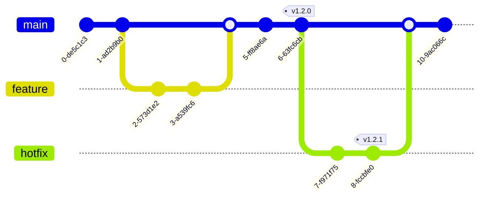

# Release Strategy

## 1. Release from Trunk

We follow a **Release from Trunk** model. The `main` branch is our single source of truth and is always deployable.

### Visual Workflow

### Workflow
1.  **Development**: Code is merged to `main` via Merge Requests (MRs).
2.  **Tagging**: When a release is ready, we tag the `main` branch with a version number (e.g., `v1.2.0`).
3.  **Immutable Artifact**: The CI pipeline builds an immutable artifact (Docker image, Lambda zip) from this tag.
4.  **Deployment**: This specific artifact is promoted through environments (DEV -> QA -> UAT -> PROD).

## 2. Hotfix Strategy

We avoid long-lived maintenance branches. However, critical production issues may require a **Hotfix** when `main` has moved ahead and contains unverified features.

### Policy
**Hotfixes are a last resort.** They are reserved for **Critical Severity 1** issues where `main` cannot be safely deployed immediately ("Fix Forward").

### Hotfix Workflow
1.  **Branch**: Create a branch from the specific release tag causing the issue.
    -   `git checkout -b hotfix/v1.2.1-fix-crash v1.2.0`
2.  **Fix**: Commit the fix to this branch.
3.  **Tag**: Tag the hotfix branch with the next patch version (e.g., `v1.2.1`).
4.  **Deploy**: The new tag triggers the standard release pipeline.
5.  **CRITICAL**: You **MUST** cherry-pick this fix back to `main` immediately to prevent regression in the next release.

## 3. Improvements & Best Practices

To minimize the complexity and risk of hotfixes, we adopt the following practices:

### Fix Forward
If the issue is not catastrophic or if the deployment pipeline is fast (< 30 mins), prefer fixing the issue directly in `main` and rolling forward. This avoids the "Split Brain" problem of managing multiple branches.

### Automated Backports
To ensure fixes are never lost, we recommend automating the cherry-pick process.
-   **Tooling**: Use a bot or GitLab CI script.
-   **Trigger**: When a tag is pushed to a hotfix branch, the bot automatically opens a Merge Request against `main` with the changes.

### Feature Flags
Decouple **Deployment** from **Release**.
-   Wrap new features in Feature Flags (e.g., LaunchDarkly).
-   If a feature causes an issue, turn it off via the flag rather than rolling back code or hotfixing.
